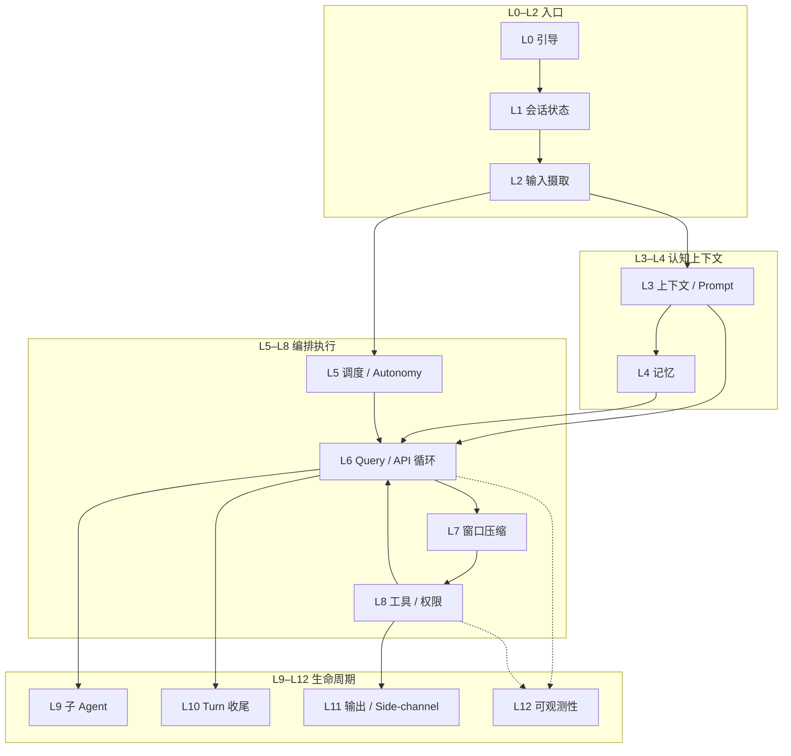
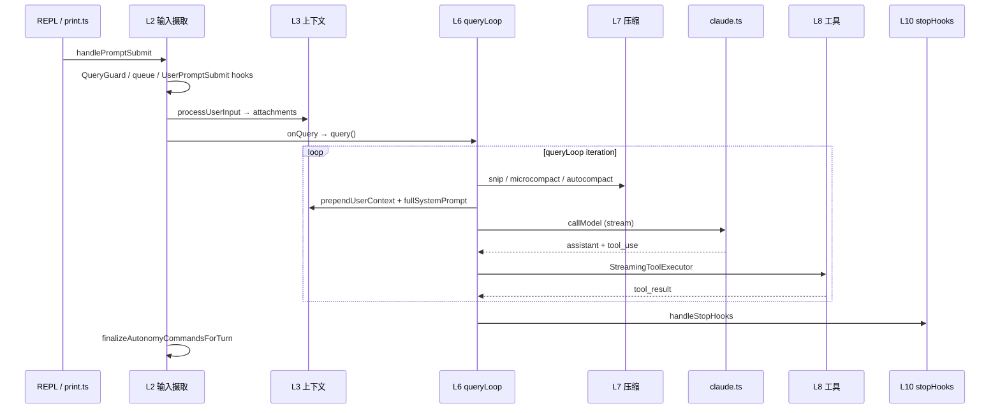

# Harness 实战指导 — 生产级智能体架构

本文档面向**要改 Claude Code Best 运行时编排层**的开发者。这里的 **Harness** 不是某个文件名，而是：**包裹 LLM 的确定性执行层**——在模型不可控的生成之外，保证输入解析、上下文、权限、工具、调度、压缩、收尾等行为**可预测、可测试、可运维**。

功能开关与 `/slash` 用法见 [`docs/features/`](features/)；Hook 协议见 [`docs/extensibility/hooks.mdx`](extensibility/hooks.mdx)。环境搭建与日常命令见 [`practical-handbook.md`](practical-handbook.md)。

---

## 目录

**Part I — 架构总览**

1. [设计原则与分层模型](#1-设计原则与分层模型)
2. [端到端生命周期](#2-端到端生命周期)
3. [运行时形态（REPL / Headless / ACP）](#3-运行时形态repl--headless--acp)

**Part II — 各层 Harness 方案（按生产链路顺序）**

4. [L0 引导与入口 Harness](#4-l0-引导与入口-harness)
5. [L1 会话状态 Harness](#5-l1-会话状态-harness)
6. [L2 输入摄取 Harness](#6-l2-输入摄取-harness)
7. [L3 上下文与 Prompt Harness](#7-l3-上下文与-prompt-harness)
8. [L4 记忆 Harness](#8-l4-记忆-harness)
9. [L5 调度与 Autonomy Harness](#9-l5-调度与-autonomy-harness)
10. [L6 推理循环 Harness（Query / API）](#10-l6-推理循环-harnessquery--api)
11. [L7 上下文窗口 Harness（压缩）](#11-l7-上下文窗口-harness压缩)
12. [L8 工具与权限 Harness](#12-l8-工具与权限-harness)
13. [L9 子 Agent Harness](#13-l9-子-agent-harness)
14. [L10 Turn 收尾 Harness](#14-l10-turn-收尾-harness)
15. [L11 输出与 Side-Channel Harness](#15-l11-输出与-side-channel-harness)
16. [L12 可观测性 Harness](#16-l12-可观测性-harness)

**Part III — 横切能力**

17. [配置型 Harness：Settings 与 Hooks](#17-配置型-harnesssettings-与-hooks)
18. [关键契约（改之前必读）](#18-关键契约改之前必读)
19. [测试 Harness](#19-测试-harness)
20. [调试与排错索引](#20-调试与排错索引)

**Part IV — 实战手册**

21. [场景 Playbook（按症状）](#21-场景-playbook按症状)
22. [改代码检查清单（按层）](#22-改代码检查清单按层)
23. [延伸阅读](#23-延伸阅读)

---

# Part I — 架构总览

## 1. 设计原则与分层模型

### 1.1 模型 vs Harness vs 工具

| 层 | 职责 | 谁保证确定性 |
|----|------|--------------|
| **模型** | 生成文本 / `tool_use` 意图 | 概率性，不可依赖 |
| **Harness** | 编排、 gate、压缩、权限、队列、生命周期 | **必须 100% 代码保证** |
| **工具** | 副作用（读写、bash、MCP 等） | 工具实现 + Harness 权限管道 |

### 1.2 核心原则

> **「每当 X 就 Y」不能交给模型或 memory——必须写在 Harness 代码、settings Hook 或策略配置里。**

`updateConfig` skill 的说明与此一致：自动化行为由 harness 执行，不是 Claude 的「记忆」。

### 1.3 十二层 Harness 模型

生产级智能体在本仓库中按 **L0–L12** 分层；下层为上层提供不变量，上层不得绕过下层 gate。



| 层 | Harness 名称 | 一句话 |
|----|--------------|--------|
| L0 | 引导与入口 | 快速路径、init、feature 注入 |
| L1 | 会话状态 | sessionId、CWD、AppState 单例 |
| L2 | 输入摄取 | 提交、排队、Hook、slash |
| L3 | 上下文 / Prompt | CLAUDE.md、system prompt、attachment |
| L4 | 记忆 | memdir、extract、prefetch、session-memory |
| L5 | 调度 / Autonomy | cron、HEARTBEAT、run 状态机 |
| L6 | Query / API | `queryLoop`、流式、provider |
| L7 | 窗口压缩 | snip → microcompact → autocompact |
| L8 | 工具 / 权限 | 注册、执行、allow/deny/ask |
| L9 | 子 Agent | fork、工具黑名单、trace 归属 |
| L10 | Turn 收尾 | stopHooks、后台 agent、shutdown |
| L11 | 输出 / Side-channel | hints 剥离、headless 协议 |
| L12 | 可观测性 | Langfuse、checkpoint、analytics |

**横切：** §17 Settings/Hooks、§18 契约、§19 测试——作用于多层。

---

## 2. 端到端生命周期

用户按 Enter（或 pipe 一行输入）到 turn 结束，Harness 保证的顺序：



| 阶段 | 关键入口 | 文件 |
|------|----------|------|
| 提交 | `handlePromptSubmit` | `src/utils/handlePromptSubmit.ts` |
| 语义解析 | `processUserInput` | `src/utils/processUserInput/processUserInput.ts` |
| API 循环 | `query` / `queryLoop` | `src/query.ts` |
| 会话编排 | `QueryEngine` | `src/QueryEngine.ts` |
| 单次 API | `queryModelWithStreaming` | `src/services/api/claude.ts` |

---

## 3. 运行时形态（REPL / Headless / ACP）

同一套 L0–L12 逻辑，三种入口壳：

| 形态 | 入口 | Harness 差异 |
|------|------|--------------|
| **REPL** | `REPL.tsx` | `QueryGuard`、Ink 权限 UI、排队可视化 |
| **Headless** | `cli/print.ts` | 无 React；`structuredIO` 队列与 elicitation |
| **ACP** | `--acp` | `src/services/acp/`，`createAcpCanUseTool` 权限桥 |
| **集成测** | `dist/cli.js` 子进程 | 见 §19.3 |

**Invariant：** 改 `handlePromptSubmit` 或 `query.ts` 的 autonomy / 队列逻辑时，**必须对称检查** `print.ts`（见 `docs/internals/autonomy-jira.md`）。

---

# Part II — 各层 Harness 方案

## 4. L0 引导与入口 Harness

### 4.1 职责

- 零模块快速路径（`--version`）
- 一次性 init（telemetry、config、trust）
- Feature / MACRO 注入（dev vs build）
- Ablation 基线 env（须在 import 工具模块**之前**）

### 4.2 关键文件

| 文件 | 作用 |
|------|------|
| `src/entrypoints/cli.tsx` | 快速路径分发 → `main.tsx` |
| `src/entrypoints/init.ts` | 一次性初始化 |
| `src/main.tsx` | Commander 子命令注册 |
| `scripts/dev.ts` / `build.ts` | `feature()` 默认集 |
| `scripts/defines.ts` | 版本等 MACRO |

### 4.3 Harness 保证

- `feature('X')` **只能**出现在 `if` 或三元条件位（Bun 编译器限制）
- `ABLATION_BASELINE` 在 `cli.tsx` 顶部——BashTool/AgentTool 在 load 时 capture 常量，不能挪到 `init.ts`
- 快速路径命令不加载完整 REPL harness，避免 RSS 暴涨

### 4.4 实战

| 任务 | 做法 |
|------|------|
| 新子命令快速路径 | 在 `cli.tsx` `main()` 优先级链插入，feature-gate |
| 新 feature 默认值 | 改 `scripts/dev.ts` + `build.ts` `DEFAULT_BUILD_FEATURES` |
| Ablation 实验 | env 注入放 `cli.tsx`，勿依赖运行时 settings |

---

## 5. L1 会话状态 Harness

### 5.1 职责

- 全局单例：`sessionId`、`cwd`、`projectRoot`、model override
- `AppState`（messages、permissions、MCP、tools）
- 会话持久化路径（`.claude/projects/...`）

### 5.2 关键文件

| 文件 | 作用 |
|------|------|
| `src/bootstrap/state.ts` | 模块级 session 单例 |
| `src/state/AppState.tsx` / `AppStateStore.ts` | React 侧状态 |
| `src/state/store.ts` | Zustand-style store |
| `src/utils/sessionStorage.ts` | 项目目录编码 |

### 5.3 Harness 保证

- `getSessionId()` 在整个进程内稳定；harness 路径（session-memory、plans）都挂 sessionId
- 改 CWD / project root 时必须同步 permission working directories
- 测试 mock 链：`log.ts` / `debug.ts` → `bootstrap/state.ts` 有模块加载副作用

### 5.4 实战

| 症状 | 排查 |
|------|------|
| 会话 resume 后路径错 | `sessionStorage` + `getProjectDir` |
| 权限 working dir 不对 | `bootstrap/state` 的 CWD vs `additionalWorkingDirectories` |
| 单测随机 UUID 污染 | mock `bootstrap/state` 或使用 `tests/mocks/` |

---

## 6. L2 输入摄取 Harness

### 6.1 职责

- 串行化用户输入（`QueryGuard`）
- 排队与 dequeue（`messageQueueManager`）
- UserPromptSubmit / slash / skill 分发
- 打断可中断工具

### 6.2 数据流

```
PromptInput → handlePromptSubmit → executeUserInput → processUserInput
  ├─ executeUserPromptSubmitHooks (可 block)
  ├─ processSlashCommand
  └─ shouldQuery ? onQuery → query()
→ finalizeAutonomyCommandsForTurn
```

### 6.3 关键文件

| 组件 | 文件 |
|------|------|
| 提交入口 | `src/utils/handlePromptSubmit.ts` |
| 排队 | `src/utils/messageQueueManager.ts`、`useQueueProcessor.ts` |
| 互斥 | `src/utils/QueryGuard.ts` |
| Slash | `processSlashCommand.tsx` |

### 6.4 Harness 保证

- **同一时刻只有一个 in-flight query**（`QueryGuard.reserve/release`）
- 连续输入先入队；turn 结束后 `dequeue` 再进 `handlePromptSubmit`（带 `queuedCommands`）
- 仅 cancel-interrupt 类工具在跑时，新输入 abort 当前 turn 并重新入队
- 非 trusted workspace：**跳过** Hook 执行（防 RCE）

### 6.5 实战

改排队逻辑必读：**`handlePromptSubmit`**、**`useQueueProcessor.ts`**、**`messageQueueManager.ts`**。

单测模板：`src/__tests__/handlePromptSubmit.test.ts`。

---

## 7. L3 上下文与 Prompt Harness

### 7.1 职责

在每次 `callModel` 前组装 **system prompt + messages**，分三条通道：

| 通道 | 函数 | 注入位置 | 内容 |
|------|------|----------|------|
| **System prompt** | `getSystemPrompt()` | API `system` | 工具说明、memory 段、MCP、env |
| **User context** | `getUserContext()` → `prependUserContext()` | messages 头部 meta | CLAUDE.md、日期 |
| **System context** | `getSystemContext()` → `appendSystemContext()` | system 尾部 | git status |
| **Turn attachments** | `getAttachmentMessages()` | 每轮 user turn | plan、queue、delta 等 |

### 7.2 关键文件

| 模块 | 文件 |
|------|------|
| 会话 context | `src/context.ts` |
| 注入 API | `src/utils/api.ts` |
| CLAUDE.md 发现 | `src/utils/claudemd.ts` |
| System prompt 段 | `src/constants/prompts.ts` |
| Turn 级注入 | `src/utils/attachments.ts` |

### 7.3 Harness 保证

- `getUserContext` / `getSystemContext`：**lodash memoize**，会话内算一次；`setSystemPromptInjection()` 会 `cache.clear()`
- `claudeMd` 单独进 `<project-instructions>`，不混在 “may or may not be relevant” disclaimer 里
- `filterInjectedMemoryFiles` 避免 CLAUDE.md 与 L4 memory 段重复 token
- `NODE_ENV=test` 时 `prependUserContext` **直接 return 原 messages**——单测不覆盖注入，需集成测

### 7.4 CLAUDE.md 开关

| 条件 | 行为 |
|------|------|
| `CLAUDE_CODE_DISABLE_CLAUDE_MDS=1` | 硬关 |
| `--bare` 且无 `--add-dir` | 跳过自动 walk |
| `--add-dir` | 显式目录仍加载 |

### 7.5 Attachment 时机分类

| 类型 | 时机 | 示例 |
|------|------|------|
| Session 级 | memoize | CLAUDE.md、git |
| Turn 级 | 每次 user input | plan mode、autonomy queue |
| Async prefetch | turn 开始 fire-and-forget | relevant memory（§8.4）、skill discovery |

### 7.6 实战

「CLAUDE.md 改了但模型还用旧的」→ 查 memoize 是否被 `postCompactCleanup` 清掉，不是模型问题。

---

## 8. L4 记忆 Harness

### 8.1 职责

三条**独立**路径，勿混为一谈：

| 路径 | 生命周期 | 机制 |
|------|----------|------|
| **持久 memdir** | 跨会话 | `MEMORY.md` + sidecar 文件 |
| **Turn 结束提取** | 异步后台 | `extractMemories` |
| **Turn 内 recall** | 当前 turn | prefetch + `nested_memory` |
| **Session-memory** | 当前 session | compact 摘要、plan spill |

### 8.2 开关链（`src/memdir/paths.ts`）

`isAutoMemoryEnabled()` 优先级：

1. `CLAUDE_CODE_DISABLE_AUTO_MEMORY=1` → OFF
2. `CLAUDE_CODE_SIMPLE` / `--bare` → OFF
3. CCR 且无 `CLAUDE_CODE_REMOTE_MEMORY_DIR` → OFF
4. `settings.autoMemoryEnabled`
5. 默认 ON

`ensureMemoryDirExists()` — **Harness guarantees the directory exists**。

### 8.3 System prompt 注入

```
getSystemPrompt() → loadMemoryPrompt()
  → buildMemoryPrompt → MEMORY.md (≤200 行 & ≤25KB 截断)
```

### 8.4 Turn 内 Prefetch

```ts
// query.ts — 每 user turn 一次
using pendingMemoryPrefetch = startRelevantMemoryPrefetch(messages, toolUseContext)
```

- `findRelevantMemories`：Sonnet side-query，最多 5 文件
- Poor mode / 单词 prompt / `MAX_SESSION_BYTES` 跳过
- `using` dispose → abort + `tengu_memdir_prefetch_collected`

### 8.5 Turn 结束 extractMemories

触发：`stopHooks.ts` → `handleStopHooks`（模型无 pending tool）

条件：`feature('EXTRACT_MEMORIES')` && 主线程 && `isExtractModeActive()` && !bare && !poor && `isAutoMemoryEnabled()`

实现：`runForkedAgent` 写 memdir；与主 agent 手写 memory 去重（`hasMemoryWritesSince`）。

Headless `-p`：`print.ts` → `drainPendingExtraction` 再 shutdown。

### 8.6 Session-memory 路径

| 路径 | 用途 |
|------|------|
| `{projectDir}/{sessionId}/session-memory/` | 会话摘要 |
| `plans/`、`tool-results/` | plan harness、大结果 spill |

`filesystem.ts` 步骤 7：`checkReadableInternalPath` 允许 Read harness 路径。

### 8.7 实战

「没生成 memory 文件」→ 查 feature + poor + bare + 非交互 gate，不是模型「不想记」。

---

## 9. L5 调度与 Autonomy Harness

### 9.1 职责

Managed flow / HEARTBEAT / cron / proactive 将 prompt **入队**为带 `autonomy.runId` 的 `QueuedCommand`，由 harness 消费——**不由模型自行调度**。

### 9.2 状态机

| 模块 | 职责 |
|------|------|
| `autonomyRuns.ts` | queued → running → completed / failed / cancelled |
| `autonomyQueueLifecycle.ts` | turn 开始 claim、turn 结束 finalize |
| `handlePromptSubmit` | turn 结束后 `finalizeAutonomyCommandsForTurn` |
| `query.ts` | turn **中途** drain 高优先级 command → attachment |

### 9.3 两个 finalize 入口（Invariant）

1. **正常路径：** `handlePromptSubmit` / `print.ts` 在 `processUserInput` 返回后 finalize
2. **Mid-turn 消费：** `query.ts` → `claimConsumableQueuedAutonomyCommands` + turn 结束 `finalizeAutonomyCommandsForTurn`

二者语义必须一致，否则出现 AUT-001 类 stuck / 叠 tick bug。

### 9.4 Deferred completion 契约

KAIROS 等 slash **detach 后台**但立刻返回 → slash 返回 `{ deferAutonomyCompletion: true }`；`handlePromptSubmit` 维护 `deferredAutonomyRunIds`，**跳过**即时 finalize；后台结束时自行 `finalizeAutonomyRunCompleted/Failed`。

详见 §18.1、`docs/internals/autonomy-jira.md`。

### 9.5 实战

- stale run → `removeFromQueue`，**不要**发给模型
- 改 drain → 回归 `autonomyRuns.test.ts` + 集成测

---

## 10. L6 推理循环 Harness（Query / API）

### 10.1 职责

- `query()` 包装 trace 生命周期、autonomy finalize、`finally` 清理
- `queryLoop`：压缩 → callModel → 工具循环 → 终止条件
- Provider 路由、`claude.ts` 流式适配

### 10.2 分工边界

| 模块 | 边界 |
|------|------|
| **`query.ts`** | 多轮 tool loop、压缩、attachment 消费、autonomy drain |
| **`claude.ts`** | **单次** API 请求：参数构建、流式事件、重试 |
| **`QueryEngine.ts`** | REPL 侧编排：compaction 边界、file history、turn bookkeeping |

调用链：`REPL → query() → deps.callModel (= queryModelWithStreaming) → queryModel → Provider`。

### 10.3 queryLoop 内 invariant

- `messagesForQuery = getMessagesAfterCompactBoundary(messages)`
- 删除 stale `toolUseResult`  payload（防长会话 RSS）
- `applyToolResultBudget` 在 microcompact **之前**
- Prefetch：`startRelevantMemoryPrefetch`、`startSkillDiscoveryPrefetch` 用 `using` 保证 dispose
- `query` 的 `finally`：autonomy finalize、Langfuse end/flush、Performance buffer clear

### 10.4 实战

F5 断点：`query.ts` 的 `queryLoop`；API 单次请求断 `claude.ts` 的 `queryModel`。见 [`vscode-f5-debugging.md`](vscode-f5-debugging.md)。

---

## 11. L7 上下文窗口 Harness（压缩）

### 11.1 职责

Token 逼近上限时 **确定性瘦身**——模型不能自己删历史。

### 11.2 压缩链（每次 iteration、callModel 前）

| 顺序 | 模块 | Feature | 作用 |
|------|------|---------|------|
| 1 | `snipCompactIfNeeded` | `HISTORY_SNIP` | 截断远端历史；`snipTokensFreed` 参与阈值 |
| 2 | `microcompact` | 始终 | 清大 tool_result / cache edit |
| 3 | `applyCollapsesIfNeeded` | `CONTEXT_COLLAPSE`（默认关） | 读时投影，**先于** autocompact |
| 4 | `autocompact` | 始终 | 超阈 fork 摘要 |

阈值：`getEffectiveContextWindowSize(model)` = 窗口 − summary 预留（~20k）；buffer 按窗口阶梯 13k / 30k / 50k。

### 11.3 Harness 保证

- 压缩成功 → `buildPostCompactMessages` 替换 `messagesForQuery`，yield boundary 给 UI
- `consecutiveFailures` 熔断不可恢复超限
- compact 后 → `postCompactCleanup` 清 `getUserContext` cache
- `CLAUDE_CODE_AUTO_COMPACT_WINDOW` 可人为缩小触发窗口

### 11.4 实战

跟 checkpoint：`query_snip_*` → `query_microcompact_*` → `query_autocompact_*` + `tengu_auto_compact_succeeded`。

---

## 12. L8 工具与权限 Harness

### 12.1 三层分工

| 层 | 职责 | 文件 |
|----|------|------|
| 工具实现 | `call()`、`checkPermissions()` | `packages/builtin-tools/` |
| Tool harness | 注册、延迟加载、执行编排 | `src/tools.ts`、`StreamingToolExecutor.ts` |
| Permission harness | allow/deny/ask、mode、classifier | `src/utils/permissions/*` |

模型只产生 `tool_use`；**能否执行、并发与否** 全由 L8 决定。

### 12.2 工具注册 → API

```
getTools → ToolUseContext.options.tools
  → claude.ts toolToAPISchema
  → StreamingToolExecutor / runTools
```

| 机制 | 作用 |
|------|------|
| `CORE_TOOLS` | 延迟工具白名单 |
| `ALL_AGENT_DISALLOWED_TOOLS` | 子 Agent 黑名单 |
| `allowedTools`（slash） | 单轮工具子集 |
| MCP | 连接后动态注入 |

### 12.3 执行链

```
tool_use 完成 → StreamingToolExecutor
  → canUseTool → hasPermissionsToUseToolInner
  → PreToolUse / PermissionRequest hooks
  → runToolUse → tool.call()
```

### 12.4 权限决策顺序（`hasPermissionsToUseToolInner`）

| 步骤 | 检查 | 结果 |
|------|------|------|
| 1a–1g | deny / ask / `tool.checkPermissions()` / safety | deny 或 ask |
| 2a | `bypassPermissions` mode | allow |
| 2b | allow 规则 | allow |
| 3 | passthrough | ask → UI / classifier |
| 末尾 | `dontAsk` | ask → deny |

**白名单 = 规则字符串 + destination**，无独立 `whitelist.json`：

| destination | 持久化 |
|-------------|--------|
| `userSettings` / `projectSettings` / `localSettings` | 磁盘 |
| **`session`** | 进程内，重启失效 |
| `user_temporary` 批准 | 同 session |
| `user_permanent` 批准 | 写 settings |

**无 wall-clock TTL**；Auto 模式 `DENIAL_LIMITS` 连续 deny 后 fallback 人工。

### 12.5 实战

「工具被拦」→ §12.4 顺序表 + 打印 `toolPermissionContext.mode` 与 rules source。

单测：`src/utils/permissions/__tests__/`。

---

## 13. L9 子 Agent Harness

### 13.1 职责

- `AgentTool` / `runForkedAgent` / `runAgent` 启动隔离 query
- 工具黑名单、独立 querySource、sidechain 持久化
- Langfuse trace：**子 agent 复用 parent trace**，不重复 create

### 13.2 Harness 保证

- `!toolUseContext.agentId` gate：extractMemories、autoDream、CHICAGO_MCP cleanup **仅主线程**
- 子 agent compact → `postCompactCleanup` 行为与主线程不同（勿污染 parent CLAUDE.md cache）
- `queryTracking.depth` 递增；过深需产品层限制

### 13.3 实战

改 Agent 工具集 → 同步 `ALL_AGENT_DISALLOWED_TOOLS` 与 `CORE_TOOLS` 策略。

---

## 14. L10 Turn 收尾 Harness

### 14.1 职责

模型产出 final response（无 pending tool）后：

| 任务 | 模块 | Gate |
|------|------|------|
| Stop hooks | `executeStopHooks` | 可 block 继续 |
| Prompt suggestion | `promptSuggestion` | !bare, !poor |
| Extract memories | `extractMemories` | §8.5 |
| Auto dream | `autoDream` | !bare, !poor, 主线程 |
| CHICAGO MCP cleanup | `cleanupComputerUseAfterTurn` | 主线程 |

### 14.2 关键文件

- `src/query/stopHooks.ts` — `handleStopHooks`
- `src/utils/gracefulShutdown.ts` — 进程退出
- `cli/print.ts` — `drainPendingExtraction`

### 14.3 实战

Headless 脚本过早 exit → 丢 extractMemories；需等 drain。

---

## 15. L11 输出与 Side-Channel Harness

### 15.1 职责

- **Claude Code Hints**：Bash 输出中 `<claude-code-hint />` 被 harness **剥掉**再给模型；UI 可展示 install 提示（`claudeCodeHints.ts`）
- **Headless**：`structuredIO.ts` control 协议、elicitation
- **REPL**：Ink 渲染与权限对话框

### 15.2 Invariant

Side-channel 内容**不得**进入 model-visible messages，除非显式 attachment 设计。

---

## 16. L12 可观测性 Harness

### 16.1 职责

| 能力 | 文件 / 机制 |
|------|-------------|
| Langfuse trace | `query.ts` create/end/flush |
| Query profiling | `queryCheckpoint`、`startQueryProfile` |
| Workload | `runWithWorkload`（`handlePromptSubmit`） |
| Analytics | `logEvent('tengu_*')` |
| Eval 确定性 | `growthbook.ts` env override（eval harness） |

### 16.2 实战

性能回归：对照 `queryCheckpoint` 名称；F5 调试见 vscode 文档。

---

# Part III — 横切能力

## 17. 配置型 Harness：Settings 与 Hooks

用户通过 settings **无需改 TS** 扩展 harness：

| 配置 | 作用层 |
|------|--------|
| `hooks`（27 事件） | L2、L8、L10 |
| `permissions` | L8 |
| `env` | L0、L6 provider |
| `autoMemoryEnabled` | L4 |

Hook 引擎：`executeHooks`（`src/utils/hooks.ts`）；schema：`src/entrypoints/sdk/coreSchemas.ts`。

`CLAUDE_CODE_SIMPLE=1` 关闭 Hook。非 trusted workspace skip。

**实战：** 「每次 Stop 跑脚本」→ 配 `Stop` hook，不是写 memory。

---

## 18. 关键契约（改之前必读）

### 18.1 Deferred autonomy completion

```ts
{ deferAutonomyCompletion: true }  // slash 返回
// handlePromptSubmit 跳过 finalize → 后台自行 finalize
```

文件：`processSlashCommand.tsx`、`handlePromptSubmit.ts`。

### 18.2 Mid-turn queue drain

`query.ts` → `claimConsumableQueuedAutonomyCommands`：stale → remove；consumed → turn 结束 finalize。

### 18.3 TEST-ONLY：`allowBackgroundForkedSlashCommands`

仅 `NODE_ENV=test` + 单测构造 `ToolUseContext`；生产无效。见 `src/Tool.ts`。

### 18.4 Harness-science / Ablation

env 注入在 `cli.tsx` import 前，不在 `init.ts`。

---

## 19. 测试 Harness

### 19.1 单元测试（in-process）

模板：`src/__tests__/handlePromptSubmit.test.ts`

- 共享 mock：`tests/mocks/log.ts`、`debug.ts`
- **勿** mock 被测业务模块上层（Bun `mock.module` 进程全局污染）
- autonomy：`createAutonomyQueuedPrompt`、`resetCommandQueue`

### 19.2 Deferred completion 测试

1. `allowBackgroundForkedSlashCommands: true` + `NODE_ENV=test`
2. `deferAutonomyCompletion` 时 assert **不** finalize
3. 后台结束后自行 finalize

### 19.3 集成测试（subprocess）

`tests/integration/autonomy-lifecycle-user-flow.test.ts`：

- 用 **`dist/cli.js`**，非 `src/entrypoints/cli.tsx`
- `CLAUDE_CONFIG_DIR` → temp dir

### 19.4 Eval harness

GrowthBook env override 保证 eval 分组确定性。

### 19.5 命令

```bash
bun test src/__tests__/handlePromptSubmit.test.ts
bun test src/utils/__tests__/autonomyRuns.test.ts
bun test tests/integration/autonomy-lifecycle-user-flow.test.ts
bun run precheck
```

---

## 20. 调试与排错索引

| 目标 | 层 | 做法 |
|------|-----|------|
| 提交 / 排队 | L2 | F5 → `handlePromptSubmit`；`getCommandQueue()` |
| 上下文 / 压缩 | L3/L7 | `queryLoop` checkpoint；`autoCompact.ts` |
| Memory | L4 | `stopHooks`；memdir；prefetch telemetry |
| Autonomy stuck | L5 | `listAutonomyRuns`；finalize 双路径 |
| API / tool loop | L6/L8 | `queryLoop`；`hasPermissionsToUseTool` |
| Hook 未跑 | L17 | trusted workspace；`CLAUDE_CODE_SIMPLE` |
| Headless 不一致 | L3 | 对比 `REPL.tsx` vs `print.ts` 参数 |

**常见误判：**

- 只改 REPL 未改 headless
- `bun run dev` 子进程断点打不中 → 用 `dev-cli.ts` 同进程
- 单测通过、集成失败 → 是否用 `dist/cli.js`

---

# Part IV — 实战手册

## 21. 场景 Playbook（按症状）

| # | 症状 | 层 | 第一步 |
|---|------|-----|--------|
| A | 提交被 Hook 拦截 | L2/L17 | `executeUserPromptSubmitHooks` |
| B | Autonomy 卡 queued | L5 | `listAutonomyRuns` + finalize 双路径 |
| C | 调度器叠 tick | L5 | `deferAutonomyCompletion` |
| D | REPL vs pipe 不一致 | L2/L3 | 对比 `print.ts` 参数 |
| E | 新 Hook 事件 | L17 | `coreSchemas.ts` → generate-sdk-types |
| F | 队列优先级错 | L2/L5 | `getCommandsByMaxPriority` |
| G | 工具 deny | L8 | §12.4 决策顺序 |
| H | 突然 autocompact | L7 | `query_autocompact_*` + env 窗口 |
| I | Memory 未写入 | L4 | §8.2–8.5 gate 链 |
| J | CLAUDE.md stale | L3 | memoize cache / compact cleanup |
| K | 子 agent 行为异常 | L9 | agentId gate + 工具黑名单 |

### 场景 A 详解：Hook 拦截

1. `processUserInput` → `getUserPromptSubmitHookBlockingMessage`
2. settings 加 `UserPromptSubmit` hook 打 log 复现
3. mock hooks 返回 blocking → `shouldQuery === false`

### 场景 G 详解：权限

1. `hasPermissionsToUseToolInner` 顺序（§12.4）
2. `appState.toolPermissionContext` → mode + rules source
3. Bash → `bashPermissions.ts` + `shellRuleMatching.ts`

---

## 22. 改代码检查清单（按层）

| 改动涉及 | 必查 |
|----------|------|
| L2 排队 | REPL + `print.ts` + 单测 |
| L3 context | memoize invalidation；headless 传参 |
| L4 memory | feature + poor + bare 双 gate；filesystem internal paths |
| L5 autonomy | 两个 finalize 入口；deferred completion |
| L6 query | `finally` autonomy + Langfuse flush |
| L7 compact | `snipTokensFreed`；postCompact cleanup |
| L8 权限 | REPL UI + headless `canUseTool` + hooks |
| L9 agent | 主线程 gate；trace 归属 |
| L10 stop | drain pending extraction（headless） |

---

## 23. 延伸阅读

| 文档 | 内容 |
|------|------|
| [practical-handbook.md](practical-handbook.md) | 环境、命令、代码地图 |
| [vscode-f5-debugging.md](vscode-f5-debugging.md) | F5 断点 |
| [internals/autonomy-jira.md](internals/autonomy-jira.md) | Autonomy AC |
| [agent/sur-loop-scheduled-oom.md](agent/sur-loop-scheduled-oom.md) | KAIROS / deferred completion |
| [extensibility/hooks.mdx](extensibility/hooks.mdx) | Hook 协议 |

---

**维护：** 修改任一层 Harness（L0–L12）或 §18 契约时，请同步更新对应章节与 §21 Playbook。架构分层变更时先改 §1.3 与 §2 生命周期图。
