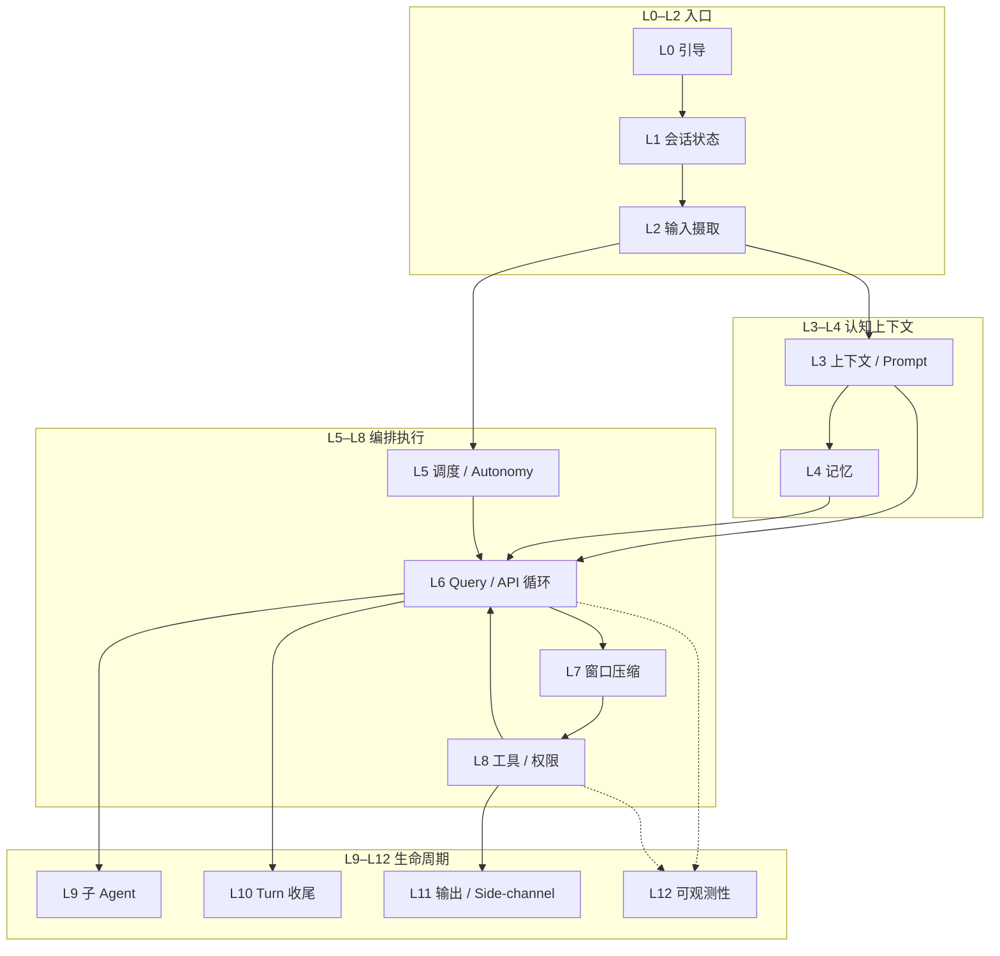
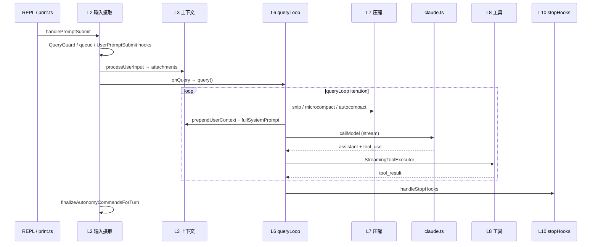

# Harness 实战指导 — 生产级智能体架构

本文档面向**要改 Claude Code Best 运行时编排层**的开发者。这里的 **Harness** 不是某个文件名，而是：**包裹 LLM 的确定性执行层**——在模型不可控的生成之外，保证输入解析、上下文、权限、工具、调度、压缩、收尾等行为**可预测、可测试、可运维**。

功能开关与 `/slash` 用法见 [`docs/features/`](features/)；Hook 协议见 [`docs/extensibility/hooks.mdx`](extensibility/hooks.mdx)。环境搭建与日常命令见 [`practical-handbook.md`](practical-handbook.md)。

---

## 目录

**Part I — 架构总览**

1. [设计原则与分层模型](#1-设计原则与分层模型)
2. [端到端生命周期](#2-端到端生命周期)
3. [运行时形态（REPL / Headless / ACP）](#3-运行时形态repl--headless--acp)

**Part II — 各层 Harness 方案（按生产链路顺序）**

4. [L0 引导与入口 Harness](#4-l0-引导与入口-harness)
5. [L1 会话状态 Harness](#5-l1-会话状态-harness)
6. [L2 输入摄取 Harness](#6-l2-输入摄取-harness)
7. [L3 上下文与 Prompt Harness](#7-l3-上下文与-prompt-harness)
8. [L4 记忆 Harness](#8-l4-记忆-harness)
9. [L5 调度与 Autonomy Harness](#9-l5-调度与-autonomy-harness)
10. [L6 推理循环 Harness（Query / API）](#10-l6-推理循环-harnessquery--api)
11. [L7 上下文窗口 Harness（压缩）](#11-l7-上下文窗口-harness压缩)
12. [L8 工具与权限 Harness](#12-l8-工具与权限-harness)
13. [L9 子 Agent Harness](#13-l9-子-agent-harness)
14. [L10 Turn 收尾 Harness](#14-l10-turn-收尾-harness)
15. [L11 输出与 Side-Channel Harness](#15-l11-输出与-side-channel-harness)
16. [L12 可观测性 Harness](#16-l12-可观测性-harness)

**Part III — 横切能力**

17. [配置型 Harness：Settings 与 Hooks](#17-配置型-harnesssettings-与-hooks)
18. [关键契约（改之前必读）](#18-关键契约改之前必读)
19. [测试 Harness](#19-测试-harness)
20. [调试与排错索引](#20-调试与排错索引)

**Part IV — 实战手册**

21. [分层典型案例库（L0–L12 + 横切）](#21-分层典型案例库l0l12--横切)
22. [场景 Playbook（按症状索引）](#22-场景-playbook按症状索引)
23. [改代码检查清单（按层）](#23-改代码检查清单按层)
24. [延伸阅读](#24-延伸阅读)

---

# Part I — 架构总览

## 1. 设计原则与分层模型

### 1.1 模型 vs Harness vs 工具

| 层 | 职责 | 谁保证确定性 |
|----|------|--------------|
| **模型** | 生成文本 / `tool_use` 意图 | 概率性，不可依赖 |
| **Harness** | 编排、 gate、压缩、权限、队列、生命周期 | **必须 100% 代码保证** |
| **工具** | 副作用（读写、bash、MCP 等） | 工具实现 + Harness 权限管道 |

### 1.2 核心原则

> **「每当 X 就 Y」不能交给模型或 memory——必须写在 Harness 代码、settings Hook 或策略配置里。**

`updateConfig` skill 的说明与此一致：自动化行为由 harness 执行，不是 Claude 的「记忆」。

### 1.3 十二层 Harness 模型

生产级智能体在本仓库中按 **L0–L12** 分层；下层为上层提供不变量，上层不得绕过下层 gate。



| 层 | Harness 名称 | 一句话 |
|----|--------------|--------|
| L0 | 引导与入口 | 快速路径、init、feature 注入 |
| L1 | 会话状态 | sessionId、CWD、AppState 单例 |
| L2 | 输入摄取 | 提交、排队、Hook、slash |
| L3 | 上下文 / Prompt | CLAUDE.md、system prompt、attachment |
| L4 | 记忆 | memdir、extract、prefetch、session-memory |
| L5 | 调度 / Autonomy | cron、HEARTBEAT、run 状态机 |
| L6 | Query / API | `queryLoop`、流式、provider |
| L7 | 窗口压缩 | snip → microcompact → autocompact |
| L8 | 工具 / 权限 | 注册、执行、allow/deny/ask |
| L9 | 子 Agent | fork、工具黑名单、trace 归属 |
| L10 | Turn 收尾 | stopHooks、后台 agent、shutdown |
| L11 | 输出 / Side-channel | hints 剥离、headless 协议 |
| L12 | 可观测性 | Langfuse、checkpoint、analytics |

**横切：** §17 Settings/Hooks、§18 契约、§19 测试——作用于多层。

---

## 2. 端到端生命周期

用户按 Enter（或 pipe 一行输入）到 turn 结束，Harness 保证的顺序：



| 阶段 | 关键入口 | 文件 |
|------|----------|------|
| 提交 | `handlePromptSubmit` | `src/utils/handlePromptSubmit.ts` |
| 语义解析 | `processUserInput` | `src/utils/processUserInput/processUserInput.ts` |
| API 循环 | `query` / `queryLoop` | `src/query.ts` |
| 会话编排 | `QueryEngine` | `src/QueryEngine.ts` |
| 单次 API | `queryModelWithStreaming` | `src/services/api/claude.ts` |

---

## 3. 运行时形态（REPL / Headless / ACP）

同一套 L0–L12 逻辑，三种入口壳：

| 形态 | 入口 | Harness 差异 |
|------|------|--------------|
| **REPL** | `REPL.tsx` | `QueryGuard`、Ink 权限 UI、排队可视化 |
| **Headless** | `cli/print.ts` | 无 React；`structuredIO` 队列与 elicitation |
| **ACP** | `--acp` | `src/services/acp/`，`createAcpCanUseTool` 权限桥 |
| **集成测** | `dist/cli.js` 子进程 | 见 §19.3 |

**Invariant：** 改 `handlePromptSubmit` 或 `query.ts` 的 autonomy / 队列逻辑时，**必须对称检查** `print.ts`（见 `docs/internals/autonomy-jira.md`）。

---

# Part II — 各层 Harness 方案

## 4. L0 引导与入口 Harness

### 4.1 职责

- 零模块快速路径（`--version`）
- 一次性 init（telemetry、config、trust）
- Feature / MACRO 注入（dev vs build）
- Ablation 基线 env（须在 import 工具模块**之前**）

### 4.2 关键文件

| 文件 | 作用 |
|------|------|
| `src/entrypoints/cli.tsx` | 快速路径分发 → `main.tsx` |
| `src/entrypoints/init.ts` | 一次性初始化 |
| `src/main.tsx` | Commander 子命令注册 |
| `scripts/dev.ts` / `build.ts` | `feature()` 默认集 |
| `scripts/defines.ts` | 版本等 MACRO |

### 4.3 Harness 保证

- `feature('X')` **只能**出现在 `if` 或三元条件位（Bun 编译器限制）
- `ABLATION_BASELINE` 在 `cli.tsx` 顶部——BashTool/AgentTool 在 load 时 capture 常量，不能挪到 `init.ts`
- 快速路径命令不加载完整 REPL harness，避免 RSS 暴涨

### 4.4 实战

| 任务 | 做法 |
|------|------|
| 新子命令快速路径 | 在 `cli.tsx` `main()` 优先级链插入，feature-gate |
| 新 feature 默认值 | 改 `scripts/dev.ts` + `build.ts` `DEFAULT_BUILD_FEATURES` |
| Ablation 实验 | env 注入放 `cli.tsx`，勿依赖运行时 settings |

### 4.5 典型案例

→ 完整步骤见 [§21.1 L0 案例](#211-l0-引导与入口)

| 案例 | 一句话 |
|------|--------|
| [L0-1](#案例-l0-1-dev-有-feature生产-build-没有) | dev 有 feature、dist 没有 |
| [L0-2](#案例-l0-2-ablation-实验对照组行为不对) | Ablation env 注入太晚 |
| [L0-3](#案例-l0-3-子命令走了完整-repl-启动慢) | 新命令未走快速路径 |

---

## 5. L1 会话状态 Harness

### 5.1 职责

- 全局单例：`sessionId`、`cwd`、`projectRoot`、model override
- `AppState`（messages、permissions、MCP、tools）
- 会话持久化路径（`.claude/projects/...`）

### 5.2 关键文件

| 文件 | 作用 |
|------|------|
| `src/bootstrap/state.ts` | 模块级 session 单例 |
| `src/state/AppState.tsx` / `AppStateStore.ts` | React 侧状态 |
| `src/state/store.ts` | Zustand-style store |
| `src/utils/sessionStorage.ts` | 项目目录编码 |

### 5.3 Harness 保证

- `getSessionId()` 在整个进程内稳定；harness 路径（session-memory、plans）都挂 sessionId
- 改 CWD / project root 时必须同步 permission working directories
- 测试 mock 链：`log.ts` / `debug.ts` → `bootstrap/state.ts` 有模块加载副作用

### 5.4 实战

| 症状 | 排查 |
|------|------|
| 会话 resume 后路径错 | `sessionStorage` + `getProjectDir` |
| 权限 working dir 不对 | `bootstrap/state` 的 CWD vs `additionalWorkingDirectories` |
| 单测随机 UUID 污染 | mock `bootstrap/state` 或使用 `tests/mocks/` |

### 5.5 典型案例

→ [§21.2 L1 案例](#212-l1-会话状态)

| 案例 | 一句话 |
|------|--------|
| [L1-1](#案例-l1-1-resume-后会话文件写到错误项目目录) | `/resume` 后 memdir 路径错 |
| [L1-2](#案例-l1-2-cd-子目录后-write-被拒绝) | CWD 变了 working dir 未同步 |
| [L1-3](#案例-l1-3-并行单测-sessionid-互相污染) | 单测 session 泄漏 |

---

## 6. L2 输入摄取 Harness

### 6.1 职责

- 串行化用户输入（`QueryGuard`）
- 排队与 dequeue（`messageQueueManager`）
- UserPromptSubmit / slash / skill 分发
- 打断可中断工具

### 6.2 数据流

```
PromptInput → handlePromptSubmit → executeUserInput → processUserInput
  ├─ executeUserPromptSubmitHooks (可 block)
  ├─ processSlashCommand
  └─ shouldQuery ? onQuery → query()
→ finalizeAutonomyCommandsForTurn
```

### 6.3 关键文件

| 组件 | 文件 |
|------|------|
| 提交入口 | `src/utils/handlePromptSubmit.ts` |
| 排队 | `src/utils/messageQueueManager.ts`、`useQueueProcessor.ts` |
| 互斥 | `src/utils/QueryGuard.ts` |
| Slash | `processSlashCommand.tsx` |

### 6.4 Harness 保证

- **同一时刻只有一个 in-flight query**（`QueryGuard.reserve/release`）
- 连续输入先入队；turn 结束后 `dequeue` 再进 `handlePromptSubmit`（带 `queuedCommands`）
- 仅 cancel-interrupt 类工具在跑时，新输入 abort 当前 turn 并重新入队
- 非 trusted workspace：**跳过** Hook 执行（防 RCE）

### 6.5 实战

改排队逻辑必读：**`handlePromptSubmit`**、**`useQueueProcessor.ts`**、**`messageQueueManager.ts`**。

单测模板：`src/__tests__/handlePromptSubmit.test.ts`。

### 6.6 典型案例

→ [§21.3 L2 案例](#213-l2-输入摄取)

| 案例 | 一句话 |
|------|--------|
| [L2-1](#案例-l2-1-连发三条消息只执行了第一条) | 排队未 dequeue |
| [L2-2](#案例-l2-2-userpromptsubmit-hook-拦截但-ui-无提示) | Hook block 无反馈 |
| [L2-3](#案例-l2-3-模型还在跑用户新输入被吞) | QueryGuard 与 interrupt 语义 |
| [L2-4](#案例-l2-4-slash-命令未触发-query) | `shouldQuery === false` 路径 |

---

## 7. L3 上下文与 Prompt Harness

### 7.1 职责

在每次 `callModel` 前组装 **system prompt + messages**，分三条通道：

| 通道 | 函数 | 注入位置 | 内容 |
|------|------|----------|------|
| **System prompt** | `getSystemPrompt()` | API `system` | 工具说明、memory 段、MCP、env |
| **User context** | `getUserContext()` → `prependUserContext()` | messages 头部 meta | CLAUDE.md、日期 |
| **System context** | `getSystemContext()` → `appendSystemContext()` | system 尾部 | git status |
| **Turn attachments** | `getAttachmentMessages()` | 每轮 user turn | plan、queue、delta 等 |

### 7.2 关键文件

| 模块 | 文件 |
|------|------|
| 会话 context | `src/context.ts` |
| 注入 API | `src/utils/api.ts` |
| CLAUDE.md 发现 | `src/utils/claudemd.ts` |
| System prompt 段 | `src/constants/prompts.ts` |
| Turn 级注入 | `src/utils/attachments.ts` |

### 7.3 Harness 保证

- `getUserContext` / `getSystemContext`：**lodash memoize**，会话内算一次；`setSystemPromptInjection()` 会 `cache.clear()`
- `claudeMd` 单独进 `<project-instructions>`，不混在 “may or may not be relevant” disclaimer 里
- `filterInjectedMemoryFiles` 避免 CLAUDE.md 与 L4 memory 段重复 token
- `NODE_ENV=test` 时 `prependUserContext` **直接 return 原 messages**——单测不覆盖注入，需集成测

### 7.4 CLAUDE.md 开关

| 条件 | 行为 |
|------|------|
| `CLAUDE_CODE_DISABLE_CLAUDE_MDS=1` | 硬关 |
| `--bare` 且无 `--add-dir` | 跳过自动 walk |
| `--add-dir` | 显式目录仍加载 |

### 7.5 Attachment 时机分类

| 类型 | 时机 | 示例 |
|------|------|------|
| Session 级 | memoize | CLAUDE.md、git |
| Turn 级 | 每次 user input | plan mode、autonomy queue |
| Async prefetch | turn 开始 fire-and-forget | relevant memory（§8.4）、skill discovery |

### 7.6 实战

「CLAUDE.md 改了但模型还用旧的」→ 查 memoize 是否被 `postCompactCleanup` 清掉，不是模型问题。

### 7.7 典型案例

→ [§21.4 L3 案例](#214-l3-上下文与-prompt)

| 案例 | 一句话 |
|------|--------|
| [L3-1](#案例-l3-1-claudemd-修改不生效) | memoize 未 invalidate |
| [L3-2](#案例-l3-2-plan-mode-切换后模型仍像在执行模式) | plan attachment 未注入 |
| [L3-3](#案例-l3-3-mcp-重连后工具说明重复或缺失) | `mcp_instructions_delta` |
| [L3-4](#案例-l3-4-bare-模式仍加载了部分-claudemd) | `--add-dir` 显式路径 |

---

## 8. L4 记忆 Harness

### 8.1 职责

三条**独立**路径，勿混为一谈：

| 路径 | 生命周期 | 机制 |
|------|----------|------|
| **持久 memdir** | 跨会话 | `MEMORY.md` + sidecar 文件 |
| **Turn 结束提取** | 异步后台 | `extractMemories` |
| **Turn 内 recall** | 当前 turn | prefetch + `nested_memory` |
| **Session-memory** | 当前 session | compact 摘要、plan spill |

### 8.2 开关链（`src/memdir/paths.ts`）

`isAutoMemoryEnabled()` 优先级：

1. `CLAUDE_CODE_DISABLE_AUTO_MEMORY=1` → OFF
2. `CLAUDE_CODE_SIMPLE` / `--bare` → OFF
3. CCR 且无 `CLAUDE_CODE_REMOTE_MEMORY_DIR` → OFF
4. `settings.autoMemoryEnabled`
5. 默认 ON

`ensureMemoryDirExists()` — **Harness guarantees the directory exists**。

### 8.3 System prompt 注入

```
getSystemPrompt() → loadMemoryPrompt()
  → buildMemoryPrompt → MEMORY.md (≤200 行 & ≤25KB 截断)
```

### 8.4 Turn 内 Prefetch

```ts
// query.ts — 每 user turn 一次
using pendingMemoryPrefetch = startRelevantMemoryPrefetch(messages, toolUseContext)
```

- `findRelevantMemories`：Sonnet side-query，最多 5 文件
- Poor mode / 单词 prompt / `MAX_SESSION_BYTES` 跳过
- `using` dispose → abort + `tengu_memdir_prefetch_collected`

### 8.5 Turn 结束 extractMemories

触发：`stopHooks.ts` → `handleStopHooks`（模型无 pending tool）

条件：`feature('EXTRACT_MEMORIES')` && 主线程 && `isExtractModeActive()` && !bare && !poor && `isAutoMemoryEnabled()`

实现：`runForkedAgent` 写 memdir；与主 agent 手写 memory 去重（`hasMemoryWritesSince`）。

Headless `-p`：`print.ts` → `drainPendingExtraction` 再 shutdown。

### 8.6 Session-memory 路径

| 路径 | 用途 |
|------|------|
| `{projectDir}/{sessionId}/session-memory/` | 会话摘要 |
| `plans/`、`tool-results/` | plan harness、大结果 spill |

`filesystem.ts` 步骤 7：`checkReadableInternalPath` 允许 Read harness 路径。

### 8.7 实战

「没生成 memory 文件」→ 查 feature + poor + bare + 非交互 gate，不是模型「不想记」。

### 8.8 典型案例

→ [§21.5 L4 案例](#215-l4-记忆)

| 案例 | 一句话 |
|------|--------|
| [L4-1](#案例-l4-1-长对话后-memdir-无新文件) | extractMemories gate 未过 |
| [L4-2](#案例-l4-2-pipe-模式记忆未落盘) | 未 `drainPendingExtraction` |
| [L4-3](#案例-l4-3-prefetch-没注入相关记忆) | GrowthBook / 单词 prompt / 字节上限 |
| [L4-4](#案例-l4-4-memorymd-被截断模型看不到后半) | 200 行 / 25KB cap |

---

## 9. L5 调度与 Autonomy Harness

### 9.1 职责

Managed flow / HEARTBEAT / cron / proactive 将 prompt **入队**为带 `autonomy.runId` 的 `QueuedCommand`，由 harness 消费——**不由模型自行调度**。

### 9.2 状态机

| 模块 | 职责 |
|------|------|
| `autonomyRuns.ts` | queued → running → completed / failed / cancelled |
| `autonomyQueueLifecycle.ts` | turn 开始 claim、turn 结束 finalize |
| `handlePromptSubmit` | turn 结束后 `finalizeAutonomyCommandsForTurn` |
| `query.ts` | turn **中途** drain 高优先级 command → attachment |

### 9.3 两个 finalize 入口（Invariant）

1. **正常路径：** `handlePromptSubmit` / `print.ts` 在 `processUserInput` 返回后 finalize
2. **Mid-turn 消费：** `query.ts` → `claimConsumableQueuedAutonomyCommands` + turn 结束 `finalizeAutonomyCommandsForTurn`

二者语义必须一致，否则出现 AUT-001 类 stuck / 叠 tick bug。

### 9.4 Deferred completion 契约

KAIROS 等 slash **detach 后台**但立刻返回 → slash 返回 `{ deferAutonomyCompletion: true }`；`handlePromptSubmit` 维护 `deferredAutonomyRunIds`，**跳过**即时 finalize；后台结束时自行 `finalizeAutonomyRunCompleted/Failed`。

详见 §18.1、`docs/internals/autonomy-jira.md`。

### 9.5 实战

- stale run → `removeFromQueue`，**不要**发给模型
- 改 drain → 回归 `autonomyRuns.test.ts` + 集成测

### 9.6 典型案例

→ [§21.6 L5 案例](#216-l5-调度与-autonomy)

| 案例 | 一句话 |
|------|--------|
| [L5-1](#案例-l5-1-autonomy-run-永久-queued) | finalize 双路径不一致 |
| [L5-2](#案例-l5-2-kairos-后台任务叠了多个-worker) | 缺 `deferAutonomyCompletion` |
| [L5-3](#案例-l5-3-turn-中途插队的高优先级-autonomy-命令) | mid-turn drain + attachment |
| [L5-4](#案例-l5-4-已-cancel-的-run-又被-mark-running) | stale command 未 remove |

---

## 10. L6 推理循环 Harness（Query / API）

### 10.1 职责

- `query()` 包装 trace 生命周期、autonomy finalize、`finally` 清理
- `queryLoop`：压缩 → callModel → 工具循环 → 终止条件
- Provider 路由、`claude.ts` 流式适配

### 10.2 分工边界

| 模块 | 边界 |
|------|------|
| **`query.ts`** | 多轮 tool loop、压缩、attachment 消费、autonomy drain |
| **`claude.ts`** | **单次** API 请求：参数构建、流式事件、重试 |
| **`QueryEngine.ts`** | REPL 侧编排：compaction 边界、file history、turn bookkeeping |

调用链：`REPL → query() → deps.callModel (= queryModelWithStreaming) → queryModel → Provider`。

### 10.3 queryLoop 内 invariant

- `messagesForQuery = getMessagesAfterCompactBoundary(messages)`
- 删除 stale `toolUseResult`  payload（防长会话 RSS）
- `applyToolResultBudget` 在 microcompact **之前**
- Prefetch：`startRelevantMemoryPrefetch`、`startSkillDiscoveryPrefetch` 用 `using` 保证 dispose
- `query` 的 `finally`：autonomy finalize、Langfuse end/flush、Performance buffer clear

### 10.4 实战

F5 断点：`query.ts` 的 `queryLoop`；API 单次请求断 `claude.ts` 的 `queryModel`。见 [`vscode-f5-debugging.md`](vscode-f5-debugging.md)。

### 10.5 典型案例

→ [§21.7 L6 案例](#217-l6-推理循环)

| 案例 | 一句话 |
|------|--------|
| [L6-1](#案例-l6-1-工具循环不停止) | maxTurns / stopHook block |
| [L6-2](#案例-l6-2-流式中途-provider-切换) | streaming fallback |
| [L6-3](#案例-l6-3-长会话-rss-暴涨) | `toolUseResult` 未释放 |
| [L6-4](#案例-l6-4-f5-断点打不中-query) | dev 子进程 vs dev-cli 同进程 |

---

## 11. L7 上下文窗口 Harness（压缩）

### 11.1 职责

Token 逼近上限时 **确定性瘦身**——模型不能自己删历史。

### 11.2 压缩链（每次 iteration、callModel 前）

| 顺序 | 模块 | Feature | 作用 |
|------|------|---------|------|
| 1 | `snipCompactIfNeeded` | `HISTORY_SNIP` | 截断远端历史；`snipTokensFreed` 参与阈值 |
| 2 | `microcompact` | 始终 | 清大 tool_result / cache edit |
| 3 | `applyCollapsesIfNeeded` | `CONTEXT_COLLAPSE`（默认关） | 读时投影，**先于** autocompact |
| 4 | `autocompact` | 始终 | 超阈 fork 摘要 |

阈值：`getEffectiveContextWindowSize(model)` = 窗口 − summary 预留（~20k）；buffer 按窗口阶梯 13k / 30k / 50k。

### 11.3 Harness 保证

- 压缩成功 → `buildPostCompactMessages` 替换 `messagesForQuery`，yield boundary 给 UI
- `consecutiveFailures` 熔断不可恢复超限
- compact 后 → `postCompactCleanup` 清 `getUserContext` cache
- `CLAUDE_CODE_AUTO_COMPACT_WINDOW` 可人为缩小触发窗口

### 11.4 实战

跟 checkpoint：`query_snip_*` → `query_microcompact_*` → `query_autocompact_*` + `tengu_auto_compact_succeeded`。

### 11.5 典型案例

→ [§21.8 L7 案例](#218-l7-上下文窗口压缩)

| 案例 | 一句话 |
|------|--------|
| [L7-1](#案例-l7-1-对话中途突然变摘要) | autocompact 触阈 |
| [L7-2](#案例-l7-2-compact-后-claudemd-仍是旧的) | postCompactCleanup 未清 cache |
| [L7-3](#案例-l7-3-snip-后仍立即-autocompact) | `snipTokensFreed` 未参与阈值 |
| [L7-4](#案例-l7-4-手动-compact-与自动-compact-行为不同) | buffer 常量差异 |

---

## 12. L8 工具与权限 Harness

### 12.1 三层分工

| 层 | 职责 | 文件 |
|----|------|------|
| 工具实现 | `call()`、`checkPermissions()` | `packages/builtin-tools/` |
| Tool harness | 注册、延迟加载、执行编排 | `src/tools.ts`、`StreamingToolExecutor.ts` |
| Permission harness | allow/deny/ask、mode、classifier | `src/utils/permissions/*` |

模型只产生 `tool_use`；**能否执行、并发与否** 全由 L8 决定。

### 12.2 工具注册 → API

```
getTools → ToolUseContext.options.tools
  → claude.ts toolToAPISchema
  → StreamingToolExecutor / runTools
```

| 机制 | 作用 |
|------|------|
| `CORE_TOOLS` | 延迟工具白名单 |
| `ALL_AGENT_DISALLOWED_TOOLS` | 子 Agent 黑名单 |
| `allowedTools`（slash） | 单轮工具子集 |
| MCP | 连接后动态注入 |

### 12.3 执行链

```
tool_use 完成 → StreamingToolExecutor
  → canUseTool → hasPermissionsToUseToolInner
  → PreToolUse / PermissionRequest hooks
  → runToolUse → tool.call()
```

### 12.4 权限决策顺序（`hasPermissionsToUseToolInner`）

| 步骤 | 检查 | 结果 |
|------|------|------|
| 1a–1g | deny / ask / `tool.checkPermissions()` / safety | deny 或 ask |
| 2a | `bypassPermissions` mode | allow |
| 2b | allow 规则 | allow |
| 3 | passthrough | ask → UI / classifier |
| 末尾 | `dontAsk` | ask → deny |

**白名单 = 规则字符串 + destination**，无独立 `whitelist.json`：

| destination | 持久化 |
|-------------|--------|
| `userSettings` / `projectSettings` / `localSettings` | 磁盘 |
| **`session`** | 进程内，重启失效 |
| `user_temporary` 批准 | 同 session |
| `user_permanent` 批准 | 写 settings |

**无 wall-clock TTL**；Auto 模式 `DENIAL_LIMITS` 连续 deny 后 fallback 人工。

### 12.5 实战

「工具被拦」→ §12.4 顺序表 + 打印 `toolPermissionContext.mode` 与 rules source。

单测：`src/utils/permissions/__tests__/`。

### 12.6 典型案例

→ [§21.9 L8 案例](#219-l8-工具与权限)

| 案例 | 一句话 |
|------|--------|
| [L8-1](#案例-l8-1-bash-明明批准过仍被-deny) | deny 规则优先于 session allow |
| [L8-2](#案例-l8-2-本次会话允许重启后失效) | `destination: session` 语义 |
| [L8-3](#案例-l8-3-pretooluse-hook-改了命令仍执行原命令) | hook 返回值未合并 |
| [L8-4](#案例-l8-4-searchextratools-找不到工具) | CORE_TOOLS 延迟加载 |
| [L8-5](#案例-l8-5-auto-模式连续-deny-后突然要人工确认) | `DENIAL_LIMITS` fallback |

---

## 13. L9 子 Agent Harness

### 13.1 职责

- `AgentTool` / `runForkedAgent` / `runAgent` 启动隔离 query
- 工具黑名单、独立 querySource、sidechain 持久化
- Langfuse trace：**子 agent 复用 parent trace**，不重复 create

### 13.2 Harness 保证

- `!toolUseContext.agentId` gate：extractMemories、autoDream、CHICAGO_MCP cleanup **仅主线程**
- 子 agent compact → `postCompactCleanup` 行为与主线程不同（勿污染 parent CLAUDE.md cache）
- `queryTracking.depth` 递增；过深需产品层限制

### 13.3 实战

改 Agent 工具集 → 同步 `ALL_AGENT_DISALLOWED_TOOLS` 与 `CORE_TOOLS` 策略。

### 13.4 典型案例

→ [§21.10 L9 案例](#2110-l9-子-agent)

| 案例 | 一句话 |
|------|--------|
| [L9-1](#案例-l9-1-子-agent-调用了禁止的工具) | 黑名单未同步 |
| [L9-2](#案例-l9-2-子-agent-turn-触发了-extractmemories) | `agentId` gate 缺失（bug） |
| [L9-3](#案例-l9-3-子-agent-resume-后上下文丢失) | sidechain 持久化路径 |

---

## 14. L10 Turn 收尾 Harness

### 14.1 职责

模型产出 final response（无 pending tool）后：

| 任务 | 模块 | Gate |
|------|------|------|
| Stop hooks | `executeStopHooks` | 可 block 继续 |
| Prompt suggestion | `promptSuggestion` | !bare, !poor |
| Extract memories | `extractMemories` | §8.5 |
| Auto dream | `autoDream` | !bare, !poor, 主线程 |
| CHICAGO MCP cleanup | `cleanupComputerUseAfterTurn` | 主线程 |

### 14.2 关键文件

- `src/query/stopHooks.ts` — `handleStopHooks`
- `src/utils/gracefulShutdown.ts` — 进程退出
- `cli/print.ts` — `drainPendingExtraction`

### 14.3 实战

Headless 脚本过早 exit → 丢 extractMemories；需等 drain。

### 14.4 典型案例

→ [§21.11 L10 案例](#2111-l10-turn-收尾)

| 案例 | 一句话 |
|------|--------|
| [L10-1](#案例-l10-1-stop-hook-让模型继续改代码) | Stop hook block 继续 |
| [L10-2](#案例-l10-2-p-管道脚本记忆未写入) | shutdown 早于 drain |
| [L10-3](#案例-l10-3-poor-模式仍跑-prompt-suggestion) | poor gate 遗漏 |

---

## 15. L11 输出与 Side-Channel Harness

### 15.1 职责

- **Claude Code Hints**：Bash 输出中 `<claude-code-hint />` 被 harness **剥掉**再给模型；UI 可展示 install 提示（`claudeCodeHints.ts`）
- **Headless**：`structuredIO.ts` control 协议、elicitation
- **REPL**：Ink 渲染与权限对话框

### 15.2 Invariant

Side-channel 内容**不得**进入 model-visible messages，除非显式 attachment 设计。

### 15.3 典型案例

→ [§21.12 L11 案例](#2112-l11-输出与-side-channel)

| 案例 | 一句话 |
|------|--------|
| [L11-1](#案例-l11-1-bash-输出里-hint-模型却引用了) | hint 未剥离（bug） |
| [L11-2](#案例-l11-2-headless-权限问答无响应) | structuredIO elicitation |
| [L11-3](#案例-l11-3-ui-显示-plugin-提示但模型不知道) | side-channel 设计如此 |

---

## 16. L12 可观测性 Harness

### 16.1 职责

| 能力 | 文件 / 机制 |
|------|-------------|
| Langfuse trace | `query.ts` create/end/flush |
| Query profiling | `queryCheckpoint`、`startQueryProfile` |
| Workload | `runWithWorkload`（`handlePromptSubmit`） |
| Analytics | `logEvent('tengu_*')` |
| Eval 确定性 | `growthbook.ts` env override（eval harness） |

### 16.2 实战

性能回归：对照 `queryCheckpoint` 名称；F5 调试见 vscode 文档。

### 16.3 典型案例

→ [§21.13 L12 案例](#2113-l12-可观测性)

| 案例 | 一句话 |
|------|--------|
| [L12-1](#案例-l12-1-langfuse-trace-一直-running) | `endTrace` / flush 未走 finally |
| [L12-2](#案例-l12-2-某次提交后-query-变慢) | checkpoint 对比定位 |
| [L12-3](#案例-l12-3-eval-分组不稳定) | GrowthBook env override |

---

# Part III — 横切能力

## 17. 配置型 Harness：Settings 与 Hooks

用户通过 settings **无需改 TS** 扩展 harness：

| 配置 | 作用层 |
|------|--------|
| `hooks`（27 事件） | L2、L8、L10 |
| `permissions` | L8 |
| `env` | L0、L6 provider |
| `autoMemoryEnabled` | L4 |

Hook 引擎：`executeHooks`（`src/utils/hooks.ts`）；schema：`src/entrypoints/sdk/coreSchemas.ts`。

`CLAUDE_CODE_SIMPLE=1` 关闭 Hook。非 trusted workspace skip。

**实战：** 「每次 Stop 跑脚本」→ 配 `Stop` hook，不是写 memory。

### 17.1 典型案例

→ [§21.14 横切案例（Settings / Hooks）](#2114-横切-settings--hooks)

| 案例 | 一句话 |
|------|--------|
| [X-1](#案例-x-1-非-trusted-workspace-hook-从不执行) | trusted workspace gate |
| [X-2](#案例-x-2-pretooluse-修改-tool-input) | hook 改 input schema |
| [X-3](#案例-x-3-项目-settings-与-local-冲突) | settingSources 优先级 |

---

## 18. 关键契约（改之前必读）

### 18.1 Deferred autonomy completion

```ts
{ deferAutonomyCompletion: true }  // slash 返回
// handlePromptSubmit 跳过 finalize → 后台自行 finalize
```

文件：`processSlashCommand.tsx`、`handlePromptSubmit.ts`。

### 18.2 Mid-turn queue drain

`query.ts` → `claimConsumableQueuedAutonomyCommands`：stale → remove；consumed → turn 结束 finalize。

### 18.3 TEST-ONLY：`allowBackgroundForkedSlashCommands`

仅 `NODE_ENV=test` + 单测构造 `ToolUseContext`；生产无效。见 `src/Tool.ts`。

### 18.4 Harness-science / Ablation

env 注入在 `cli.tsx` import 前，不在 `init.ts`。

---

## 19. 测试 Harness

### 19.1 单元测试（in-process）

模板：`src/__tests__/handlePromptSubmit.test.ts`

- 共享 mock：`tests/mocks/log.ts`、`debug.ts`
- **勿** mock 被测业务模块上层（Bun `mock.module` 进程全局污染）
- autonomy：`createAutonomyQueuedPrompt`、`resetCommandQueue`

### 19.2 Deferred completion 测试

1. `allowBackgroundForkedSlashCommands: true` + `NODE_ENV=test`
2. `deferAutonomyCompletion` 时 assert **不** finalize
3. 后台结束后自行 finalize

### 19.3 集成测试（subprocess）

`tests/integration/autonomy-lifecycle-user-flow.test.ts`：

- 用 **`dist/cli.js`**，非 `src/entrypoints/cli.tsx`
- `CLAUDE_CONFIG_DIR` → temp dir

### 19.4 Eval harness

GrowthBook env override 保证 eval 分组确定性。

### 19.5 命令

```bash
bun test src/__tests__/handlePromptSubmit.test.ts
bun test src/utils/__tests__/autonomyRuns.test.ts
bun test tests/integration/autonomy-lifecycle-user-flow.test.ts
bun run precheck
```

---

## 20. 调试与排错索引

| 目标 | 层 | 做法 |
|------|-----|------|
| 提交 / 排队 | L2 | F5 → `handlePromptSubmit`；`getCommandQueue()` |
| 上下文 / 压缩 | L3/L7 | `queryLoop` checkpoint；`autoCompact.ts` |
| Memory | L4 | `stopHooks`；memdir；prefetch telemetry |
| Autonomy stuck | L5 | `listAutonomyRuns`；finalize 双路径 |
| API / tool loop | L6/L8 | `queryLoop`；`hasPermissionsToUseTool` |
| Hook 未跑 | L17 | trusted workspace；`CLAUDE_CODE_SIMPLE` |
| Headless 不一致 | L3 | 对比 `REPL.tsx` vs `print.ts` 参数 |

**常见误判：**

- 只改 REPL 未改 headless
- `bun run dev` 子进程断点打不中 → 用 `dev-cli.ts` 同进程
- 单测通过、集成失败 → 是否用 `dist/cli.js`

---

# Part IV — 实战手册

## 21. 分层典型案例库（L0–L12 + 横切）

每个案例统一结构：**现象 → 触发条件 → Harness 行为 → 排查步骤 → 验证**。

---

### 21.1 L0 引导与入口

#### 案例 L0-1：dev 有 feature、生产 build 没有

| 项 | 内容 |
|----|------|
| **现象** | `bun run dev` 下功能正常，`dist/cli.js` 或 CI build 产物行为缺失 |
| **触发** | 只在 `scripts/dev.ts` 注入了 `FEATURE_*`，未加入 `build.ts` `DEFAULT_BUILD_FEATURES` |
| **Harness** | `feature('X')` 在 build 时被静态折叠为 `false`，相关代码被 tree-shake |
| **排查** | 1. 对比 `scripts/dev.ts` vs `build.ts` feature 列表 2. `grep feature('YOUR_FLAG')` 看调用是否在 `if` 条件位 3. build 后 `FEATURE_YOUR_FLAG=1 node dist/cli.js` 验证运行时 env 是否仍无效（已被折叠则无效） |
| **验证** | 改 build 默认集 → `bun run build` → 用 build 产物复现 |

#### 案例 L0-2：Ablation 实验对照组行为不对

| 项 | 内容 |
|----|------|
| **现象** | 设置 ablation env 后 BashTool/AgentTool 常量仍是对照组行为 |
| **触发** | env 注入写在 `init.ts` 或 settings 加载之后，工具模块已 import |
| **Harness** | `ABLATION_BASELINE` 必须在 `cli.tsx` **任何工具 import 之前** |
| **排查** | 读 `cli.tsx` 顶部注入顺序；确认 ablation 变量在 `Bun.build` define 或进程 env 中早于模块图 |
| **验证** | 在 BashTool 常量定义处临时 log，确认 load 时值已正确 |

#### 案例 L0-3：子命令走了完整 REPL 启动慢

| 项 | 内容 |
|----|------|
| **现象** | 新 CLI 子命令 RSS 高、启动 >2s，而 `--version` 瞬时返回 |
| **触发** | 未在 `cli.tsx` `main()` 快速路径链注册，落到 `main.tsx` 全量加载 |
| **Harness** | 快速路径零模块或最小模块加载 |
| **排查** | 对比 `--version` 与新命令的 import 图；用 `--help` 测启动时间 |
| **验证** | 插入 `cli.tsx` 快速路径 + feature-gate；build 后测 RSS（见 CLAUDE.md 代码分割说明） |

---

### 21.2 L1 会话状态

#### 案例 L1-1：resume 后会话文件写到错误项目目录

| 项 | 内容 |
|----|------|
| **现象** | `/resume` 后 memory、session-memory、transcript 出现在另一个项目名下 |
| **触发** | `getProjectDir` 编码路径与 resume 时 CWD / git root 不一致 |
| **Harness** | `sessionStorage.ts` 用 canonical project path 编码；sessionId 绑定 projectDir |
| **排查** | 打印 `getCwd()`、`getProjectRoot()`、`getProjectDir(getCwd())`、`getSessionId()` |
| **验证** | 同 repo 不同子目录 resume；检查 `~/.claude/projects/` 下目录名 |

#### 案例 L1-2：cd 子目录后 Write 被拒绝

| 项 | 内容 |
|----|------|
| **现象** | 进入 monorepo 子包后模型 Write 报 working dir 外 |
| **触发** | CWD 变了但 `additionalWorkingDirectories` / project root 未更新 |
| **Harness** | 权限 harness 用 bootstrap state 的 CWD + settings 额外目录 |
| **排查** | `appState.toolPermissionContext.additionalWorkingDirectories`；是否需 `/add-dir` 或 settings |
| **验证** | settings 加 `"permissions": { "allow": ["Write(./packages/foo/**)"] }` 或 EnterWorktree |

#### 案例 L1-3：并行单测 sessionId 互相污染

| 项 | 内容 |
|----|------|
| **现象** | 全量 `bun test` 偶发失败，单独跑文件通过 |
| **触发** | 测试未 mock `bootstrap/state.ts`，模块级 `randomUUID` 共享 |
| **Harness** | L1 单例是进程全局的 |
| **排查** | 用 `tests/mocks/log.ts` 链；禁止在测里依赖真实 sessionId |
| **验证** | `bun test path/to/suspect.test.ts` vs 全量对比 |

---

### 21.3 L2 输入摄取

#### 案例 L2-1：连发三条消息只执行了第一条

| 项 | 内容 |
|----|------|
| **现象** | 用户快速连按 Enter，仅第一条进模型，后两条消失 |
| **触发** | 队列未 dequeue，或 QueryGuard 未 release |
| **Harness** | `messageQueueManager` enqueue → turn 结束 `useQueueProcessor` dequeue |
| **排查** | REPL 队列 UI；断点 `handlePromptSubmit` finally 是否 `queryGuard.release()`；`getCommandQueue()` 长度 |
| **验证** | `handlePromptSubmit.test.ts` 排队用例；手动连发三条断言三条都执行 |

#### 案例 L2-2：UserPromptSubmit Hook 拦截但 UI 无提示

| 项 | 内容 |
|----|------|
| **现象** | 输入后无任何响应，模型不跑，也无错误条 |
| **触发** | Hook 返回 blocking message，UI 未渲染或 message 为空 |
| **Harness** | `executeUserPromptSubmitHooks` → `shouldQuery === false` |
| **排查** | settings 加 hook 打 stderr；跟 `getUserPromptSubmitHookBlockingMessage` |
| **验证** | mock hook 返回固定 blocking 文案，断言 REPL 展示 |

#### 案例 L2-3：模型还在跑，用户新输入被吞

| 项 | 内容 |
|----|------|
| **现象** | 工具执行中输入新问题，无排队、无 abort |
| **触发** | QueryGuard 已 reserve 且当前工具不可 interrupt |
| **Harness** | 仅 cancel-interrupt 类工具在跑时可 abort 并 re-enqueue |
| **排查** | 当前 in-flight 工具名；`handlePromptSubmit` interrupt 分支 |
| **验证** | 跑长 bash 再输入；对比 SleepTool vs Bash 行为 |

#### 案例 L2-4：slash 命令未触发 query

| 项 | 内容 |
|----|------|
| **现象** | `/compact` 或自定义 slash 执行了但无 API 调用 |
| **触发** | slash 返回 `shouldQuery: false`（纯 UI/配置类命令） |
| **Harness** | `processSlashCommand` 决定是否进入 `onQuery` |
| **排查** | slash handler 返回值；headless 是否 `skipSlashCommands` |
| **验证** | 对比 REPL 与 `print.ts` 的 slash 路径 |

---

### 21.4 L3 上下文与 Prompt

#### 案例 L3-1：CLAUDE.md 修改不生效

| 项 | 内容 |
|----|------|
| **现象** | 磁盘已改 CLAUDE.md，模型仍按旧规则答 |
| **触发** | `getUserContext` memoize 未清；或未走 compact 后 cleanup |
| **Harness** | 会话内 cache；compact 后 `postCompactCleanup` 应 `getUserContext.cache.clear()` |
| **排查** | 是否同 session 未重启；改 md 后是否触发 compact；`CLAUDE_CODE_DISABLE_CLAUDE_MDS` |
| **验证** | 新开会话对比；或手动触发 compact 后再问 |

#### 案例 L3-2：Plan mode 切换后模型仍像执行模式

| 项 | 内容 |
|----|------|
| **现象** | 进入 plan mode 后模型直接改文件 |
| **触发** | `getPlanModeAttachments` 未注入或 mode 未同步 AppState |
| **Harness** | turn 级 attachment + permission mode `plan` |
| **排查** | `appState.toolPermissionContext.mode`；messages 里是否有 plan attachment |
| **验证** | EnterPlanMode 后断言 Write 被 plan harness 限制 |

#### 案例 L3-3：MCP 重连后工具说明重复或缺失

| 项 | 内容 |
|----|------|
| **现象** | MCP server 重启后 system 里指令重复，或新工具无说明 |
| **触发** | delta attachment 与全量 section 同时生效或 delta 未触发 |
| **Harness** | `mcp_instructions_delta` attachment（feature 开时替代全量段） |
| **排查** | `isMcpInstructionsDeltaEnabled()`；`getMcpInstructionsDeltaAttachment` |
| **验证** | 重连 MCP 前后抓 API 请求 system 段 diff |

#### 案例 L3-4：`--bare` 模式仍加载了部分 CLAUDE.md

| 项 | 内容 |
|----|------|
| **现象** | `CLAUDE_CODE_SIMPLE=1` 但 project-instructions 仍有内容 |
| **触发** | 使用了 `--add-dir`，bare 仍 honor 显式目录 |
| **Harness** | bare = 跳过自动 walk，非忽略用户显式指定 |
| **排查** | `getAdditionalDirectoriesForClaudeMd()`；context.ts `shouldDisableClaudeMd` 逻辑 |
| **验证** | bare 无 add-dir vs 有 add-dir 对比 token |

---

### 21.5 L4 记忆

#### 案例 L4-1：长对话后 memdir 无新文件

| 项 | 内容 |
|----|------|
| **现象** | 多 turn 后 `~/.claude/projects/.../memory/` 无变化 |
| **触发** | extractMemories gate：feature / poor / bare / 非交互 / subagent |
| **Harness** | turn 结束 `handleStopHooks` fire-and-forget fork |
| **排查** | `isAutoMemoryEnabled()`、`isExtractModeActive()`、`/poor`、主线程 `!agentId` |
| **验证** | 交互 REPL 完成一轮无 tool 的 turn；查 stopHooks 是否跑到 import |

#### 案例 L4-2：pipe 模式记忆未落盘

| 项 | 内容 |
|----|------|
| **现象** | `echo "..." \| bun run dev -p` 结束后 memdir 无写入 |
| **触发** | 进程 exit 早于 `drainPendingExtraction` |
| **Harness** | `print.ts` shutdown 前应等待 in-flight extract |
| **排查** | headless 退出路径；extract promise 是否被 void 掉 |
| **验证** | 加长 pipe 对话 + 退出前 sleep；或查 print.ts drain 逻辑 |

#### 案例 L4-3：prefetch 没注入相关记忆

| 项 | 内容 |
|----|------|
| **现象** | memdir 有明显相关文件，本轮模型未收到 |
| **触发** | 单词 prompt、Poor mode、GrowthBook gate、`MAX_SESSION_BYTES` 已满 |
| **Harness** | `startRelevantMemoryPrefetch` + side-query 选最多 5 个 |
| **排查** | telemetry `tengu_memdir_prefetch_collected`；`alreadySurfaced` 集合 |
| **验证** | 多词具体问题复现；查 `findRelevantMemories` 返回 |

#### 案例 L4-4：MEMORY.md 被截断，模型看不到后半

| 项 | 内容 |
|----|------|
| **现象** | 索引很大但 system prompt 里 MEMORY.md 只有前 200 行 |
| **触发** | `truncateEntrypointContent` 行/字节双 cap |
| **Harness** | 防止 entrypoint 撑爆 context；sidecar 文件靠 prefetch 拉 |
| **排查** | `tengu_memdir_*` telemetry `was_truncated`；拆分到 sidecar md |
| **验证** | 缩小 MEMORY.md；靠 L4-3 prefetch 补全细节 |

---

### 21.6 L5 调度与 Autonomy

#### 案例 L5-1：Autonomy run 永久 queued

| 项 | 内容 |
|----|------|
| **现象** | `listAutonomyRuns()` 显示 queued，永不 running/completed |
| **触发** | claim 失败或 finalize 从未调用；mid-turn drain 与 handlePromptSubmit 不一致 |
| **Harness** | 双 finalize 入口必须一致（§18.1–18.2） |
| **排查** | 磁盘 run 状态；queue 里是否还有对应 command；AUT-001 类日志 |
| **验证** | `autonomyRuns.test.ts` + 集成测 `autonomy-lifecycle-user-flow` |

#### 案例 L5-2：KAIROS 后台任务叠了多个 worker

| 项 | 内容 |
|----|------|
| **现象** | 同一 flow 多个 running worker，OOM 或重复执行 |
| **触发** | slash detach 后台但 `deferAutonomyCompletion` 未设，turn 结束误 finalize 为 completed |
| **Harness** | deferred runIds 跳过即时 finalize |
| **排查** | slash 返回值；`deferredAutonomyRunIds` in handlePromptSubmit |
| **验证** | `processSlashCommand.test.ts` deferred 路径 |

#### 案例 L5-3：turn 中途插队的高优先级 autonomy 命令

| 项 | 内容 |
|----|------|
| **现象** | 模型一轮 tool loop 中途突然收到 HEARTBEAT 类 user attachment |
| **触发** | `query.ts` drain 高优先级 `QueuedCommand` |
| **Harness** | mid-turn 消费 + turn 结束 finalize consumed runs |
| **排查** | `claimConsumableQueuedAutonomyCommands`；attachment 合并顺序 |
| **验证** | 手动 enqueue 高优先级 command，观察 query iteration 内注入 |

#### 案例 L5-4：已 cancel 的 run 又被 mark running

| 项 | 内容 |
|----|------|
| **现象** | cancel 后 stale command 仍被 claim |
| **触发** | cancel 未 `removeFromQueue` |
| **Harness** | stale run 不得发给模型 |
| **排查** | cancel API + queue 快照；terminal-safe 状态转换 |
| **验证** | `autonomyRuns.test.ts` cancel 用例 |

---

### 21.7 L6 推理循环

#### 案例 L6-1：工具循环不停止

| 项 | 内容 |
|----|------|
| **现象** | 同一 user turn 内 API 调用次数过多，或永不产出 final text |
| **触发** | 模型持续 tool_use；或 Stop hook block 后继续循环 |
| **Harness** | `maxTurns`、`stopHookActive`、terminal 条件 |
| **排查** | `turnCount` / `queryTracking.depth`；stopHooks 返回值 |
| **验证** | 设低 maxTurns 断言终止 reason |

#### 案例 L6-2：流式中途 provider 切换

| 项 | 内容 |
|----|------|
| **现象** | 流式报错后模型换 fallback model 重试 |
| **触发** | `onStreamingFallback` / provider 错误分类 |
| **Harness** | `claude.ts` 内 retry + fallbackModel 参数 |
| **排查** | API 错误码；`streamingFallbackOccured` flag |
| **验证** | mock 429/529 看 fallback 路径 |

#### 案例 L6-3：长会话 RSS 暴涨

| 项 | 内容 |
|----|------|
| **现象** | 数小时后进程内存 GB 级 |
| **触发** | `toolUseResult` 未删；Langfuse span 未 flush；Performance buffer |
| **Harness** | queryLoop 删 payload；query `finally` flush + clear Performance |
| **排查** | 是否 compact 触发；Langfuse 是否 enable |
| **验证** | 长跑 session 看 RSS；对照 query finally 清理 |

#### 案例 L6-4：F5 断点打不中 query

| 项 | 内容 |
|----|------|
| **现象** | VS Code 断点从不命中 `query.ts` |
| **触发** | `bun run dev` spawn 子进程，调试器 attach 错进程 |
| **Harness** | 需同进程 `scripts/dev-cli.ts` |
| **排查** | launch.json 配置；见 vscode-f5-debugging.md |
| **验证** | F5 attach 后 `queryCheckpoint('query_fn_entry')` 命中 |

---

### 21.8 L7 上下文窗口压缩

#### 案例 L7-1：对话中途突然变摘要

| 项 | 内容 |
|----|------|
| **现象** | UI 出现 compact boundary，早期消息被 summary 替代 |
| **触发** | token 超 `getEffectiveContextWindowSize - buffer` |
| **Harness** | autocompact fork 摘要 |
| **排查** | `tengu_auto_compact_succeeded`；`CLAUDE_CODE_AUTO_COMPACT_WINDOW` |
| **验证** | 故意读大文件灌 token；跟 checkpoint 链 |

#### 案例 L7-2：compact 后 CLAUDE.md 仍是旧的

| 项 | 内容 |
|----|------|
| **现象** | compact 后改了 CLAUDE.md 仍 stale |
| **触发** | `postCompactCleanup` 未清 getUserContext cache |
| **Harness** | compact 应 invalidate L3 memoize |
| **排查** | `postCompactCleanup.ts`；主线程 vs subagent 分支 |
| **验证** | compact → 改 md → 新 turn 是否刷新 |

#### 案例 L7-3：snip 后仍立即 autocompact

| 项 | 内容 |
|----|------|
| **现象** | snip 已释放 token 仍触发 autocompact |
| **触发** | `snipTokensFreed` 未传入 autocompact 阈值计算 |
| **Harness** | snip 与 autocompact 阈值联动 |
| **排查** | `deps.autocompact(..., snipTokensFreed)` 参数 |
| **验证** | 开 HISTORY_SNIP 灌历史，看阈值日志 |

#### 案例 L7-4：手动 `/compact` 与自动 compact 行为不同

| 项 | 内容 |
|----|------|
| **现象** | 手动 compact 保留更多/更少上下文 |
| **触发** | `MANUAL_COMPACT_BUFFER_TOKENS` vs `AUTOCOMPACT_BUFFER_TOKENS` |
| **Harness** | 同一 `compactConversation` 不同 buffer 常量 |
| **排查** | slash compact 路径 vs autoCompact.ts |
| **验证** | 同会话分别手动/自动，对比 postCompact message 数 |

---

### 21.9 L8 工具与权限

#### 案例 L8-1：Bash 明明批准过仍被 deny

| 项 | 内容 |
|----|------|
| **现象** | 用户点过允许，类似命令仍被拒 |
| **触发** | deny 规则优先；或 pattern 不匹配（`npm run test` vs `npm run:`*） |
| **Harness** | §12.4 顺序：deny 先于 allow |
| **排查** | 完整规则串；`bashPermissions.ts` pattern |
| **验证** | settings 显式 `"allow": ["Bash(npm run:*)"]` |

#### 案例 L8-2：「本次会话允许」重启后失效

| 项 | 内容 |
|----|------|
| **现象** | 同命令下次启动又要问 |
| **触发** | 用户选 `user_temporary` → `destination: session` |
| **Harness** | 无 wall-clock TTL；session = 进程 lifetime |
| **排查** | 权限 UI 选项；`permissionLogging` 写的 destination |
| **验证** | 选「始终允许」→ `user_permanent` 写 settings |

#### 案例 L8-3：PreToolUse Hook 改了命令仍执行原命令

| 项 | 内容 |
|----|------|
| **现象** | Hook stdout 说改了 input，实际 bash 跑旧命令 |
| **触发** | hook 返回 `updatedInput` 未合并到 `runToolUse` |
| **Harness** | PreToolUse → permission → call 管道应传递 updatedInput |
| **排查** | `toolExecution.ts` hook 结果合并 |
| **验证** | hook 脚本改 `command` 字段，bash 日志验证 |

#### 案例 L8-4：SearchExtraTools 找不到工具

| 项 | 内容 |
|----|------|
| **现象** | 模型 search 不到已知 extra tool |
| **触发** | 工具 defer 未加载；不在 TF-IDF 索引 |
| **Harness** | CORE_TOOLS 白名单 + ExecuteExtraTool 按需加载 |
| **排查** | `src/services/searchExtraTools/toolIndex.ts`；feature `EXPERIMENTAL_SEARCH_EXTRA_TOOLS` |
| **验证** | 先 SearchExtraTools 再 ExecuteExtraTool 链式调用 |

#### 案例 L8-5：Auto 模式连续 deny 后突然要人工确认

| 项 | 内容 |
|----|------|
| **现象** | yolo 模式下突然弹权限框 |
| **触发** | `DENIAL_LIMITS` 连续 deny ≥3 或累计 ≥20 |
| **Harness** | classifier fallback 人工（安全阀） |
| **排查** | `denialTracking.ts` 计数 |
| **验证** | 故意连续 deny 触发 fallback |

---

### 21.10 L9 子 Agent

#### 案例 L9-1：子 Agent 调用了禁止的工具

| 项 | 内容 |
|----|------|
| **现象** | Task/Agent 子进程里出现 SleepTool、EnterPlanMode 等 |
| **触发** | `ALL_AGENT_DISALLOWED_TOOLS` 未包含新工具名 |
| **Harness** | 子 agent 工具集是主 agent 的子集 |
| **排查** | `runAgent` 传入 tools 列表；constants 黑名单 |
| **验证** | 单测断言 subagent tools 无禁项 |

#### 案例 L9-2：子 Agent turn 触发了 extractMemories

| 项 | 内容 |
|----|------|
| **现象** | 后台 extract 写乱 memdir（本应仅主线程） |
| **触发** | stopHooks 缺 `!toolUseContext.agentId` gate（回归 bug） |
| **Harness** | L10 后台任务主线程 only |
| **排查** | stopHooks.ts extract 条件 |
| **验证** | 跑 AgentTool 长任务，memdir 不应有 extract 并发写 |

#### 案例 L9-3：子 Agent resume 后上下文丢失

| 项 | 内容 |
|----|------|
| **现象** | AgentTool 中断后续传，之前 tool 结果不见 |
| **触发** | sidechain 文件未 persist 或 querySource 未走 resume 路径 |
| **Harness** | agent sidechain 与 session 文件分工 |
| **排查** | `querySource.startsWith('agent:')` 持久化 flags |
| **验证** | AgentTool 中断/resume 集成路径 |

---

### 21.11 L10 Turn 收尾

#### 案例 L10-1：Stop Hook 让模型继续改代码

| 项 | 内容 |
|----|------|
| **现象** | 用户以为 turn 结束，Stop hook 注入「继续执行」类 blocking |
| **触发** | Stop hook 返回 prevent continuation |
| **Harness** | `executeStopHooks` 可 block 并续跑 query |
| **排查** | hook 返回 `preventContinuation`；stopReason 文案 |
| **验证** | settings Stop hook 返回 block，观察是否新 iteration |

#### 案例 L10-2：`-p` 管道脚本记忆未写入

| 项 | 内容 |
|----|------|
| **现象** | 同 L4-2 | |
| **Harness** | `drainPendingExtraction` before shutdown |
| **排查** | `print.ts` graceful shutdown 顺序 |
| **验证** | pipe 后检查 memdir mtime |

#### 案例 L10-3：Poor 模式仍跑 prompt-suggestion

| 项 | 内容 |
|----|------|
| **现象** | `/poor` 后仍有 suggestion 类 API 调用 |
| **触发** | stopHooks poor gate 遗漏某分支 |
| **Harness** | poor 跳过 extract、suggestion、prefetch |
| **排查** | `isPoorModeActive()` 所有 stopHooks 分支 |
| **验证** | poor on 后 network 无 suggestion endpoint |

---

### 21.12 L11 输出与 Side-Channel

#### 案例 L11-1：Bash 输出里 hint，模型却引用了

| 项 | 内容 |
|----|------|
| **现象** | 模型复述 marketplace install 命令，用户未在对话里说过 |
| **触发** | hint 未从 tool_result 剥离（bug） |
| **Harness** | `claudeCodeHints.ts` strip before model |
| **排查** | BashTool 输出管道；hint parser |
| **验证** | bash 打印 `<claude-code-hint />`，查 API messages 无该串 |

#### 案例 L11-2：Headless 权限问答无响应

| 项 | 内容 |
|----|------|
| **现象** | `-p` 模式工具 ask 权限，脚本 hang |
| **触发** | 无 TUI；需 structuredIO elicitation 或 `--permission-mode` |
| **Harness** | headless 权限与 REPL 不同 UI 路径 |
| **排查** | `print.ts` canUseTool；`bypassPermissions` / `--allowedTools` |
| **验证** | pipe 加 `--permission-mode bypassPermissions` 或预配 allow |

#### 案例 L11-3：UI 显示 plugin 提示但模型不知道

| 项 | 内容 |
|----|------|
| **现象** | 终端底部有 install 条，模型答「无法安装 plugin」 |
| **触发** | 设计如此：hint 仅 side-channel UI |
| **Harness** | L11 invariant——模型不可见 hint |
| **排查** | 区分 UI notification vs model context |
| **验证** | 正常；若需模型知道应走 attachment 或 user 消息 |

---

### 21.13 L12 可观测性

#### 案例 L12-1：Langfuse trace 一直 running

| 项 | 内容 |
|----|------|
| **现象** | Langfuse UI 中 session trace 不结束 |
| **触发** | query throw 未走 finally；或 subagent 误 end parent trace |
| **Harness** | `ownsTrace` 才 `endTrace`；finally flush |
| **排查** | query catch/finally；`ownsTrace` flag |
| **验证** | 正常完成 vs Esc abort 两种 exit |

#### 案例 L12-2：某次提交后 query 变慢

| 项 | 内容 |
|----|------|
| **现象** | turn  latency P99 上升 |
| **触发** | 新增同步 IO、prefetch await 点错误、压缩链变长 |
| **Harness** | `queryCheckpoint` 分段计时 |
| **排查** | 对比 `query_snip/microcompact/autocompact/api` checkpoint |
| **验证** | `startQueryProfile` 或 headlessProfiler |

#### 案例 L12-3：Eval 分组不稳定

| 项 | 内容 |
|----|------|
| **现象** | 同脚本不同机器 eval 结果不可比 |
| **触发** | 依赖 GrowthBook 远程分组 |
| **Harness** | eval harness 用 env override 强制分组 |
| **排查** | `growthbook.ts` 「for eval harnesses」注释处 |
| **验证** | CI 设 `FEATURE_*` / statsig override env |

---

### 21.14 横切（Settings / Hooks）

#### 案例 X-1：非 trusted workspace Hook 从不执行

| 项 | 内容 |
|----|------|
| **现象** | settings 配了 Hook，clone 陌生 repo 不跑 |
| **触发** | trusted workspace dialog 未通过 |
| **Harness** | 防 RCE：untrusted 跳过 hooks |
| **排查** | trust 状态；`executeHooks` early return |
| **验证** | trust 后再现 |

#### 案例 X-2：PreToolUse 修改 tool input

| 项 | 内容 |
|----|------|
| **现象** | 想自动给 Read 加 offset/limit |
| **触发** | PreToolUse hook 返回 JSON updatedInput |
| **Harness** | L8 执行链合并 hook 结果 |
| **排查** | hook schema `tool_input` 字段；matcher `tool_name` |
| **验证** | settings 示例 + 单工具调用日志 |

#### 案例 X-3：项目 settings 与 local 冲突

| 项 | 内容 |
|----|------|
| **现象** | 团队 settings 允许，个人机器仍 deny |
| **触发** | `localSettings` 或 userSettings 覆盖 |
| **Harness** | `PermissionRuleSource` 分层合并 |
| **排查** | `.claude/settings.json` vs `settings.local.json` vs `~/.claude` |
| **验证** | `/permissions` 或 debug 打印 rule source |

---

## 22. 场景 Playbook（按症状索引）

| # | 症状 | 层 | 案例 |
|---|------|-----|------|
| A | 提交被 Hook 拦截 | L2/X | [L2-2](#案例-l2-2-userpromptsubmit-hook-拦截但-ui-无提示)、[X-1](#案例-x-1-非-trusted-workspace-hook-从不执行) |
| B | Autonomy 卡 queued | L5 | [L5-1](#案例-l5-1-autonomy-run-永久-queued) |
| C | 调度器叠 tick | L5 | [L5-2](#案例-l5-2-kairos-后台任务叠了多个-worker) |
| D | REPL vs pipe 不一致 | L2/L3 | [L2-4](#案例-l2-4-slash-命令未触发-query)、[L11-2](#案例-l11-2-headless-权限问答无响应) |
| E | 新 Hook 事件 | X | [X-2](#案例-x-2-pretooluse-修改-tool-input) |
| F | 队列优先级错 | L2/L5 | [L2-1](#案例-l2-1-连发三条消息只执行了第一条)、[L5-3](#案例-l5-3-turn-中途插队的高优先级-autonomy-命令) |
| G | 工具 deny | L8 | [L8-1](#案例-l8-1-bash-明明批准过仍被-deny)～[L8-5](#案例-l8-5-auto-模式连续-deny-后突然要人工确认) |
| H | 突然 autocompact | L7 | [L7-1](#案例-l7-1-对话中途突然变摘要) |
| I | Memory 未写入 | L4/L10 | [L4-1](#案例-l4-1-长对话后-memdir-无新文件)、[L10-2](#案例-l10-2-p-管道脚本记忆未写入) |
| J | CLAUDE.md stale | L3/L7 | [L3-1](#案例-l3-1-claudemd-修改不生效)、[L7-2](#案例-l7-2-compact-后-claudemd-仍是旧的) |
| K | 子 agent 异常 | L9 | [L9-1](#案例-l9-1-子-agent-调用了禁止的工具)～[L9-3](#案例-l9-3-子-agent-resume-后上下文丢失) |
| L | dev/build 行为不一致 | L0 | [L0-1](#案例-l0-1-dev-有-feature生产-build-没有) |
| M | 断点/debug | L6/L12 | [L6-4](#案例-l6-4-f5-断点打不中-query) |
| N | 内存/leak | L6 | [L6-3](#案例-l6-3-长会话-rss-暴涨) |

---

## 23. 改代码检查清单（按层）

| 改动涉及 | 必查 | 建议回归案例 |
|----------|------|--------------|
| L0 入口 | dev + build feature 集；cli 快速路径 | L0-1 |
| L1 状态 | CWD / projectDir / sessionId | L1-1、L1-2 |
| L2 排队 | REPL + `print.ts` + QueryGuard | L2-1、L2-3 |
| L3 context | memoize invalidation；headless 传参 | L3-1、L3-2 |
| L4 memory | feature + poor + bare；filesystem paths | L4-1、L4-2 |
| L5 autonomy | 双 finalize；deferred completion | L5-1、L5-2 |
| L6 query | `finally` autonomy + Langfuse flush | L6-1、L6-3 |
| L7 compact | `snipTokensFreed`；postCompact cleanup | L7-1、L7-3 |
| L8 权限 | REPL + headless `canUseTool` + hooks | L8-1、L8-3 |
| L9 agent | agentId gate；工具黑名单 | L9-1、L9-2 |
| L10 stop | drain pending extraction | L10-2 |
| L11 output | hint 剥离；structuredIO | L11-1 |
| L12 观测 | trace ownsTrace；checkpoint | L12-1 |
| L17 hooks | trusted workspace；schema | X-1、X-2 |

---

## 24. 延伸阅读

| 文档 | 内容 |
|------|------|
| [practical-handbook.md](practical-handbook.md) | 环境、命令、代码地图 |
| [vscode-f5-debugging.md](vscode-f5-debugging.md) | F5 断点 |
| [internals/autonomy-jira.md](internals/autonomy-jira.md) | Autonomy AC |
| [agent/sur-loop-scheduled-oom.md](agent/sur-loop-scheduled-oom.md) | KAIROS / deferred completion |
| [extensibility/hooks.mdx](extensibility/hooks.mdx) | Hook 协议 |

---

**维护：** 新增 Harness 行为或 invariant 时，在对应层 §4–§17 补充 **典型案例** 索引，并在 **§21** 增加完整案例（现象/触发/Harness/排查/验证五段式）。架构分层变更时先改 §1.3 与 §2。
