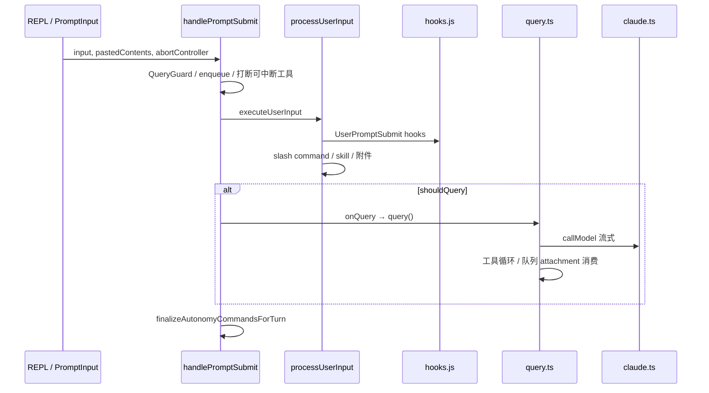
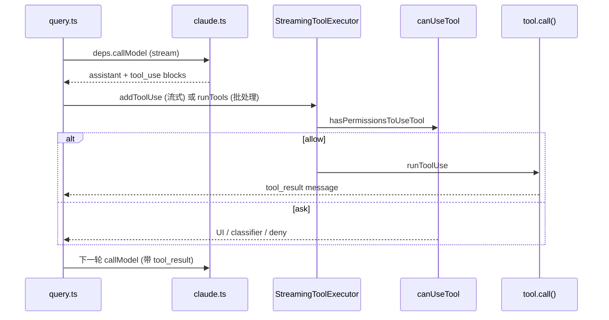

# Harness 实战指导

本文档面向**要改 Claude Code Best 运行时编排层**的开发者。这里的 **Harness** 不是某个文件名，而是：**包裹 LLM 的确定性执行层**——负责把用户输入变成消息、跑 Hook、管权限、排队、驱动 query 循环、收尾 autonomy 生命周期，并把 side channel（hints、telemetry）从模型可见文本里剥离。

功能开关与 `/slash` 用法见 [`docs/features/`](features/)；Hook 协议见 [`docs/extensibility/hooks.mdx`](extensibility/hooks.mdx)。本文讲**怎么读代码、怎么改、怎么测、踩哪些坑**。

---

## 目录

1. [Harness 是什么](#1-harness-是什么)
2. [两条运行时路径](#2-两条运行时路径)
3. [主调用链（REPL）](#3-主调用链repl)
4. [子系统地图](#4-子系统地图)
5. [Tool Harness 与权限管道（详解）](#5-tool-harness-与权限管道详解)
6. [关键契约（改之前必读）](#6-关键契约改之前必读)
7. [配置型 Harness：settings 与 Hooks](#7-配置型-harnessssettings-与-hooks)
8. [测试 Harness：怎么验证你的改动](#8-测试-harness怎么验证你的改动)
9. [实战场景 walkthrough](#9-实战场景-walkthrough)
10. [调试与排错](#10-调试与排错)
11. [延伸阅读](#11-延伸阅读)

---

## 1. Harness 是什么

### 1.1 分工

| 层 | 职责 | 典型文件 |
|----|------|----------|
| **模型** | 生成文本 / tool_use | `src/services/api/claude.ts` |
| **Harness** | 输入解析、队列、Hook、权限、turn 生命周期、消息规范化 | 见 §4 |
| **工具** | 执行副作用（读写文件、bash 等） | `packages/builtin-tools/` |

代码里出现 “harness” 时，通常指下面之一：

- **Prompt-submit harness**：`handlePromptSubmit` 包住一整轮用户输入
- **Autonomy harness**：`autonomyRuns` + `autonomyQueueLifecycle` 管理 scheduled/managed flow
- **Side-channel harness**：`claudeCodeHints` 从 shell 输出里剥 `<claude-code-hint />`
- **Test harness**：单测/集成测里构造 `ToolUseContext`、mock 依赖（非生产路径）
- **Tool harness**：工具注册、可见性、执行编排、`canUseTool` 权限管道（见 §5）
- **Eval harness**：GrowthBook 等通过 env 强制实验分组（`src/services/analytics/growthbook.ts`）

### 1.2 一句话原则

> **模型不能替你执行 “每当 X 就 Y”**——那必须写在 settings Hook 或 harness 代码里。`updateConfig` skill 的说明也强调：自动化行为由 harness 执行，不是 Claude 的记忆。

---

## 2. 两条运行时路径

同一套 harness 逻辑，有两种入口形态：

```
┌─────────────────────────────────────────────────────────────┐
│  交互式 REPL（TUI）                                            │
│  REPL.tsx → handlePromptSubmit → processUserInput → query    │
└─────────────────────────────────────────────────────────────┘

┌─────────────────────────────────────────────────────────────┐
│  Headless / pipe / SDK                                       │
│  main.tsx → cli/print.ts → （同源 processUserInput / query）   │
│  structuredIO.ts 处理 control 协议与 elicitation               │
└─────────────────────────────────────────────────────────────┘
```

| 路径 | 入口 | Harness 差异 |
|------|------|----------------|
| REPL | `src/screens/REPL.tsx` | `QueryGuard`、Ink UI、排队可视化 |
| Headless | `src/cli/print.ts` | 无 React；`structuredIO` 队列 |
| ACP | `--acp` | `src/services/acp/`，权限桥接 |
| 子进程 CLI 测 | `dist/cli.js` | 集成测用 build 产物（见 §7.3） |

**实战提示：** 改 `handlePromptSubmit` 或 `query.ts` 的 autonomy 消费逻辑时，**同时检查** `print.ts` 是否也有对称路径（见 `docs/internals/autonomy-jira.md`）。

---

## 3. 主调用链（REPL）

用户按 Enter 后，典型顺序：



### 3.1 关键函数

| 阶段 | 函数 | 文件 |
|------|------|------|
| 提交入口 | `handlePromptSubmit` | `src/utils/handlePromptSubmit.ts` |
| 单轮执行 | `executeUserInput` | 同上 |
| 输入语义 | `processUserInput` | `src/utils/processUserInput/processUserInput.ts` |
| Slash | `processSlashCommand` | `src/utils/processUserInput/processSlashCommand.tsx` |
| API 循环 | `query` / `queryLoop` | `src/query.ts` |
| 会话编排 | `QueryEngine` | `src/QueryEngine.ts` |

### 3.2 QueryGuard 与排队

- **`QueryGuard`**（`src/utils/QueryGuard.ts`）：同一时刻只允许一个 in-flight query；排队时 `reserve()` / `release()`。
- **`messageQueueManager`**：用户连续输入时先入队；`useQueueProcessor` 在 turn 结束后 `dequeue` 再进 `handlePromptSubmit`（带 `queuedCommands`）。
- **打断**：若仅有 “cancel-interrupt” 类工具在跑，新输入会 abort 当前 turn 并把输入重新入队——见 `handlePromptSubmit.test.ts`。

改排队逻辑时，读这三处：**`handlePromptSubmit`**、**`useQueueProcessor.ts`**、**`messageQueueManager.ts`**。

---

## 4. 子系统地图

§4 为索引；**Tool 注册 / 执行 / 权限白名单** 的完整梳理见 **[§5](#5-tool-harness-与权限管道详解)**（初版 §4.1 过简，易误以为 harness 不含权限管理）。

### 4.1 权限管道（摘要）

工具执行前不走模型，而走 harness 权限链（详见 §5.2–§5.4）：

```
tool_use 块完成
  → StreamingToolExecutor / runTools
  → canUseTool → hasPermissionsToUseTool
  → 规则匹配 (allow/deny/ask) + tool.checkPermissions
  → PermissionRequest / PreToolUse hooks / UI 或 classifier
  → runToolUse → tool.call()
```

改 “为什么这个工具被拦了” → **§5.4** 决策顺序表。

### 4.2 Hook 执行引擎

- 事件列表：`HOOK_EVENTS` in `src/entrypoints/sdk/coreTypes.ts`（27 种）
- 执行：`executeHooks` in `src/utils/hooks.ts`
- 用户提交：`executeUserPromptSubmitHooks` 在 `processUserInput` 里调用

Harness 对 Hook 的保证：

- 非 trusted workspace 会 **skip**（防 RCE）
- `CLAUDE_CODE_SIMPLE=1` 可关闭 Hook
- 同步/异步 Hook 有 timeout；结果可 **block** 提交或 **inject** 上下文

### 4.3 Autonomy 生命周期

Managed flow / HEARTBEAT / cron / proactive tick 会把 prompt **入队**为带 `autonomy.runId` 的 `QueuedCommand`。

| 模块 | 职责 |
|------|------|
| `autonomyRuns.ts` | run 状态机：queued → running → completed/failed/cancelled |
| `autonomyQueueLifecycle.ts` | turn 开始 claim、turn 结束 finalize |
| `handlePromptSubmit` | turn 结束后 `finalizeAutonomyCommandsForTurn` |
| `query.ts` | turn **中途** 从队列 drain 高优先级 command 作 attachment |

**两个 finalize 入口必须一致：**

1. 正常路径：`handlePromptSubmit` / `print.ts` 在 `processUserInput` 返回后 finalize  
2. 中途消费：`query.ts` 里 `claimConsumableQueuedAutonomyCommands` + turn 结束时 `finalizeAutonomyCommandsForTurn`

详见 `docs/internals/autonomy-jira.md`、`docs/agent/sur-loop-scheduled-oom.md`。

### 4.4 Claude Code Hints（side channel）

`src/utils/claudeCodeHints.ts`：

- Bash 等工具输出里可出现 `<claude-code-hint />`
- Harness **剥掉**后再把 stdout 给模型
- UI 侧最多展示一条 install 提示（plugin marketplace）

这是 **harness-only 通道**：模型看不见 hint 行。

### 4.5 Workload 与 profiling

- `runWithWorkload`（`handlePromptSubmit` 包住 turn）— 统计/归因用
- `queryCheckpoint` / `startQueryProfile` — 性能剖析；F5 调试时可对照

### 4.6 内部 harness 路径（文件系统）

`src/utils/permissions/filesystem.ts` 允许读取 **harness 控制目录**（session-memory、plans、tool-results 等），模型 arbitrary 读路径仍受规则约束。

---

## 5. Tool Harness 与权限管道（详解）

初版文档把 Tool 层写成「只有 `packages/builtin-tools/` 副作用」，**遗漏了 harness 对工具的注册、可见性、执行编排和权限治理**。下面按代码真实结构梳理。

### 5.1 三层分工

| 层 | 职责 | 关键文件 |
|----|------|----------|
| **工具实现** | `call()`、`checkPermissions()`、inputSchema | `packages/builtin-tools/src/tools/*/` |
| **Tool harness** | 组装工具列表、延迟加载、执行顺序、注入 `canUseTool` | `src/tools.ts`、`src/services/tools/*` |
| **Permission harness** | 白名单/黑名单/询问规则、模式、classifier、持久化 | `src/utils/permissions/*`、`useCanUseTool.tsx` |

模型只产生 `tool_use`；**能否执行、执行几次、并发与否** 全由 harness 决定。

### 5.2 工具注册与可见性（API 白名单）

```
src/tools.ts (getTools / 条件加载)
  → ToolUseContext.options.tools
  → claude.ts: toolToAPISchema → 发给模型的 tools 数组
  → query.ts: StreamingToolExecutor / runTools
```

| 机制 | 作用 |
|------|------|
| **`CORE_TOOLS`**（`src/constants/tools.ts`） | 延迟工具（SearchExtraTools）白名单：不在 CORE 的工具可 defer |
| **`ALL_AGENT_DISALLOWED_TOOLS`** | 子 Agent 禁止携带的工具黑名单 |
| **`tool.isEnabled()` / feature flag** | 运行时是否注册（如 SleepTool、MonitorTool） |
| **`allowedTools`（slash 返回）** | 单轮限制可用工具子集 |
| **MCP 动态工具** | 连接后注入；SearchExtraTools 按需 ExecuteExtraTool |

**注意：** API 里看到的 tools 列表 ≠ 会话里 `options.tools` 全集（延迟工具可能只在 ExecuteExtraTool 路径出现）。

### 5.3 工具执行 Harness（query 内）



| 组件 | 文件 | 说明 |
|------|------|------|
| 流式执行 | `StreamingToolExecutor.ts` | 边收 SSE 边排队；并发安全工具可并行 |
| 批处理 | `toolOrchestration.ts` → `runTools` | 非流式或 fallback 路径 |
| 单次执行 | `toolExecution.ts` → `runToolUse` | PreToolUse/PostToolUse Hook、实际 `call()` |
| 权限入口 | `useCanUseTool.tsx` | REPL 注入；headless 由 `print.ts` 注入等价 fn |

### 5.4 权限决策顺序（`hasPermissionsToUseToolInner`）

实现：`src/utils/permissions/permissions.ts`（约 1179 行起）。

| 步骤 | 检查 | 结果 |
|------|------|------|
| 1a | 工具级 **deny** 规则 | deny |
| 1b | 工具级 **ask** 规则 | ask（沙箱 auto-allow bash 可例外） |
| 1c | **`tool.checkPermissions()`** | 工具自定义（Bash 命令 pattern、路径安全等） |
| 1d–1g | deny / 强制交互 / 内容 ask / safetyCheck | 即使 bypass 模式也可能 ask |
| 2a | **`mode === bypassPermissions`**（或 plan+bypass 可用） | allow |
| 2b | 工具级 **allow** 规则 | allow |
| 3 | passthrough → **ask** | 弹 UI / classifier |
| 末尾 | **`dontAsk` 模式** | ask → deny |
| 末尾 | **`auto` 模式 + classifier** | yoloClassifier 代替人工 |

Hook 层：`PermissionRequest` / `PreToolUse` 在 UI 或 headless 路径上叠加（`executePermissionRequestHooks`、`hooks.ts`）。

### 5.5 「白名单」在代码里是什么

没有单独的 `whitelist.json`；**规则字符串 + 来源（destination）** 构成白名单/黑名单：

```json
// ~/.claude/settings.json 示例
{
  "permissions": {
    "allow": ["Bash(npm run:*)", "Read(./src/**)"],
    "deny": ["WebFetch"],
    "ask": ["Bash(git push:*)"]
  }
}
```

运行时载入为 `ToolPermissionContext`：

| 字段 | 含义 |
|------|------|
| `alwaysAllowRules` | allow 规则，按 source 分组 |
| `alwaysDenyRules` | deny 规则 |
| `alwaysAskRules` | ask 规则 |
| `mode` | `default` / `acceptEdits` / `plan` / `bypassPermissions` / `dontAsk` / `auto` |
| `additionalWorkingDirectories` | 额外可写目录 |

**规则来源（`PermissionRuleSource`）：**

| source | 持久化 | 典型场景 |
|--------|--------|----------|
| `userSettings` | 全局磁盘 | `/login`、用户批准「始终允许」 |
| `projectSettings` | 项目 `.claude/settings.json` | 团队共享 |
| `localSettings` | gitignore 本地 | 个人项目覆盖 |
| **`session`** | **仅内存，会话结束失效** | CLI `--permission-mode`、UI「本次会话允许」 |
| `cliArg` | 启动参数 | `--allowedTools` 等 |
| `command` / `policySettings` | 只读 | 企业策略、slash 注入 |

用户在权限 UI 选择：

- **`user_permanent`** → 写入 user/project/local settings（持久白名单）
- **`user_temporary`** → 写入 **`session` destination**（会话级，非 wall-clock TTL）
- **`user_reject`** → 拒绝本次

见 `PermissionPromptToolResultSchema.ts`、`permissionLogging.ts`。

### 5.6 「时效限制」在代码里是什么

**当前实现没有「规则 N 小时后过期」的 wall-clock TTL 字段**（`permissions/` 下无 `expiresAt`）。

时效由以下机制表达：

| 机制 | 行为 |
|------|------|
| **`destination: session`** | 进程/会话存活期间有效，重启 CLI 失效 |
| **`user_temporary` 批准** | 同上，不写磁盘 |
| **`user_permanent` 批准** | 持久到 settings，直到用户删除或 `removeRules` |
| **Auto 模式 classifier** | `DENIAL_LIMITS`：连续 deny ≥3 或累计 ≥20 次后 **fallback 到人工 prompt**（`denialTracking.ts`） |
| **Plan 模式 / acceptEdits** | 模式切换改变可写路径与 bypass 语义，非时间 TTL |
| **Sandbox** | 命令在沙箱内执行，与权限规则正交（`shouldUseSandbox`、`SandboxManager`） |

若产品上要「1 小时有效的 allow」，需要新增规则 schema + `permissionsLoader` 过期逻辑（当前未实现）。

### 5.7 与 settings / Hooks 的关系

| 配置 | Tool harness 作用 |
|------|-------------------|
| `permissions.allow/deny/ask` | 载入 `ToolPermissionContext` 规则集 |
| `permissions.defaultMode` | 初始 `mode` |
| `hooks.PreToolUse` | 可在工具执行前 block / modify |
| `hooks.PermissionRequest` | 权限对话框前后注入逻辑 |

复杂 allow 仍推荐走 settings + `updateConfig` skill，而非指望模型记忆。

### 5.8 Test-only 与 §6.3 的关系

`allowBackgroundForkedSlashCommands` 属于 **KAIROS 测试逃生口**，与 permissions 白名单无关；详见 [§6.3](#63-test-onlyallowbackgroundforkedslashcommands)。

---

## 6. 关键契约（改之前必读）

### 6.1 Deferred autonomy completion

**问题背景：** KAIROS 等 slash 会 **detach 后台任务** 但立刻从 `processUserInput` 返回。若 harness 马上 `finalizeAutonomyRunCompleted`，调度器会认为 run 已成功，下一 tick 可能叠多个 worker。

**契约：**

```ts
// slash 返回
{ deferAutonomyCompletion: true, ... }

// handlePromptSubmit 维护 deferredAutonomyRunIds，跳过这些 run 的 finalize
// 命令实现必须在后台结束时自行调用 finalizeAutonomyRunCompleted / Failed
```

涉及文件：

- `processSlashCommand.tsx`
- `handlePromptSubmit.ts`
- `processSlashCommand.test.ts`

### 6.2 Mid-turn queue drain（query.ts）

在 **已有 turn 进行中**，`query.ts` 可能通过 attachment 消费队列里的 autonomy 命令：

```ts
// query.ts（约 1826+ 行）
const queuedCommandsSnapshot = getCommandsByMaxPriority(...)
const queuedAutonomyClaim = await claimConsumableQueuedAutonomyCommands(...)
```

改 drain 逻辑时必须：

- stale run → `removeFromQueue`，**不要**发给模型
- consumed run → turn 结束时走 `finalizeAutonomyCommandsForTurn`
- 不要破坏 `markAutonomyRunRunning` 的 **terminal-safe** 转换（`autonomyRuns.test.ts`）

### 6.3 TEST-ONLY：`allowBackgroundForkedSlashCommands`

`ToolUseContext.options.allowBackgroundForkedSlashCommands`（`src/Tool.ts`）：

- **仅** 单测构造 context 时使用
- 生产仍要 `feature('KAIROS')` + `AppState.kairosEnabled`
- `processSlashCommand` 在 `NODE_ENV !== 'test'` 会拒绝此 flag

这是 **non-bundled test harness** 进入 KAIROS fork 路径的逃生口，不是功能开关。

### 6.4 Harness-science / Ablation

`src/entrypoints/cli.tsx` 顶部 `ABLATION_BASELINE`：在 **模块 import 前** 注入 env，因为 BashTool/AgentTool 会在 load 时 capture 常量。改 ablation 要放在 cli 入口，不要放到 `init.ts`。

---

## 7. 配置型 Harness：settings 与 Hooks

用户通过 `~/.claude/settings.json`（及项目级 `settings.local.json`）配置 harness 行为，**无需改 TS**：

| 配置 | Harness 行为 |
|------|----------------|
| `hooks` | 27 种事件触发命令 / prompt hook |
| `permissions` | allow/deny/ask 规则 |
| `env` | 注入 provider、feature env |
| `model` / `theme` | 会话默认值 |

**实战：** “每次 Stop 后执行脚本” → 配 `Stop` hook，不是写 memory。REPL 里可用 `/config` 或 Config 工具；复杂变更用 `updateConfig` skill。

Hook 匹配字段（如 `PreToolUse` 的 `tool_name`）见 SDK schema：`src/entrypoints/sdk/coreSchemas.ts`。

---

## 8. 测试 Harness：怎么验证你的改动

### 8.1 单元测试（in-process harness）

**模板：** `src/__tests__/handlePromptSubmit.test.ts`

```ts
// 最小参数面
await handlePromptSubmit({
  input: 'hello',
  mode: 'prompt',
  queryGuard: new QueryGuard(),
  helpers: { setCursorOffset, clearBuffer, resetHistory },
  onQuery: mock(...),
  getToolUseContext: mock(...),
  // ...
})
```

要点：

- 用 `tests/mocks/log.ts`、`tests/mocks/debug.ts` **共享 mock**
- **不要** mock 被测业务模块的上层（避免 `mock.module` 污染同目录其他测试）
- autonomy 相关：`createAutonomyQueuedPrompt`、`resetCommandQueue`

### 8.2 Slash / deferred completion 测试

`src/utils/processUserInput/__tests__/processSlashCommand.test.ts`（若存在）及 `sur-loop-scheduled-oom.md` 中的清单：

1. `allowBackgroundForkedSlashCommands: true` + `NODE_ENV=test`
2. 断言 `deferAutonomyCompletion` 时 **handlePromptSubmit 不 finalize**
3. 后台结束后命令自行 finalize

### 8.3 集成测试（subprocess harness）

`tests/integration/autonomy-lifecycle-user-flow.test.ts`：

- 用 **`dist/cli.js`** 子进程，不用 `src/entrypoints/cli.tsx`（cwd 下 path alias 会炸）
- CI 可能尚未 build → `beforeAll` 里 lazy `bun run build`
- 隔离 config：`CLAUDE_CONFIG_DIR` 指向 temp dir

**何时用集成测：** 跨进程、持久化 autonomy run、真实 CLI argv。

### 8.4 Eval harness（GrowthBook）

`growthbook.ts` 多处注释 **“for eval harnesses”**：

- 环境变量覆盖远程分组，保证 eval **确定性**
- 写 eval 脚本时优先 env override，而不是改生产默认

### 8.5 测试命令

```bash
bun test src/__tests__/handlePromptSubmit.test.ts
bun test src/utils/__tests__/autonomyRuns.test.ts
bun test tests/integration/autonomy-lifecycle-user-flow.test.ts
bun run precheck   # 提交前
```

---

## 9. 实战场景 walkthrough

### 场景 A：用户提交被 Hook 拦截

1. 在 `processUserInput` 找 `getUserPromptSubmitHookBlockingMessage`
2. 跟 `executeUserPromptSubmitHooks` → `executeHooks`
3. 本地复现：在 `settings.json` 加 `UserPromptSubmit` hook 打 log
4. 单测：mock `hooks.js` 返回 blocking message，断言 `shouldQuery === false`

### 场景 B：Autonomy 任务卡在 queued

1. `listAutonomyRuns()` / `listAutonomyFlows()` 看磁盘状态（项目 `.claude` 或 config dir）
2. 查是否只走了 `query.ts` mid-turn drain 却 **没 finalize**（AUT-001 类 bug）
3. 查 run 是否已被 cancel  yet  stale command 又 `markAutonomyRunRunning`
4. 跑 `autonomyRuns.test.ts` + 集成测

### 场景 C：Slash 命令后台跑但调度器狂叠 tick

1. 确认是否应设 `deferAutonomyCompletion: true`
2. 读 `handlePromptSubmit` 里 `deferredAutonomyRunIds`
3. 用 test harness flag 写回归测（§7.2）

### 场景 D：Headless pipe 与 REPL 行为不一致

1. 对比 `REPL.tsx` 与 `cli/print.ts` 传给 `processUserInput` / `onQuery` 的参数
2. 检查 `skipSlashCommands`、`bridgeOrigin`、`querySource`
3. 管道验证：`echo "..." | bun run dev -p`

### 场景 E：新增 Hook 事件或改 schema

1. 改 `coreSchemas.ts` → `bun scripts/generate-sdk-types.ts`
2. 在 `hooks.ts` 注册匹配逻辑
3. 更新 `docs/extensibility/hooks.mdx`

### 场景 F：改 query turn 内队列优先级

1. `messageQueueManager.getCommandsByMaxPriority`
2. `query.ts` attachment 合并逻辑
3. 回归：`handlePromptSubmit.test.ts` + 手动 REPL 连发两条消息

### 场景 G：工具被 deny / 白名单不生效

1. 读 `hasPermissionsToUseToolInner` 决策顺序（§5.4）——是 deny 规则、mode、还是 `tool.checkPermissions`
2. 打印 `appState.toolPermissionContext` 的 `alwaysAllowRules` / `mode`
3. 确认用户批准写的是 `session` 还是 `userSettings`（§5.5–§5.6）
4. Bash 类工具跟 `bashPermissions.ts` + `shellRuleMatching.ts`
5. 单测：`src/utils/permissions/__tests__/` 下对应用例

---

## 10. 调试与排错

| 目标 | 做法 |
|------|------|
| 跟 prompt-submit | F5 attach → `handlePromptSubmit` / `executeUserInput` 断点（见 [vscode-f5-debugging.md](vscode-f5-debugging.md)） |
| 跟 API turn | `query.ts` 的 `queryLoop` |
| 看 Hook 是否执行 | `DEBUG=1` / `logForDebugging`；或 Hook 脚本 stdout |
| Autonomy 状态 | 日志 + `listAutonomyRuns`；集成测 temp config dir |
| 排队问题 | `getCommandQueue()` 在测里断言；REPL 看 queue UI |
| 工具权限 | `hasPermissionsToUseTool` 断点；查 settings `permissions` 与 `mode`（§5） |

**常见误判：**

- 只改了 REPL 路径，headless 未改 → 线上 pipe/CI 仍坏
- 在 `bun run dev` 子进程里断点 query → 应改 F5 同进程
- 单测通过、集成失败 → 检查是否用了 `dist/cli.js` 与 config 隔离

---

## 11. 延伸阅读

| 文档 | 内容 |
|------|------|
| [practical-handbook.md](practical-handbook.md) | 源码开发总手册 |
| [vscode-f5-debugging.md](vscode-f5-debugging.md) | F5 断点调试 |
| [internals/autonomy-jira.md](internals/autonomy-jira.md) | Autonomy 生命周期审计与 AC |
| [agent/sur-loop-scheduled-oom.md](agent/sur-loop-scheduled-oom.md) | Deferred completion、KAIROS harness 设计 |
| [extensibility/hooks.mdx](extensibility/hooks.mdx) | Hook 协议 |
| [test-plans/openclaw-autonomy-baseline.md](test-plans/openclaw-autonomy-baseline.md) | 高成本 harness 测试范围 |

---

**维护：** 修改 `handlePromptSubmit`、`query.ts` autonomy 消费、`autonomyRuns` 状态机、**工具权限/执行管道**或 Hook 执行语义时，请同步更新本文 §5–§6 与 §9 场景。
