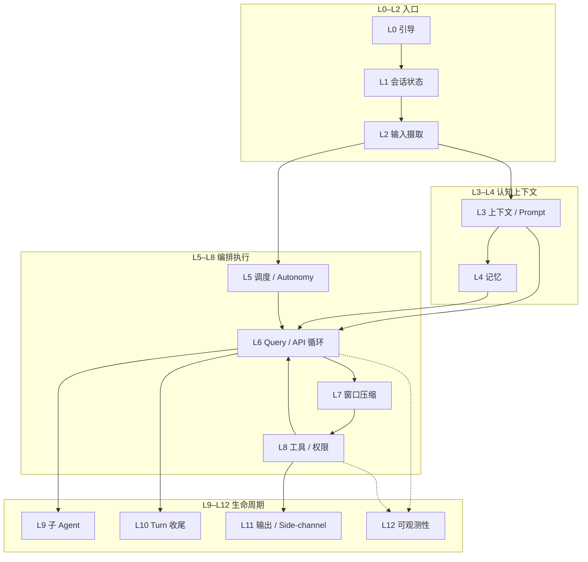
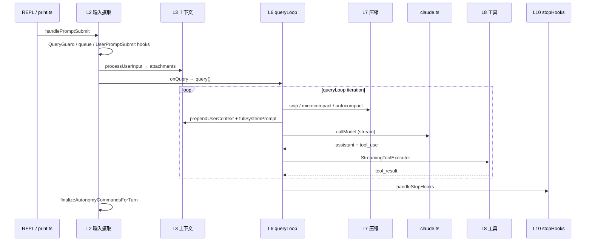
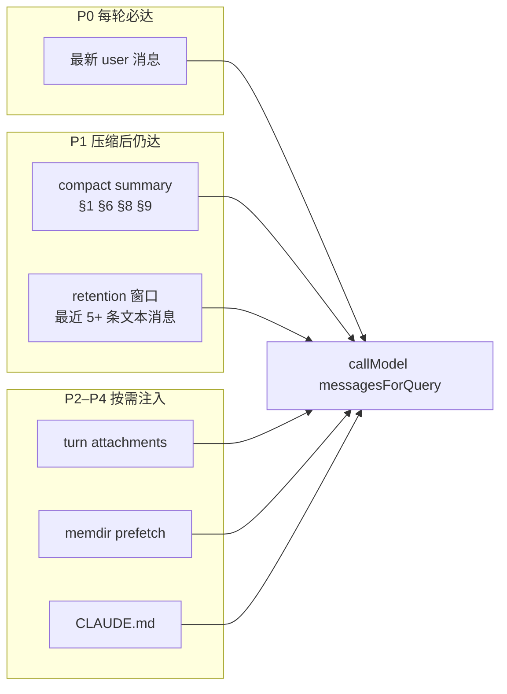

# Harness 实战指导 — 生产级智能体架构

本文档面向**要改 Claude Code Best 运行时编排层**的开发者。这里的 **Harness** 不是某个文件名，而是：**包裹 LLM 的确定性执行层**——在模型不可控的生成之外，保证输入解析、上下文、权限、工具、调度、压缩、收尾等行为**可预测、可测试、可运维**。

功能开关与 `/slash` 用法见 [`docs/features/`](features/)；Hook 协议见 [`docs/extensibility/hooks.mdx`](extensibility/hooks.mdx)。环境搭建与日常命令见 [`practical-handbook.md`](practical-handbook.md)。

---

## 目录

**Part I — 架构总览**

1. [设计原则与分层模型](#1-设计原则与分层模型)
   - [1.4 十二层核心特性速览](#14-十二层核心特性速览)
2. [端到端生命周期](#2-端到端生命周期)
   - [2.1 生命周期：五段式与层对应](#21-生命周期五段式与层对应)
3. [运行时形态（REPL / Headless / ACP）](#3-运行时形态repl--headless--acp)
   - [3.1 三入口：同一 Harness，不同 I/O 壳](#31-三入口同一-harness不同-io-壳)

**Part II — 各层 Harness 方案（按生产链路顺序）**

4. [L0 引导与入口 Harness](#4-l0-引导与入口-harness)
5. [L1 会话状态 Harness](#5-l1-会话状态-harness)
6. [L2 输入摄取 Harness](#6-l2-输入摄取-harness)
7. [L3 上下文与 Prompt Harness](#7-l3-上下文与-prompt-harness)
   - [7.8 长对话：意图识别与关键信息传递](#78-长对话意图识别与关键信息传递)
8. [L4 记忆 Harness](#8-l4-记忆-harness)
9. [L5 调度与 Autonomy Harness](#9-l5-调度与-autonomy-harness)
10. [L6 推理循环 Harness（Query / API）](#10-l6-推理循环-harnessquery--api)
11. [L7 上下文窗口 Harness（压缩）](#11-l7-上下文窗口-harness压缩)
12. [L8 工具与权限 Harness](#12-l8-工具与权限-harness)
13. [L9 子 Agent Harness](#13-l9-子-agent-harness)
14. [L10 Turn 收尾 Harness](#14-l10-turn-收尾-harness)
15. [L11 输出与 Side-Channel Harness](#15-l11-输出与-side-channel-harness)
16. [L12 可观测性 Harness](#16-l12-可观测性-harness)

**Part III — 横切能力**

17. [配置型 Harness：Settings 与 Hooks](#17-配置型-harnesssettings-与-hooks)
18. [关键契约（改之前必读）](#18-关键契约改之前必读)
19. [测试 Harness](#19-测试-harness)
20. [调试与排错索引](#20-调试与排错索引)

**Part IV — 实战手册**

21. [分层典型案例库（L0–L12 + 横切）](#21-分层典型案例库l0l12--横切)
22. [场景 Playbook（按症状索引）](#22-场景-playbook按症状索引)
23. [改代码检查清单（按层）](#23-改代码检查清单按层)
24. [延伸阅读](#24-延伸阅读)

---

# Part I — 架构总览

## 1. 设计原则与分层模型

### 1.1 模型 vs Harness vs 工具

| 层 | 职责 | 谁保证确定性 |
|----|------|--------------|
| **模型** | 生成文本 / `tool_use` 意图 | 概率性，不可依赖 |
| **Harness** | 编排、 gate、压缩、权限、队列、生命周期 | **必须 100% 代码保证** |
| **工具** | 副作用（读写、bash、MCP 等） | 工具实现 + Harness 权限管道 |

### 1.2 核心原则

> **「每当 X 就 Y」不能交给模型或 memory——必须写在 Harness 代码、settings Hook 或策略配置里。**

`updateConfig` skill 的说明与此一致：自动化行为由 harness 执行，不是 Claude 的「记忆」。

### 1.3 十二层 Harness 模型

生产级智能体在本仓库中按 **L0–L12** 分层；下层为上层提供不变量，上层不得绕过下层 gate。



| 层 | Harness 名称 | 一句话 |
|----|--------------|--------|
| L0 | 引导与入口 | 快速路径、init、feature 注入 |
| L1 | 会话状态 | sessionId、CWD、AppState 单例 |
| L2 | 输入摄取 | 提交、排队、Hook、slash |
| L3 | 上下文 / Prompt | CLAUDE.md、system prompt、attachment |
| L4 | 记忆 | memdir、extract、prefetch、session-memory |
| L5 | 调度 / Autonomy | cron、HEARTBEAT、run 状态机 |
| L6 | Query / API | `queryLoop`、流式、provider |
| L7 | 窗口压缩 | snip → microcompact → autocompact |
| L8 | 工具 / 权限 | 注册、执行、allow/deny/ask |
| L9 | 子 Agent | fork、工具黑名单、trace 归属 |
| L10 | Turn 收尾 | stopHooks、后台 agent、shutdown |
| L11 | 输出 / Side-channel | hints 剥离、headless 协议 |
| L12 | 可观测性 | Langfuse、checkpoint、analytics |

**横切：** §17 Settings/Hooks、§18 契约、§19 测试——作用于多层。

### 1.4 十二层核心特性速览

读任意一层细节前，先用下表建立「**这层保证什么、不保证什么**」的心智模型。详细机制与案例见各层 **§X.0 核心特性** 与 Part IV §21。

| 层 | Harness 回答的核心问题 | 关键不变量（每当 X → Y） | 常见误区 | 一条例子 |
|----|----------------------|--------------------------|----------|----------|
| **L0** | 进程如何以正确 capability 启动 | 快速路径 → 最小 import；ablation env → **早于**工具模块 load | 以为 runtime env 能打开 build 已 tree-shake 的 feature | `--version` 瞬时返回，REPL 慢路径加载完整 harness |
| **L1** | 「这是哪次会话、在哪个目录」 | `sessionId` 进程内稳定；改 CWD → 同步 permission working dirs | 在 React state 里另存 session 路径，与 bootstrap 单例不一致 | `/resume` 后 memdir 写到 `getProjectDir(cwd)` 下 |
| **L2** | 用户输入如何不丢、不并发乱序 | 同时仅 1 个 in-flight query；连发 → 入队 → turn 结束 dequeue | 模型还在跑时以为新输入一定排队（不可 interrupt 工具时会阻塞） | 连发三条 Enter，三条都执行，顺序 harness 保证 |
| **L3** | 模型窗口里装什么 context | UI 保留 full transcript；API 只看 slice + 注入；超窗 → **代码** pipeline 丢/留 | 让模型自己决定删历史；把 UI 历史当 API 视图 | `/context` 看到的比聊天面板短 |
| **L4** | 跨轮/跨 session 知识如何外化再拉回 | 大段知识 → 磁盘；进窗口 → prefetch/索引，有 cap | 把 MEMORY.md 当无限 system prompt；extract 当同步阻塞 | turn 结束 extract 写 sidecar，下轮 prefetch 注入 |
| **L5** | 谁触发下一轮 work | cron/HEARTBEAT → **入队** QueuedCommand，非模型 self-schedule | mid-turn drain 与 turn 结束 finalize 不一致 → stuck | KAIROS 后台需 `deferAutonomyCompletion` |
| **L6** | 一次 user turn 内 API↔工具如何循环 | 每 iteration 先 L7 再 callModel；`query()` finally 必 cleanup | 在 `claude.ts` 里加压缩或 autonomy 逻辑 | tool loop 10 次后 stopHook block 续跑 |
| **L7** | token 满了丢什么、留什么 | pipeline 顺序固定（§7.4）；SM compact 优先于 full compact | 改 microcompact 未传 `snipTokensFreed` → 阈值误判 | 对话中途变 summary → autocompact 触发 |
| **L8** | 模型 tool_use 能否变成副作用 | deny > allow；hook 可改 input；子 agent 有黑名单 | 以为用户点过一次 allow 就永久全局生效（session 级会重启失效） | deny 规则挡掉已 session-allow 的 bash |
| **L9** | 子 agent 与主线程如何隔离 | `agentId` gate 主线程-only 任务；子 compact 不清 parent cache | 子 agent 拥有与主 agent 相同工具集 | extractMemories 仅 `!agentId` |
| **L10** | turn「表面结束」后还要做什么 | 无 pending tool → stopHooks；extract 异步；headless 需 drain | pipe 脚本 exit 早于 extract promise | `-p` 模式 memdir 空 → 未 drain |
| **L11** | 什么给 UI、什么给模型 | hint / structuredIO **默认**不进 model-visible | UI 底部 install 提示 ≠ 模型已知 | 模型说「无法安装 plugin」但 UI 有 hint 条 |
| **L12** | 如何观测而不改变语义 | trace end/flush 在 finally；eval 用 env 固定分组 | Langfuse span 泄漏当成功（RSS 涨） | F5 用 checkpoint 对比 snip vs API 耗时 |

**读法建议：** Part II 按 L0→L12 顺序改代码；Part IV §22 按**症状**反查层。

---

## 2. 端到端生命周期

用户按 Enter（或 pipe 一行输入）到 turn 结束，Harness 保证的顺序：



| 阶段 | 关键入口 | 文件 |
|------|----------|------|
| 提交 | `handlePromptSubmit` | `src/utils/handlePromptSubmit.ts` |
| 语义解析 | `processUserInput` | `src/utils/processUserInput/processUserInput.ts` |
| API 循环 | `query` / `queryLoop` | `src/query.ts` |
| 会话编排 | `QueryEngine` | `src/QueryEngine.ts` |
| 单次 API | `queryModelWithStreaming` | `src/services/api/claude.ts` |

### 2.1 生命周期：五段式与层对应

用户一次 Enter 在 Harness 眼里是五段，**段边界即调试断点**：

| 段 | 做什么 | 主要层 | 典型断点 / 日志 |
|----|--------|--------|-----------------|
| **① 摄取** | 互斥、Hook、slash、入队 | L0–L2 | `handlePromptSubmit`、`QueryGuard` |
| **② 组装** | attachments、user context、prefetch | L3–L4 | `processUserInput`、`getAttachmentMessages` |
| **③ 循环** | 压缩 → API → 工具 → 再压缩 | L6–L8、L7 | `queryLoop`、`query_snip_start` |
| **④ 分支** | 子 agent fork | L9 | `runForkedAgent` |
| **⑤ 收尾** | stopHooks、extract、autonomy finalize | L5、L10 | `stopHooks.ts`、`finalizeAutonomyCommandsForTurn` |

**Invariant：** ② 只在 user turn 开始时跑全量 attachment；③ 每个 **queryLoop iteration** 都重跑 L7，因 tool result 会撑 token。

---

## 3. 运行时形态（REPL / Headless / ACP）

同一套 L0–L12 逻辑，三种入口壳：

| 形态 | 入口 | Harness 差异 |
|------|------|--------------|
| **REPL** | `REPL.tsx` | `QueryGuard`、Ink 权限 UI、排队可视化 |
| **Headless** | `cli/print.ts` | 无 React；`structuredIO` 队列与 elicitation |
| **ACP** | `--acp` | `src/services/acp/`，`createAcpCanUseTool` 权限桥 |
| **集成测** | `dist/cli.js` 子进程 | 见 §19.3 |

**Invariant：** 改 `handlePromptSubmit` 或 `query.ts` 的 autonomy / 队列逻辑时，**必须对称检查** `print.ts`（见 `docs/internals/autonomy-jira.md`）。

### 3.1 三入口：同一 Harness，不同 I/O 壳

| 能力 | REPL | Headless (`print.ts`) | ACP |
|------|------|----------------------|-----|
| 用户输入 | Ink `PromptInput` | stdin / structuredIO | ACP session |
| 权限 ask | Ink 对话框 | elicitation / `--permission-mode` | `createAcpCanUseTool` |
| 排队可视化 | UI 队列条 | 无（逻辑仍在） | 依客户端 |
| extract drain | REPL shutdown | **`drainPendingExtraction` 必调** | 同 REPL 路径 |
| 集成测基准 | 可选 | **`dist/cli.js` 子进程** | — |

**核心特性：** 业务 invariant（L2 排队、L5 finalize、L8 权限序）在三种入口**必须一致**；差异只在 **I/O 呈现**。改 REPL 未改 `print.ts` 是最高频的生产 bug 类（→ Playbook D）。

---

# Part II — 各层 Harness 方案

每层统一结构：**§X.0 核心特性**（问题 / 不变量 / 误区 / 例子）→ 职责与文件 → Harness 保证 → 实战 → 案例索引（细节在 §21）。

## 4. L0 引导与入口 Harness

L0 决定 **进程以什么 capability 启动**——feature 集、ablation 基线、是否加载完整 REPL。这一层的问题若错了，后面 L1–L12 全部在错误前提下运行。

### 4.0 核心特性

| 维度 | 内容 |
|------|------|
| **回答的问题** | 这条命令走快速路径还是全量 harness？哪些代码在 build 里被编译期剪掉？ |
| **关键不变量** | `feature('X')` 仅在 `if`/三元中（Bun DCE）；ablation env 在 `cli.tsx` **任何工具 import 之前**；新子命令默认走快速路径 unless 需要 REPL |
| **常见误区** | 只在 `dev.ts` 开 feature、未改 `build.ts` → 生产无功能；把 ablation 写进 `init.ts` → 工具常量已 capture |
| **例子** | 对照 `bun run dev` 与 `node dist/cli.js`：同一 flag，dev 有、`dist` 无 → L0-1 |

### 4.1 职责

- 零模块快速路径（`--version`）
- 一次性 init（telemetry、config、trust）
- Feature / MACRO 注入（dev vs build）
- Ablation 基线 env（须在 import 工具模块**之前**）

### 4.2 关键文件

| 文件 | 作用 |
|------|------|
| `src/entrypoints/cli.tsx` | 快速路径分发 → `main.tsx` |
| `src/entrypoints/init.ts` | 一次性初始化 |
| `src/main.tsx` | Commander 子命令注册 |
| `scripts/dev.ts` / `build.ts` | `feature()` 默认集 |
| `scripts/defines.ts` | 版本等 MACRO |

### 4.3 Harness 保证

- `feature('X')` **只能**出现在 `if` 或三元条件位（Bun 编译器限制）
- `ABLATION_BASELINE` 在 `cli.tsx` 顶部——BashTool/AgentTool 在 load 时 capture 常量，不能挪到 `init.ts`
- 快速路径命令不加载完整 REPL harness，避免 RSS 暴涨

### 4.4 实战

| 任务 | 做法 |
|------|------|
| 新子命令快速路径 | 在 `cli.tsx` `main()` 优先级链插入，feature-gate |
| 新 feature 默认值 | 改 `scripts/dev.ts` + `build.ts` `DEFAULT_BUILD_FEATURES` |
| Ablation 实验 | env 注入放 `cli.tsx`，勿依赖运行时 settings |

### 4.5 典型案例

→ 完整步骤见 [§21.1 L0 案例](#211-l0-引导与入口)

| 案例 | 一句话 |
|------|--------|
| [L0-1](#案例-l0-1-dev-有-feature生产-build-没有) | dev 有 feature、dist 没有 |
| [L0-2](#案例-l0-2-ablation-实验对照组行为不对) | Ablation env 注入太晚 |
| [L0-3](#案例-l0-3-子命令走了完整-repl-启动慢) | 新命令未走快速路径 |

---

## 5. L1 会话状态 Harness

L1 是 **进程级身份与坐标系**：sessionId、CWD、projectRoot 决定 transcript、memdir、plans、权限 working dir 写到哪里。**Harness 路径都挂 L1 单例，不能在各层另起一套。**

### 5.0 核心特性

| 维度 | 内容 |
|------|------|
| **回答的问题** | 这次会话的 ID 是什么？文件副作用相对哪条路径？resume 后状态从哪恢复？ |
| **关键不变量** | `getSessionId()` 进程内稳定；`getProjectDir(getCwd())` 编码 canonical 项目路径；**改 CWD → 必须同步** `additionalWorkingDirectories` |
| **常见误区** | 在组件 state 缓存 project 路径，与 `bootstrap/state.ts` 漂移；单测不 mock L1 → 并行污染 |
| **例子** | monorepo 里 `cd packages/foo` 后 Write 被拒 → CWD 变、working dir 未扩（L1-2） |

### 5.1 职责

- 全局单例：`sessionId`、`cwd`、`projectRoot`、model override
- `AppState`（messages、permissions、MCP、tools）
- 会话持久化路径（`.claude/projects/...`）

### 5.2 关键文件

| 文件 | 作用 |
|------|------|
| `src/bootstrap/state.ts` | 模块级 session 单例 |
| `src/state/AppState.tsx` / `AppStateStore.ts` | React 侧状态 |
| `src/state/store.ts` | Zustand-style store |
| `src/utils/sessionStorage.ts` | 项目目录编码 |

### 5.3 Harness 保证

- `getSessionId()` 在整个进程内稳定；harness 路径（session-memory、plans）都挂 sessionId
- 改 CWD / project root 时必须同步 permission working directories
- 测试 mock 链：`log.ts` / `debug.ts` → `bootstrap/state.ts` 有模块加载副作用

### 5.4 实战

| 症状 | 排查 |
|------|------|
| 会话 resume 后路径错 | `sessionStorage` + `getProjectDir` |
| 权限 working dir 不对 | `bootstrap/state` 的 CWD vs `additionalWorkingDirectories` |
| 单测随机 UUID 污染 | mock `bootstrap/state` 或使用 `tests/mocks/` |

### 5.5 典型案例

→ [§21.2 L1 案例](#212-l1-会话状态)

| 案例 | 一句话 |
|------|--------|
| [L1-1](#案例-l1-1-resume-后会话文件写到错误项目目录) | `/resume` 后 memdir 路径错 |
| [L1-2](#案例-l1-2-cd-子目录后-write-被拒绝) | CWD 变了 working dir 未同步 |
| [L1-3](#案例-l1-3-并行单测-sessionid-互相污染) | 单测 session 泄漏 |

---

## 6. L2 输入摄取 Harness

L2 保证 **用户表达如何变成一次（且仅一次）可执行的 query 请求**——含排队、Hook 拦截、slash 分流、可中断工具的 abort 语义。

### 6.0 核心特性

| 维度 | 内容 |
|------|------|
| **回答的问题** | 这条输入现在能进模型吗？被 Hook 挡了还是入队了？slash 会不会触发 API？ |
| **关键不变量** | `QueryGuard`：同时 **1** 个 in-flight query；连发 → `messageQueueManager` → turn 结束 `dequeue`；untrusted workspace **不跑** Hook |
| **常见误区** | 以为「模型在跑」时任何新输入都会排队——不可 interrupt 的工具在跑时会阻塞或需 abort 分支 |
| **例子** | 工具循环中用户 steering「先写测试」：若未 abort，需等当前 turn 结束才 dequeue；P0 意图仍完整进下一条 user 消息（→ §7.8） |

**与 L3 交界：** `processUserInput` 输出 user message + `shouldQuery`；attachments 在 `shouldQuery === true` 时进入 L3。

### 6.1 职责

- 串行化用户输入（`QueryGuard`）
- 排队与 dequeue（`messageQueueManager`）
- UserPromptSubmit / slash / skill 分发
- 打断可中断工具

### 6.2 数据流

```
PromptInput → handlePromptSubmit → executeUserInput → processUserInput
  ├─ executeUserPromptSubmitHooks (可 block)
  ├─ processSlashCommand
  └─ shouldQuery ? onQuery → query()
→ finalizeAutonomyCommandsForTurn
```

### 6.3 关键文件

| 组件 | 文件 |
|------|------|
| 提交入口 | `src/utils/handlePromptSubmit.ts` |
| 排队 | `src/utils/messageQueueManager.ts`、`useQueueProcessor.ts` |
| 互斥 | `src/utils/QueryGuard.ts` |
| Slash | `processSlashCommand.tsx` |

### 6.4 Harness 保证

- **同一时刻只有一个 in-flight query**（`QueryGuard.reserve/release`）
- 连续输入先入队；turn 结束后 `dequeue` 再进 `handlePromptSubmit`（带 `queuedCommands`）
- 仅 cancel-interrupt 类工具在跑时，新输入 abort 当前 turn 并重新入队
- 非 trusted workspace：**跳过** Hook 执行（防 RCE）

### 6.5 实战

改排队逻辑必读：**`handlePromptSubmit`**、**`useQueueProcessor.ts`**、**`messageQueueManager.ts`**。

单测模板：`src/__tests__/handlePromptSubmit.test.ts`。

### 6.6 典型案例

→ [§21.3 L2 案例](#213-l2-输入摄取)

| 案例 | 一句话 |
|------|--------|
| [L2-1](#案例-l2-1-连发三条消息只执行了第一条) | 排队未 dequeue |
| [L2-2](#案例-l2-2-userpromptsubmit-hook-拦截但-ui-无提示) | Hook block 无反馈 |
| [L2-3](#案例-l2-3-模型还在跑用户新输入被吞) | QueryGuard 与 interrupt 语义 |
| [L2-4](#案例-l2-4-slash-命令未触发-query) | `shouldQuery === false` 路径 |

---

## 7. L3 上下文与 Prompt Harness

L3 负责 **上下文资产管理**：计量窗口占用、组装 API payload、以及在超窗时按 deterministic pipeline 丢弃/摘要——**不是**让模型自己决定删什么。

> **与 L7 的关系：** §7.4 是完整治理 pipeline（含压缩）；§11 展开各 compressor 函数参数与边界条件。改窗口行为时两层同读。

### 7.0 核心特性

| 维度 | 内容 |
|------|------|
| **回答的问题** | 本轮 API 请求里有哪些 bytes？超窗时删谁留谁？compact 后如何补回 plan/文件？ |
| **关键不变量** | **双视图**：UI/transcript 全保留，API 只看 `messagesForQuery`；六类 bytes（§7.2）分工明确；compact 后 `buildPostCompactMessages` 顺序固定 |
| **常见误区** | 聊天面板历史 = 模型所见；改 CLAUDE.md 未清 memoize；把 microcompact 当「丢 user 消息」 |
| **例子** | 用户改口仍做旧任务 → 查 P0 最新 user + summary §8/§9（§7.8、L3-7） |

### 7.1 双层视图：Transcript vs API-facing

| 视图 | 存储 | 读者 | 作用 |
|------|------|------|------|
| **Full transcript** | REPL `messages`、磁盘 transcript | UI、resume、extractMemories | 用户可见全历史 |
| **API-facing slice** | 每轮 `messagesForQuery` | `callModel` | 实际进模型窗口 |

每轮 `queryLoop` iteration 入口：

```typescript
// src/query.ts ~522
let messagesForQuery = getMessagesAfterCompactBoundary(messages)
```

`getMessagesAfterCompactBoundary`（`src/utils/messages.ts:5057`）从 **最后一个 compact boundary** 起切片；若 `HISTORY_SNIP` 开启，再经 `projectSnippedView` 去掉 snip 登记的 UUID。**UI 保留 full transcript，模型只看 slice。**

### 7.2 进入窗口的六类 bytes

| # | 类别 | 代码入口 | 刷新频率 |
|---|------|----------|----------|
| 1 | System prompt | `getSystemPrompt()` + `appendSystemContext` | MCP/工具变 → delta attachment |
| 2 | User context | `prependUserContext(getUserContext())` | memoize；compact 后清 cache |
| 3 | Turn attachments | `getAttachmentMessages()` | 每个 user turn |
| 4 | 对话历史 | boundary slice + §7.4 pipeline | 每个 iteration |
| 5 | Prefetch 结果 | memory/skill prefetch await 后注入 | 每个 user turn |
| 6 | Tools schema | `toolToAPISchema` | defer/MCP 变 → delta |

**静态注入**（`src/utils/api.ts:443`）：`claudeMd` → `<project-instructions>`；其余 context → `<system-reminder>` meta。**`NODE_ENV=test` 时 prepend 直接 return**——单测不测注入，用集成测或 dev 手动验证。

### 7.3 Token 账本：如何判定「快满了」

**计量函数：** `tokenCountWithEstimation(messages)` — `src/utils/tokens.ts:251`

逻辑摘要：

1. 从尾部找最近带 API `usage` 的 assistant
2. 同一 response 拆多条 assistant 时 **walk back 相同 `message.id`**（否则漏计 interleaved tool_result）
3. `usage 总量 + roughTokenCountEstimation(usage 之后的新消息)`

**有效窗口上限：**

```typescript
// src/services/compact/autoCompact.ts:33
getEffectiveContextWindowSize(model)
  = getContextWindowForModel(model) - min(maxOutput, 20_000)
  // 可被 CLAUDE_CODE_AUTO_COMPACT_WINDOW cap
```

**Autocompact 触发线：**

```typescript
// autoCompact.ts:101
getAutoCompactThreshold(model)
  = getEffectiveContextWindowSize(model) - getAutocompactBufferTokens(model)
  // buffer: 13k / 30k / 50k（按窗口大小）
```

**硬阻断**（auto-compact 关闭时，`query.ts:820`）：`calculateTokenWarningState` → `isAtBlockingLimit` → yield `PROMPT_TOO_LONG_ERROR_MESSAGE`，`return { reason: 'blocking_limit' }`。

**调试 env：** `CLAUDE_AUTOCOMPACT_PCT_OVERRIDE`、`DISABLE_AUTO_COMPACT`、`CLAUDE_CODE_BLOCKING_LIMIT_OVERRIDE`。日志：`autocompact: tokens=… threshold=… snipFreed=…`（`shouldAutoCompact`）。

### 7.4 窗口治理 Pipeline（`query.ts` 522–650，不可乱序）

```
getMessagesAfterCompactBoundary
  → 删除 stale toolUseResult（RSS，~530）
  → applyToolResultBudget          // toolResultStorage.ts:925
  → snipCompactIfNeeded            // snipTokensFreed → autocompact
  → microcompact
  → contextCollapse?（先于 autocompact）
  → autocompact（先 trySessionMemoryCompaction）
  → blocking_limit 检查（~820，compact 刚发生则 skip）
  → prependUserContext + callModel
```

#### 各阶段：丢什么、留什么、如何补回

| 阶段 | 代码 | 丢失/替换 | 保留/恢复 |
|------|------|-----------|-----------|
| toolUseResult 删对象 | `query.ts:530` | 内存 raw output | API `tool_result` block 仍在 |
| tool result budget | `applyToolResultBudget` | 超大 result → stub 字符串 | transcript `ContentReplacementRecord` 可 resume |
| snip | `snipCompact.ts` | `removedUuids` 消息 | boundary 记录；文件/plan 应已外化 |
| microcompact | `microCompact.ts` | 旧 Read/Bash/Grep… **内容** → cleared 文案 | 最近 5 个 tool（cached MC `keepRecent`）；磁盘文件可再 Read |
| session-memory compact | `sessionMemoryCompact.ts` | prune 老 messages | `session-memory/summary.md` + ≥5 text messages |
| full autocompact | `compactConversation` | **全部** pre-boundary 对话 | **summary** + post-compact attachments（§7.5） |
| blocking | `query.ts:824` | 拒绝 API | 用户手动 `/compact` |

**snip 与阈值：** snip 后 surviving assistant 的 `usage` 仍反映 pre-snip 大小，故：

```typescript
// autoCompact.ts:254
const tokenCount = tokenCountWithEstimation(messages) - snipTokensFreed
```

**microcompact 白名单**（`microCompact.ts:41`）：Read、Shell、Grep、Glob、WebSearch、WebFetch、Edit、Write——Agent/MCP 不在内。

### 7.5 Compact 后「有用信息」恢复包

Full compact **无 `messagesToKeep`**（与 partial compact 不同）。靠 summary + 刻意 re-inject：

```typescript
// compact.ts:336 — 顺序固定
buildPostCompactMessages: boundary → summary → messagesToKeep? → attachments → hooks
```

`compactConversation` 成功后主动恢复（`compact.ts` 541–612）：

| 恢复项 | 函数 |
|--------|------|
| 最近读过文件 | `createPostCompactFileAttachments`（有上限） |
| 当前 plan | `createPlanAttachmentIfNeeded` |
| Plan mode | `createPlanModeAttachmentIfNeeded` |
| 已用 skill | `createSkillAttachmentIfNeeded` |
| 工具/Agent/MCP delta | `getDeferredToolsDeltaAttachment` 等（对空 history 全量 re-announce） |
| CLAUDE.md 刷新 | `runPostCompactCleanup` → `getUserContext.cache.clear()` |
| 磁盘 transcript | **不删**；仅 API slice 变短 |

Summary 由 `runForkedAgent` + `getCompactPrompt` 生成；compact 请求 PTL 时 `truncateHeadForPTLRetry`（CC-1180）。

### 7.6 CLAUDE.md 与静态 context

`getUserContext`（`context.ts:155`）→ `getClaudeMds(filterInjectedMemoryFiles(await getMemoryFiles()))`。

| env | 行为 |
|-----|------|
| `CLAUDE_CODE_DISABLE_CLAUDE_MDS=1` | 硬关 |
| `--bare` 且无 `--add-dir` | 跳过 walk |
| `--add-dir` | 显式目录仍加载 |

用户查看当前 API 视图：`/context` → `getMessagesAfterCompactBoundary(messages)`（`commands/context/context.tsx`）。

### 7.7 典型案例（代码入口）

→ 逐步操作见 [§21.4](#214-l3-上下文与-prompt)

| 案例 | 先读哪里 |
|------|----------|
| [L3-1](#案例-l3-1-claudemd-修改不生效) | `postCompactCleanup.ts` |
| [L3-5](#案例-l3-5-如何读当前-token-占用) | `tokenCountWithEstimation` |
| [L3-6](#案例-l3-6-compact-后-plan-丢失) | `createPlanAttachmentIfNeeded` |
| [L3-7](#案例-l3-7-长对话中用户改口模型仍按旧任务做) | `prompt.ts` compact 结构 + boundary slice |
| [L3-8](#案例-l3-8-几十轮后模型忘了早期约束) | L4 prefetch + post-compact 恢复包 |
| [L7-1](#案例-l7-1-对话中途突然变摘要) | `shouldAutoCompact` |

### 7.8 长对话：意图识别与关键信息传递

对话超过几十轮后，full transcript 往往进不了 API 窗口。Harness 必须**确定性**回答两件事：

1. **本轮用户真正想做什么**（意图，含改口、 steering、续做旧任务）
2. **哪些早期信息不能丢**（架构约束、用户否决项、进行中的 plan）

> **常见误区：** 意图识别不是单独的「分类器服务」。本仓库没有 `classifyUserIntent()` 这类入口——意图是 **L2 最新输入 + L3 注入 + L7 摘要结构 + L4 外化** 叠加后，模型在窗口内看到的**信号组合**。改 Harness 时要想的是「哪些信号必须进窗口、以什么优先级」，而不是「让模型自己从历史里猜」。

#### 7.8.1 意图信号：Harness 保证的优先级

| 优先级 | 信号来源 | 层 | 代码 / 机制 | Harness 保证什么 |
|--------|----------|-----|-------------|------------------|
| **P0** | 当前 user 消息原文 | L2 | `processUserInput` → 进入 `messages` | 每轮完整保留在 transcript；在 retention 窗口内**原样**进 API slice |
| **P1** | 对话弧线的显式约束 | L7 | `getCompactPrompt()` 摘要 §1/§6/§8/§9 | 压缩后旧轮次变为 summary user message，但 prompt **强制**列出全部 user 消息、Primary Request、Current Work，且 §9 要求**逐字引用**最近对话 |
| **P2** | 结构化任务状态 | L3 | `getAttachmentMessages` | plan / plan mode / @文件 / IDE 选区 / invoked skill 等 attachment，每 user turn 刷新 |
| **P3** | 跨轮偏好与架构 | L4 | memdir prefetch、`MEMORY.md` | 与当前 query 相关的 sidecar（≤5 文件/turn）+ 索引段 |
| **P4** | 项目静态规则 | L3 | `getUserContext()` → CLAUDE.md | 每 session memoize；compact 后 `runPostCompactCleanup` 刷新 |
| **P5** | 旧轮 tool 输出细节 | L7 microcompact | 清内容留 stub | **不**承载意图；细节在磁盘文件 / transcript JSONL，需 re-Read 或靠摘要 |

**意图消歧规则（Harness 侧，非模型侧）：**

| 用户行为 | Harness 如何处理 | 模型应看到的「当前意图」 |
|----------|------------------|------------------------|
| **续做**（「继续」「接着改」） | 最新消息 + summary §8 Current Work + §9 Optional Next Step | 以 §8/§9 与最近 verbatim 消息为准 |
| **Steering**（「先别管 UI，只写测试」） | P0 最新消息覆盖同轮任务描述；旧 assistant 计划仍在 history 但优先级低于 P0 | **最新 user 消息** |
| **改口 / 否决**（「不要用 Redis 了」） | compact prompt 要求 §4 Errors/fixes 与 §6 All user messages 保留否决句；L4 extract 可外化到 memdir | summary 中的 user 消息列表 + 最新句 |
| **新任务**（与旧 topic 无关） | Harness **不**自动检测 topic shift；靠 P0 + 用户是否 `/clear` | 最新消息；若模型仍纠缠旧 summary → 用户应 `/compact 聚焦在新任务` 或写 CLAUDE.md |



#### 7.8.2 几十轮后：关键信息如何送进模型（六通道）

§7.2 的六类 bytes 在长会话中的**分工**如下——不是六选一，而是**同时**作用：

| 通道 | 长对话中保留什么 | 典型触发轮次 | 代码锚点 |
|------|------------------|--------------|----------|
| **① 对话 slice** | boundary 后消息；SM compact 至少 5 条文本 + 10k token | 每 iteration | `getMessagesAfterCompactBoundary` |
| **② Compact 摘要** | 早期全部 user 意图、文件列表、错误、pending tasks | token ≥ autocompact 阈值 | `compactConversation` + `getCompactPrompt` |
| **③ Post-compact 恢复包** | 最近读过文件、active plan、已用 skill、工具 delta | compact 刚发生 | `buildPostCompactMessages` |
| **④ Microcompact** | 最近 5 个 tool result 全文；更早的 Read/Bash 变 stub | 工具输出堆积 | `microCompact.ts` `keepRecent: 5` |
| **⑤ L4 外化** | 偏好/架构写 memdir；session 内写 `session-memory/summary.md` | turn 结束 extract；compact 前 SM | `extractMemories` / `trySessionMemoryCompaction` |
| **⑥ 静态 context** | CLAUDE.md、git 状态、rules | 每 turn（memoize） | `prependUserContext` |

**Full transcript 与 API slice 的分工：**

- UI / 磁盘 JSONL：**永不因 compact 删除**（用户可 `/resume`、extract 可读全历史）
- API：**只看 slice + 摘要 + 恢复包**——改 Harness 时用这个视图调试（`/context`）

#### 7.8.3 举例：三条典型长对话路径

##### 示例 A — 45 轮功能开发，第 38 轮用户 steering

**时间线（简化）：**

| 轮次 | 用户说了什么 | Harness 动作 | 进 API 的关键 bytes |
|------|--------------|--------------|---------------------|
| 1–5 | 「给 checkout 加 OAuth，**禁止**引入新 npm 包」 | 正常累积 messages | 全文 history |
| 6–30 | 大量 Read/Edit/Bash | microcompact 清旧 Read 内容 | 最近 5 个 tool + 文件在磁盘 |
| 31 | token 接近阈值 | `trySessionMemoryCompaction` 或 full autocompact | boundary + **summary**（含 §6 列出 turn 1 的「禁止新包」） |
| 38 | 「**先别管 UI**，把 OAuth callback 测试写完」 | 无特殊分支；P0 最新消息入 slice | summary §1/§6/§8 + **turn 38 原文** + plan attachment |
| 39 | 模型若仍改 UI 文件 | — | 说明 §8/§9 或 P0 权重不足；用户可再 steering 或 `/compact 当前任务：只写 OAuth 测试` |

**要点：** Harness 不会在 turn 38 自动删除 turn 1–37 的 UI 相关 history，但 **P0 最新句** + summary **§9 逐字引用** 应让模型转向测试；若失败，是摘要质量或 prompt 遵循问题，不是 queue 丢消息。

##### 示例 B — 60 轮排错，早期错误栈已被 microcompact

**现象：** turn 12 的 `TypeError: x is undefined` 全文已被 microcompact 清掉，turn 55 用户问「最初那个报错怎么修的？」

**Harness 实际发给模型的内容：**

```
[compact summary user message]
  §4 Errors and fixes: … turn 12 TypeError in auth.ts:42，fix: null check …
[recent messages verbatim]
  turn 53–60 …
[microcompact stub]
  "[Old tool result content cleared]"  ← turn 12 的 Bash 原文不在
[post-compact file attachment]
  auth.ts 最近快照（若在 readFileState 内）
```

**恢复路径（产品层，Harness 已留钩子）：**

1. summary §4 若写全 → 模型直接答
2. 否则 `getCompactUserSummaryMessage` 提示 transcript 路径 → 模型 **Read** JSONL
3. 改 Harness：提高 SM compact 的 `minTextBlockMessages`，或 `/compact 保留所有 error message 原文`

##### 示例 C — 跨会话：第 1 天 80 轮，第 2 天 resume

| 阶段 | 机制 | 效果 |
|------|------|------|
| 第 1 天 turn 结束 | `extractMemories` → `memory/auth-prefs.md` | 外化「只用 Postgres」 |
| 第 1 天 compact | `session-memory/summary.md` | 会话内摘要 |
| 第 2 天 `/resume` | full transcript 从磁盘加载 | UI 全历史 |
| 第 2 天首条 user | `loadMemoryPrompt` + **prefetch** | 相关 mem 注入 `<system-reminder>` |
| API slice | 新 session 边界 + 摘要 + prefetch | 无需重放 80 轮全文 |

#### 7.8.4 改 Harness / 调摘要时的检查清单

| 你要保证的性质 | 改哪里 | 回归看什么 |
|----------------|--------|------------|
| 最新 user 意图不丢 | boundary retention、`calculateMessagesToKeepIndex` | L3-7：steering 后行为 |
| 早期否决/约束不丢 | `getCompactPrompt` §6/§4 文案；`/compact` 自定义指令 | L3-8 |
| 任务状态不丢 | `createPlanAttachmentIfNeeded`、plan mode attachment | L3-6 |
| 文件细节可恢复 | `createPostCompactFileAttachments` 上限 | L7-5 |
| 跨 session 偏好 | L4 extract + prefetch gate | L4-1、L4-3 |

**调试命令：** `/context` 看 API-facing slice；`DEBUG=1` 搜 `autocompact:`；compact 后断点 `buildPostCompactMessages`。

---

## 8. L4 记忆 Harness

L4 是 **跨会话 + 会话内** 的知识外化层，与 L3 窗口治理分工：

| 问题 | 谁管 |
|------|------|
| 单 session 内 token 超限 | L3/L7 compact、session-memory |
| 跨 session 记住偏好/架构 | L4 memdir |
| 本轮可能需要某条 memory | L4 prefetch |

### 8.0 核心特性

| 维度 | 内容 |
|------|------|
| **回答的问题** | 什么该记住到磁盘？什么该在本轮注入窗口？session 内 vs 跨 session 如何分工？ |
| **关键不变量** | **四条路径勿混**（§8.1）；MEMORY.md 只做索引（有截断）；prefetch 有 gate（多词 prompt、60KB session cap、≤5 文件）；extract **异步**于 turn 结束 |
| **常见误区** | 把 extract 当同步——headless exit 早于 drain 则丢；单词 prompt 期望 prefetch；主 agent 已写 memory 仍重复 extract |
| **例子** | 第 1 天 80 轮写入「只用 Postgres」→ extract 到 sidecar → 第 2 天 resume 后 prefetch 拉回（§7.8 示例 C） |

**与 L3 分工：** L3 管窗口内 bytes；L4 管**窗口装不下或跨 session** 的知识——先外化再按需拉回。

### 8.1 四条路径（勿混）

| 路径 | 生命周期 | 代码 | 进窗口方式 |
|------|----------|------|------------|
| **MEMORY.md 索引** | 跨 session | `loadMemoryPrompt()` → `buildMemoryPrompt` | system prompt 段 |
| **Sidecar `.md`** | 跨 session | memdir 文件 | prefetch attachment（≤5 文件/turn） |
| **extractMemories** | turn 结束异步 | `extractMemories.ts` + `stopHooks.ts` | 写磁盘，下轮 prefetch/索引 |
| **session-memory** | 当前 session | `sessionMemoryCompact.ts` | compact 时 summary.md；L3 恢复 |

### 8.2 开关与路径（代码级）

```typescript
// src/memdir/paths.ts — isAutoMemoryEnabled() 顺序：
// CLAUDE_CODE_DISABLE_AUTO_MEMORY → SIMPLE/bare → CCR 无 REMOTE_MEMORY_DIR
// → settings.autoMemoryEnabled → default true

getAutoMemPath()  // ~/.claude/projects/<encoded-path>/memory/
ensureMemoryDirExists(memoryDir)  // memdir.ts:129 — harness 保证目录存在
```

### 8.3 MEMORY.md 注入与截断

```typescript
// prompts.ts → systemPromptSection('memory', () => loadMemoryPrompt())
// memdir.ts — truncateEntrypointContent:
//   MAX_ENTRYPOINT_LINES = 200, MAX_ENTRYPOINT_BYTES = 25_000
```

超长 index **故意截断**——细节应放 sidecar 文件，由 prefetch 按 query 拉入（避免撑爆 system prompt）。

### 8.4 Turn 内 Prefetch（代码路径）

```typescript
// query.ts ~453 — 每 user turn 一次，using 保证 dispose
using pendingMemoryPrefetch = startRelevantMemoryPrefetch(state.messages, state.toolUseContext)
```

`startRelevantMemoryPrefetch`（`attachments.ts:2419`）gate 链：

1. `isAutoMemoryEnabled()` && GrowthBook `tengu_moth_copse`
2. `!isPoorModeActive()`
3. 最后 user 消息含空格（单词 prompt 跳过）
4. `collectSurfacedMemories(messages).totalBytes < MAX_SESSION_BYTES`（60KB，`attachments.ts:282`）

`findRelevantMemories`（`memdir/findRelevantMemories.ts:40`）：`scanMemoryFiles` → Sonnet side-query → 最多 **5** 文件；排除 `alreadySurfaced`；单文件 injection cap `MAX_MEMORY_BYTES = 4096`。

### 8.5 extractMemories（代码路径）

触发：`src/query/stopHooks.ts` — 模型 **无 pending tool** 的 turn 结束。

```typescript
if (
  feature('EXTRACT_MEMORIES') &&
  !toolUseContext.agentId &&
  isExtractModeActive() &&
  !poorMode
) {
  void import('.../extractMemories.js')
    .then(({ executeExtractMemories }) => executeExtractMemories(...))
}
```

实现要点（`extractMemories.ts`）：

- `runForkedAgent` 读 **model-visible** messages（排除 progress/system/attachment）
- 仅允许写 `isAutoMemPath(file_path)` 的 Edit/Write；只读 Bash 白名单
- `hasMemoryWritesSince`：主 agent 本轮已写 memory → background **跳过**重叠区间

Headless：`print.ts` → `drainPendingExtraction()` 再 shutdown。

### 8.6 session-memory 与 L3 compact 交界

`trySessionMemoryCompaction`（`autoCompact.ts:317`）在 full autocompact **之前**尝试：把对话沉淀到 `{projectDir}/{sessionId}/session-memory/summary.md`，再 prune messages（保留 `minTextBlockMessages: 5`、`minTokens: 10_000` 等，见 `DEFAULT_SM_COMPACT_CONFIG`）。

`filesystem.ts:1153` — `checkReadableInternalPath` 允许 Read harness 路径（session-memory、plans、tool-results）。

### 8.7 与 L3 去重

`filterInjectedMemoryFiles`（claudemd）：已在 system prompt memory 段出现的文件 **不再**进 `getUserContext` 的 CLAUDE.md 聚合，防 double token。

### 8.8 典型案例（代码入口）

→ [§21.5 L4 案例](#215-l4-记忆)

| 案例 | 先读哪里 |
|------|----------|
| [L4-1](#案例-l4-1-长对话后-memdir-无新文件) | `stopHooks.ts` extract 条件 |
| [L4-2](#案例-l4-2-pipe-模式记忆未落盘) | `print.ts` drainPendingExtraction |
| [L4-3](#案例-l4-3-prefetch-没注入相关记忆) | `startRelevantMemoryPrefetch` gate |
| [L4-5](#案例-l4-5-主-agent-写了-memory-extract-仍重复写) | `hasMemoryWritesSince` |

---

## 9. L5 调度与 Autonomy Harness

L5 是 **Harness 自己的调度器**：cron、HEARTBEAT、managed flow 把 prompt 变成带 `runId` 的 `QueuedCommand`——**从不**把「下一轮何时跑」交给模型决定。

### 9.0 核心特性

| 维度 | 内容 |
|------|------|
| **回答的问题** | 后台 tick 何时进模型？run 何时从 queued→running→completed？后台 slash 何时算结束？ |
| **关键不变量** | **双 finalize 路径**语义一致（§9.3）；stale/cancelled run **不得** claim；`deferAutonomyCompletion` → 跳过即时 finalize |
| **常见误区** | 只在 `handlePromptSubmit` finalize、忘了 `query.ts` mid-turn drain；KAIROS 未 defer → 叠 worker |
| **例子** | turn 中途模型收到 HEARTBEAT attachment → `claimConsumableQueuedAutonomyCommands`（L5-3） |

### 9.1 职责

Managed flow / HEARTBEAT / cron / proactive 将 prompt **入队**为带 `autonomy.runId` 的 `QueuedCommand`，由 harness 消费——**不由模型自行调度**。

### 9.2 状态机

| 模块 | 职责 |
|------|------|
| `autonomyRuns.ts` | queued → running → completed / failed / cancelled |
| `autonomyQueueLifecycle.ts` | turn 开始 claim、turn 结束 finalize |
| `handlePromptSubmit` | turn 结束后 `finalizeAutonomyCommandsForTurn` |
| `query.ts` | turn **中途** drain 高优先级 command → attachment |

### 9.3 两个 finalize 入口（Invariant）

1. **正常路径：** `handlePromptSubmit` / `print.ts` 在 `processUserInput` 返回后 finalize
2. **Mid-turn 消费：** `query.ts` → `claimConsumableQueuedAutonomyCommands` + turn 结束 `finalizeAutonomyCommandsForTurn`

二者语义必须一致，否则出现 AUT-001 类 stuck / 叠 tick bug。

### 9.4 Deferred completion 契约

KAIROS 等 slash **detach 后台**但立刻返回 → slash 返回 `{ deferAutonomyCompletion: true }`；`handlePromptSubmit` 维护 `deferredAutonomyRunIds`，**跳过**即时 finalize；后台结束时自行 `finalizeAutonomyRunCompleted/Failed`。

详见 §18.1、`docs/internals/autonomy-jira.md`。

### 9.5 实战

- stale run → `removeFromQueue`，**不要**发给模型
- 改 drain → 回归 `autonomyRuns.test.ts` + 集成测

### 9.6 典型案例

→ [§21.6 L5 案例](#216-l5-调度与-autonomy)

| 案例 | 一句话 |
|------|--------|
| [L5-1](#案例-l5-1-autonomy-run-永久-queued) | finalize 双路径不一致 |
| [L5-2](#案例-l5-2-kairos-后台任务叠了多个-worker) | 缺 `deferAutonomyCompletion` |
| [L5-3](#案例-l5-3-turn-中途插队的高优先级-autonomy-命令) | mid-turn drain + attachment |
| [L5-4](#案例-l5-4-已-cancel-的-run-又被-mark-running) | stale command 未 remove |

---

## 10. L6 推理循环 Harness（Query / API）

L6 是 **一次 user turn 的编排中枢**：在 L7 预处理与 L8 工具执行之间循环 callModel，直到终止条件或 stopHook 续跑。

### 10.0 核心特性

| 维度 | 内容 |
|------|------|
| **回答的问题** | 一次 Enter 内 API 调几次？压缩何时插入？trace/内存何时释放？ |
| **关键不变量** | **每 iteration** 入口 `getMessagesAfterCompactBoundary` + L7 pipeline；`claude.ts` 只管**单次** API；`query()` **finally** 必 autonomy finalize + Langfuse flush + Performance clear |
| **常见误区** | 在 `claude.ts` 加 tool loop 或 compact；prefetch 未 `using` dispose；子进程 dev 断点打不中 `query.ts` |
| **例子** | 同一 turn 内 Read 大文件 20 次 → 每次 iteration 可能 microcompact → 仍可能 autocompact（L6-3 RSS 若未删 stale payload） |

**模块边界：** 改「循环几次、何时停」→ `query.ts`；改「单次请求参数/流式」→ `claude.ts`；改 REPL turn  bookkeeping → `QueryEngine.ts`。

### 10.1 职责

- `query()` 包装 trace 生命周期、autonomy finalize、`finally` 清理
- `queryLoop`：压缩 → callModel → 工具循环 → 终止条件
- Provider 路由、`claude.ts` 流式适配

### 10.2 分工边界

| 模块 | 边界 |
|------|------|
| **`query.ts`** | 多轮 tool loop、压缩、attachment 消费、autonomy drain |
| **`claude.ts`** | **单次** API 请求：参数构建、流式事件、重试 |
| **`QueryEngine.ts`** | REPL 侧编排：compaction 边界、file history、turn bookkeeping |

调用链：`REPL → query() → deps.callModel (= queryModelWithStreaming) → queryModel → Provider`。

### 10.3 queryLoop 内 invariant

- `messagesForQuery = getMessagesAfterCompactBoundary(messages)`
- 删除 stale `toolUseResult`  payload（防长会话 RSS）
- `applyToolResultBudget` 在 microcompact **之前**
- Prefetch：`startRelevantMemoryPrefetch`、`startSkillDiscoveryPrefetch` 用 `using` 保证 dispose
- `query` 的 `finally`：autonomy finalize、Langfuse end/flush、Performance buffer clear

### 10.4 实战

F5 断点：`query.ts` 的 `queryLoop`；API 单次请求断 `claude.ts` 的 `queryModel`。见 [`vscode-f5-debugging.md`](vscode-f5-debugging.md)。

### 10.5 典型案例

→ [§21.7 L6 案例](#217-l6-推理循环)

| 案例 | 一句话 |
|------|--------|
| [L6-1](#案例-l6-1-工具循环不停止) | maxTurns / stopHook block |
| [L6-2](#案例-l6-2-流式中途-provider-切换) | streaming fallback |
| [L6-3](#案例-l6-3-长会话-rss-暴涨) | `toolUseResult` 未释放 |
| [L6-4](#案例-l6-4-f5-断点打不中-query) | dev 子进程 vs dev-cli 同进程 |

---

## 11. L7 上下文窗口 Harness（压缩）

§7.4 的 pipeline **实现层**。L7 回答：**token 预算不够时，按什么顺序、丢什么、留什么、如何补回**——全部由函数调用顺序保证，非模型自选。

### 11.0 核心特性

| 维度 | 内容 |
|------|------|
| **回答的问题** | 何时 snip / microcompact / autocompact？各阶段输入输出是什么？失败如何熔断？ |
| **关键不变量** | `query.ts` 522–650 **顺序不可乱**；`snipTokensFreed` 必须传入 `shouldAutoCompact`；SM compact **优先于** full compact；主线程 compact 才清 `getUserContext.cache` |
| **常见误区** | 只改阈值不改 pipeline 顺序；subagent compact 误清 parent CLAUDE.md cache；以为 microcompact 删消息（只清 tool **内容**） |
| **例子** | token 达阈值 → 用户看到对话「突然变摘要」→ boundary + summary + post-compact 恢复包（L7-1） |

**三层递进 severity：** microcompact（局部清 tool 输出）→ session-memory compact（prune + 磁盘 summary）→ full autocompact（fork 摘要模型）。

### 11.1 阈值公式（必读）

```typescript
// autoCompact.ts
effectiveWindow = getContextWindowForModel(model) - min(maxOutput, 20_000)
autoCompactAt   = effectiveWindow - getAutocompactBufferTokens(model)  // 13k/30k/50k
blockingAt      = effectiveWindow - 3_000  // MANUAL_COMPACT_BUFFER_TOKENS，autocompact 关时
shouldCompact   = tokenCountWithEstimation(msgs) - snipTokensFreed >= autoCompactAt
```

熔断：`consecutiveFailures >= 3` → `autoCompactIfNeeded` 直接 return（`MAX_CONSECUTIVE_AUTOCOMPACT_FAILURES`）。

### 11.2 各 compressor 实现要点

| 函数 | 文件 | 输入→输出 | 关键常量/逻辑 |
|------|------|-----------|---------------|
| `applyToolResultBudget` | `toolResultStorage.ts:925` | 超大 tool_result → stub | `contentReplacementState`；resume 从 transcript record 重建 |
| `snipCompactIfNeeded` | `snipCompact.ts` | 按 boundary UUID 删 messages | 返回 `{ messages, tokensFreed, boundaryMessage }` |
| `microcompactMessages` | `microCompact.ts:257` | 清 COMPACTABLE_TOOLS 旧内容 | cached MC: `triggerThreshold` + `keepRecent: 5` |
| `trySessionMemoryCompaction` | `sessionMemoryCompact.ts` | prune + summary.md | `minTokens: 10_000`, `minTextBlockMessages: 5`, `maxTokens: 40_000` |
| `compactConversation` | `compact.ts:411` | 全量 fork 摘要 | 无 messagesToKeep；PTL → `truncateHeadForPTLRetry` |
| `partialCompactConversation` | `compact.ts:801` | 保留 pivot 前/后 | `messagesToKeep` 显式 slice |
| `runPostCompactCleanup` | `postCompactCleanup.ts:43` | 清 module caches | 主线程才清 `getUserContext.cache`（subagent 不能清） |

### 11.3 autocompact 调用顺序（`autoCompact.ts:270`）

1. `shouldAutoCompact` — 排除 `querySource === 'session_memory' | 'compact' | 'marble_origami'`
2. **`trySessionMemoryCompaction` 优先** — 成功则 skip full compact
3. `compactConversation(..., isAutoCompact: true)`
4. `runPostCompactCleanup(querySource)`

### 11.4 调试 checklist

```bash
# 1. 开 debug 看阈值日志
DEBUG=1 bun run dev
# 搜：autocompact: tokens= threshold= snipFreed=

# 2. 人为提前触发（开发）
CLAUDE_AUTOCOMPACT_PCT_OVERRIDE=50 bun run dev

# 3. 断点（F5 同进程 dev-cli）
# query.ts: query_snip_start / query_microcompact_start / query_autocompact_start
# autoCompact.ts: shouldAutoCompact return 行
# compact.ts: compactConversation 入口
```

Telemetry：`tengu_auto_compact_succeeded`、`tengu_compact`（含 `truePostCompactTokenCount`、`willRetriggerNextTurn`）。

### 11.5 典型案例

→ [§21.8](#218-l7-上下文窗口压缩)（含逐步代码操作）

---

## 12. L8 工具与权限 Harness

L8 是 **模型提议与真实副作用之间的唯一闸门**：注册哪些工具、是否 allow/deny/ask、Hook 能否改 input、子 agent 禁哪些工具——全部 deterministic。

### 12.0 核心特性

| 维度 | 内容 |
|------|------|
| **回答的问题** | 这条 `tool_use` 会不会真的执行？规则从哪来？headless 如何问权限？ |
| **关键不变量** | 决策顺序固定（§12.4）：**deny 先于 allow**；PreToolUse `updatedInput` 必须合并进 `runToolUse`；`destination: session` = 进程 lifetime |
| **常见误区** | 用户临时批准 = 永久 settings；Auto 模式永不弹窗（`DENIAL_LIMITS` 会 fallback 人工） |
| **例子** | settings 写了 `deny Bash(rm:*)` 后，即使用户 session-allow 过类似命令仍 deny（L8-1） |

**三层：** 工具 `call()`（packages）→ 注册/执行编排（`tools.ts`）→ 权限管道（`permissions/*`）。改安全策略只动第三层 unless 工具自带 `checkPermissions`。

### 12.1 三层分工

| 层 | 职责 | 文件 |
|----|------|------|
| 工具实现 | `call()`、`checkPermissions()` | `packages/builtin-tools/` |
| Tool harness | 注册、延迟加载、执行编排 | `src/tools.ts`、`StreamingToolExecutor.ts` |
| Permission harness | allow/deny/ask、mode、classifier | `src/utils/permissions/*` |

模型只产生 `tool_use`；**能否执行、并发与否** 全由 L8 决定。

### 12.2 工具注册 → API

```
getTools → ToolUseContext.options.tools
  → claude.ts toolToAPISchema
  → StreamingToolExecutor / runTools
```

| 机制 | 作用 |
|------|------|
| `CORE_TOOLS` | 延迟工具白名单 |
| `ALL_AGENT_DISALLOWED_TOOLS` | 子 Agent 黑名单 |
| `allowedTools`（slash） | 单轮工具子集 |
| MCP | 连接后动态注入 |

### 12.3 执行链

```
tool_use 完成 → StreamingToolExecutor
  → canUseTool → hasPermissionsToUseToolInner
  → PreToolUse / PermissionRequest hooks
  → runToolUse → tool.call()
```

### 12.4 权限决策顺序（`hasPermissionsToUseToolInner`）

| 步骤 | 检查 | 结果 |
|------|------|------|
| 1a–1g | deny / ask / `tool.checkPermissions()` / safety | deny 或 ask |
| 2a | `bypassPermissions` mode | allow |
| 2b | allow 规则 | allow |
| 3 | passthrough | ask → UI / classifier |
| 末尾 | `dontAsk` | ask → deny |

**白名单 = 规则字符串 + destination**，无独立 `whitelist.json`：

| destination | 持久化 |
|-------------|--------|
| `userSettings` / `projectSettings` / `localSettings` | 磁盘 |
| **`session`** | 进程内，重启失效 |
| `user_temporary` 批准 | 同 session |
| `user_permanent` 批准 | 写 settings |

**无 wall-clock TTL**；Auto 模式 `DENIAL_LIMITS` 连续 deny 后 fallback 人工。

### 12.5 实战

「工具被拦」→ §12.4 顺序表 + 打印 `toolPermissionContext.mode` 与 rules source。

单测：`src/utils/permissions/__tests__/`。

### 12.6 典型案例

→ [§21.9 L8 案例](#219-l8-工具与权限)

| 案例 | 一句话 |
|------|--------|
| [L8-1](#案例-l8-1-bash-明明批准过仍被-deny) | deny 规则优先于 session allow |
| [L8-2](#案例-l8-2-本次会话允许重启后失效) | `destination: session` 语义 |
| [L8-3](#案例-l8-3-pretooluse-hook-改了命令仍执行原命令) | hook 返回值未合并 |
| [L8-4](#案例-l8-4-searchextratools-找不到工具) | CORE_TOOLS 延迟加载 |
| [L8-5](#案例-l8-5-auto-模式连续-deny-后突然要人工确认) | `DENIAL_LIMITS` fallback |

---

## 13. L9 子 Agent Harness

L9 在 **隔离的 query 子循环** 中跑 Task/Agent/fork——继承或独立上下文、工具黑名单、sidechain 持久化，且 **不得污染主线程 harness 状态**。

### 13.0 核心特性

| 维度 | 内容 |
|------|------|
| **回答的问题** | 子 agent 看到什么 history？能用哪些工具？compact/trace/extract 归属谁？ |
| **关键不变量** | `toolUseContext.agentId` 存在 → extractMemories、autoDream、CHICAGO cleanup **跳过**；子 compact **不清** parent `getUserContext.cache`；Langfuse **复用** parent trace |
| **常见误区** | 新工具默认可用于 subagent（须同步 `ALL_AGENT_DISALLOWED_TOOLS`）；fork 与普通 agent 上下文相同（fork 继承 full history） |
| **例子** | AgentTool 长任务跑完 memdir 无 extract 并发写 → 正确（L9-2 gate） |

### 13.1 职责

- `AgentTool` / `runForkedAgent` / `runAgent` 启动隔离 query
- 工具黑名单、独立 querySource、sidechain 持久化
- Langfuse trace：**子 agent 复用 parent trace**，不重复 create

### 13.2 Harness 保证

- `!toolUseContext.agentId` gate：extractMemories、autoDream、CHICAGO_MCP cleanup **仅主线程**
- 子 agent compact → `postCompactCleanup` 行为与主线程不同（勿污染 parent CLAUDE.md cache）
- `queryTracking.depth` 递增；过深需产品层限制

### 13.3 实战

改 Agent 工具集 → 同步 `ALL_AGENT_DISALLOWED_TOOLS` 与 `CORE_TOOLS` 策略。

### 13.4 典型案例

→ [§21.10 L9 案例](#2110-l9-子-agent)

| 案例 | 一句话 |
|------|--------|
| [L9-1](#案例-l9-1-子-agent-调用了禁止的工具) | 黑名单未同步 |
| [L9-2](#案例-l9-2-子-agent-turn-触发了-extractmemories) | `agentId` gate 缺失（bug） |
| [L9-3](#案例-l9-3-子-agent-resume-后上下文丢失) | sidechain 持久化路径 |

---

## 14. L10 Turn 收尾 Harness

L10 处理 **模型产出 final text（无 pending tool）之后** 的 harness 义务——Stop hook 可续跑、extract 异步落盘、headless 必须 drain。

### 14.0 核心特性

| 维度 | 内容 |
|------|------|
| **回答的问题** | turn「看起来结束了」还要跑什么？什么可以 block 下一轮 API？pipe 模式为何 memdir 空？ |
| **关键不变量** | extract 在 **stopHooks**、且 turn 已无 pending tool；poor/bare/agentId gate 跳过昂贵任务；**headless shutdown 前** `drainPendingExtraction` |
| **常见误区** | 以为 turn 结束 = 进程可立刻 exit；Stop hook block 时用户以为已停（模型会继续 iteration） |
| **例子** | `echo "remember X" \| bun run dev -p` 后 memdir 无文件 → 未 drain（L10-2 = L4-2） |

### 14.1 职责

模型产出 final response（无 pending tool）后：

| 任务 | 模块 | Gate |
|------|------|------|
| Stop hooks | `executeStopHooks` | 可 block 继续 |
| Prompt suggestion | `promptSuggestion` | !bare, !poor |
| Extract memories | `extractMemories` | §8.5 |
| Auto dream | `autoDream` | !bare, !poor, 主线程 |
| CHICAGO MCP cleanup | `cleanupComputerUseAfterTurn` | 主线程 |

### 14.2 关键文件

- `src/query/stopHooks.ts` — `handleStopHooks`
- `src/utils/gracefulShutdown.ts` — 进程退出
- `cli/print.ts` — `drainPendingExtraction`

### 14.3 实战

Headless 脚本过早 exit → 丢 extractMemories；需等 drain。

### 14.4 典型案例

→ [§21.11 L10 案例](#2111-l10-turn-收尾)

| 案例 | 一句话 |
|------|--------|
| [L10-1](#案例-l10-1-stop-hook-让模型继续改代码) | Stop hook block 继续 |
| [L10-2](#案例-l10-2-p-管道脚本记忆未写入) | shutdown 早于 drain |
| [L10-3](#案例-l10-3-poor-模式仍跑-prompt-suggestion) | poor gate 遗漏 |

---

## 15. L11 输出与 Side-Channel Harness

L11 分离 **给人看的输出** 与 **给模型看的 messages**——hint、structuredIO control、Ink UI 条默认不在 model-visible 路径。

### 15.0 核心特性

| 维度 | 内容 |
|------|------|
| **回答的问题** | Bash 里的 install 提示模型知道吗？headless 权限问答走哪条协议？ |
| **关键不变量** | Side-channel **默认不进** API messages；若需模型知道 → 显式 attachment 或 user 消息 |
| **常见误区** | UI 底部 plugin 提示 = 模型已被告知（设计如此，L11-3） |
| **例子** | Bash 输出含 `<claude-code-hint />` → strip 后进 tool_result → 模型不应复述 install 命令（L11-1） |

### 15.1 职责

- **Claude Code Hints**：Bash 输出中 `<claude-code-hint />` 被 harness **剥掉**再给模型；UI 可展示 install 提示（`claudeCodeHints.ts`）
- **Headless**：`structuredIO.ts` control 协议、elicitation
- **REPL**：Ink 渲染与权限对话框

### 15.2 Invariant

Side-channel 内容**不得**进入 model-visible messages，除非显式 attachment 设计。

### 15.3 典型案例

→ [§21.12 L11 案例](#2112-l11-输出与-side-channel)

| 案例 | 一句话 |
|------|--------|
| [L11-1](#案例-l11-1-bash-输出里-hint-模型却引用了) | hint 未剥离（bug） |
| [L11-2](#案例-l11-2-headless-权限问答无响应) | structuredIO elicitation |
| [L11-3](#案例-l11-3-ui-显示-plugin-提示但模型不知道) | side-channel 设计如此 |

---

## 16. L12 可观测性 Harness

L12 提供 **可复现的观测与 profiling**，且 **不改变** L2–L11 语义——trace/checkpoint/analytics 是旁路，不是第二套业务逻辑。

### 16.0 核心特性

| 维度 | 内容 |
|------|------|
| **回答的问题** | 这次 query 慢在哪一段？trace 为何一直 running？eval 分组如何固定？ |
| **关键不变量** | `ownsTrace` 才 `endTrace`；cleanup 在 `query()` **finally**；eval 用 GrowthBook env override |
| **常见误区** | 为 debug 在 hot path 加同步 IO 却不看 checkpoint；子 agent 误 end parent trace |
| **例子** | P99 latency 升 → 对比 `query_snip_start` vs `query_api_start` checkpoint（L12-2） |

### 16.1 职责

| 能力 | 文件 / 机制 |
|------|-------------|
| Langfuse trace | `query.ts` create/end/flush |
| Query profiling | `queryCheckpoint`、`startQueryProfile` |
| Workload | `runWithWorkload`（`handlePromptSubmit`） |
| Analytics | `logEvent('tengu_*')` |
| Eval 确定性 | `growthbook.ts` env override（eval harness） |

### 16.2 实战

性能回归：对照 `queryCheckpoint` 名称；F5 调试见 vscode 文档。

### 16.3 典型案例

→ [§21.13 L12 案例](#2113-l12-可观测性)

| 案例 | 一句话 |
|------|--------|
| [L12-1](#案例-l12-1-langfuse-trace-一直-running) | `endTrace` / flush 未走 finally |
| [L12-2](#案例-l12-2-某次提交后-query-变慢) | checkpoint 对比定位 |
| [L12-3](#案例-l12-3-eval-分组不稳定) | GrowthBook env override |

---

# Part III — 横切能力

## 17. 配置型 Harness：Settings 与 Hooks

用户通过 settings **无需改 TS** 扩展 harness——把「每当 X 就 Y」从代码挪到配置，但 **执行仍走 L2/L8/L10 的 Hook 引擎**，不是模型 memory。

### 17.0 核心特性

| 维度 | 内容 |
|------|------|
| **回答的问题** | 用户如何无代码扩展行为？Hook 在哪些层拦截？何时根本不跑 Hook？ |
| **关键不变量** | untrusted workspace → **skip** hooks（防 RCE）；`CLAUDE_CODE_SIMPLE=1` → 关 Hook；PreToolUse 可 block/改 input，UserPromptSubmit 可 block query |
| **常见误区** | 用 memory 文件代替 Stop hook 跑脚本；clone 陌生 repo 配了 hook 却不执行（未 trust） |
| **例子** | 「每次 git push 前跑 review 脚本」→ settings `PreToolUse` matcher `Bash`，不是 CLAUDE.md 里写「记得跑脚本」 |

**可配置项一览：**

| 配置 | 作用层 |
|------|--------|
| `hooks`（27 事件） | L2、L8、L10 |
| `permissions` | L8 |
| `env` | L0、L6 provider |
| `autoMemoryEnabled` | L4 |

Hook 引擎：`executeHooks`（`src/utils/hooks.ts`）；schema：`src/entrypoints/sdk/coreSchemas.ts`。

`CLAUDE_CODE_SIMPLE=1` 关闭 Hook。非 trusted workspace skip。

**实战：** 「每次 Stop 跑脚本」→ 配 `Stop` hook，不是写 memory。

### 17.1 典型案例

→ [§21.14 横切案例（Settings / Hooks）](#2114-横切-settings--hooks)

| 案例 | 一句话 |
|------|--------|
| [X-1](#案例-x-1-非-trusted-workspace-hook-从不执行) | trusted workspace gate |
| [X-2](#案例-x-2-pretooluse-修改-tool-input) | hook 改 input schema |
| [X-3](#案例-x-3-项目-settings-与-local-冲突) | settingSources 优先级 |

---

## 18. 关键契约（改之前必读）

§18 是 **跨层 invariant 的索引**——改 L2/L5/L6 时若违反下列契约，单测可能仍过但集成/生产会出现 stuck、叠 worker、cache 污染。

### 18.0 契约速览

| 契约 | 违反症状 | 涉及层 |
|------|----------|--------|
| Deferred autonomy completion | KAIROS 叠 worker、run 提前 completed | L5、L2 |
| Mid-turn queue drain ↔ turn 结束 finalize 一致 | run 永久 queued、重复 tick | L5、L6 |
| 主线程 vs 子 agent compact cleanup | parent CLAUDE.md stale 或误刷新 | L3、L9 |
| Headless 对称 REPL | pipe 与 TUI 行为分叉 | L2、L3、L10 |
| Ablation env 早于工具 import | 实验对照组无效 | L0 |
| TEST-ONLY `allowBackgroundForkedSlashCommands` | 勿当生产 API | L9、§19 |

### 18.1 Deferred autonomy completion

```ts
{ deferAutonomyCompletion: true }  // slash 返回
// handlePromptSubmit 跳过 finalize → 后台自行 finalize
```

文件：`processSlashCommand.tsx`、`handlePromptSubmit.ts`。

### 18.2 Mid-turn queue drain

`query.ts` → `claimConsumableQueuedAutonomyCommands`：stale → remove；consumed → turn 结束 finalize。

### 18.3 TEST-ONLY：`allowBackgroundForkedSlashCommands`

仅 `NODE_ENV=test` + 单测构造 `ToolUseContext`；生产无效。见 `src/Tool.ts`。

### 18.4 Harness-science / Ablation

env 注入在 `cli.tsx` import 前，不在 `init.ts`。

---

## 19. 测试 Harness

测试验证的是 **Harness 确定性**，不是模型输出质量。分层：**单测** mock L1、测 gate 逻辑；**集成测** 用 `dist/cli.js` 子进程测真实 CLI 链。

### 19.0 核心特性

| 维度 | 内容 |
|------|------|
| **回答的问题** | 测哪一层、mock 什么、为何不 mock 被测模块上层？ |
| **关键不变量** | `mock.module` 进程全局污染 → 用 `tests/mocks/` 链；autonomy deferred 测需 `NODE_ENV=test` + test escape hatch；集成测 **必须** `dist/cli.js` |
| **常见误区** | 单测过 = 可发布；`bun run dev` 路径当集成测入口；mock 了 `query.ts` 却声称测了 handlePromptSubmit |
| **例子** | `autonomy-lifecycle-user-flow.test.ts` + `CLAUDE_CONFIG_DIR` temp → 测 L5 全链路 |

### 19.1 单元测试（in-process）

模板：`src/__tests__/handlePromptSubmit.test.ts`

- 共享 mock：`tests/mocks/log.ts`、`debug.ts`
- **勿** mock 被测业务模块上层（Bun `mock.module` 进程全局污染）
- autonomy：`createAutonomyQueuedPrompt`、`resetCommandQueue`

### 19.2 Deferred completion 测试

1. `allowBackgroundForkedSlashCommands: true` + `NODE_ENV=test`
2. `deferAutonomyCompletion` 时 assert **不** finalize
3. 后台结束后自行 finalize

### 19.3 集成测试（subprocess）

`tests/integration/autonomy-lifecycle-user-flow.test.ts`：

- 用 **`dist/cli.js`**，非 `src/entrypoints/cli.tsx`
- `CLAUDE_CONFIG_DIR` → temp dir

### 19.4 Eval harness

GrowthBook env override 保证 eval 分组确定性。

### 19.5 命令

```bash
bun test src/__tests__/handlePromptSubmit.test.ts
bun test src/utils/__tests__/autonomyRuns.test.ts
bun test tests/integration/autonomy-lifecycle-user-flow.test.ts
bun run precheck
```

---

## 20. 调试与排错索引

排错心法：**先定层（L0–L12）→ 再定段（§2.1 五段式）→ 用该层 invariant 对照现象**。勿从模型回复反推 harness bug。

### 20.0 症状 → 层 → 第一步

| 用户/测试现象 | 优先层 | 第一步 |
|---------------|--------|--------|
| 功能 dev 有、build 无 | L0 | 对比 `dev.ts` / `build.ts` feature 列表 |
| resume 路径错 / Write working dir | L1 | 打印 `getCwd`、`getProjectDir`、`sessionId` |
| 消息丢 / 不排队 / slash 无 API | L2 | `QueryGuard`、`getCommandQueue()` |
| 模型「忘了」/ CLAUDE.md stale / token | L3、L7 | `/context`、`autocompact:` 日志 |
| memdir 空 / prefetch 无 | L4、L10 | `stopHooks` gate、`drainPendingExtraction` |
| autonomy stuck / 叠 tick | L5 | finalize 双路径、`deferredAutonomyRunIds` |
| tool loop 不停 / RSS 涨 | L6 | `maxTurns`、stale `toolUseResult`、`query()` finally |
| 中途变摘要 | L7 | `shouldAutoCompact`、post-compact attachments |
| 工具 deny / hook 未改 input | L8 | §12.4 顺序、PreToolUse 合并 |
| 子 agent 调禁工具 / extract 乱跑 | L9 | `agentId` gate、工具黑名单 |
| pipe 记忆未写入 | L10 | shutdown vs drain 顺序 |
| UI 有 hint 模型不知 | L11 | 设计预期 vs strip bug |
| trace running / 变慢 | L12 | `ownsTrace`、checkpoint 对比 |

| 目标 | 层 | 做法 |
|------|-----|------|
| 提交 / 排队 | L2 | F5 → `handlePromptSubmit`；`getCommandQueue()` |
| 上下文 / 压缩 | L3/L7 | `queryLoop` checkpoint；`autoCompact.ts` |
| Memory | L4 | `stopHooks`；memdir；prefetch telemetry |
| Autonomy stuck | L5 | `listAutonomyRuns`；finalize 双路径 |
| API / tool loop | L6/L8 | `queryLoop`；`hasPermissionsToUseTool` |
| Hook 未跑 | L17 | trusted workspace；`CLAUDE_CODE_SIMPLE` |
| Headless 不一致 | L3 | 对比 `REPL.tsx` vs `print.ts` 参数 |

**常见误判：**

- 只改 REPL 未改 headless
- `bun run dev` 子进程断点打不中 → 用 `dev-cli.ts` 同进程
- 单测通过、集成失败 → 是否用 `dist/cli.js`

---

# Part IV — 实战手册

## 21. 分层典型案例库（L0–L12 + 横切）

每个案例统一结构：**现象 → 触发条件 → Harness 行为 → 排查步骤 → 验证**。

---

### 21.1 L0 引导与入口

#### 案例 L0-1：dev 有 feature、生产 build 没有

| 项 | 内容 |
|----|------|
| **现象** | `bun run dev` 下功能正常，`dist/cli.js` 或 CI build 产物行为缺失 |
| **触发** | 只在 `scripts/dev.ts` 注入了 `FEATURE_*`，未加入 `build.ts` `DEFAULT_BUILD_FEATURES` |
| **Harness** | `feature('X')` 在 build 时被静态折叠为 `false`，相关代码被 tree-shake |
| **排查** | 1. 对比 `scripts/dev.ts` vs `build.ts` feature 列表 2. `grep feature('YOUR_FLAG')` 看调用是否在 `if` 条件位 3. build 后 `FEATURE_YOUR_FLAG=1 node dist/cli.js` 验证运行时 env 是否仍无效（已被折叠则无效） |
| **验证** | 改 build 默认集 → `bun run build` → 用 build 产物复现 |

#### 案例 L0-2：Ablation 实验对照组行为不对

| 项 | 内容 |
|----|------|
| **现象** | 设置 ablation env 后 BashTool/AgentTool 常量仍是对照组行为 |
| **触发** | env 注入写在 `init.ts` 或 settings 加载之后，工具模块已 import |
| **Harness** | `ABLATION_BASELINE` 必须在 `cli.tsx` **任何工具 import 之前** |
| **排查** | 读 `cli.tsx` 顶部注入顺序；确认 ablation 变量在 `Bun.build` define 或进程 env 中早于模块图 |
| **验证** | 在 BashTool 常量定义处临时 log，确认 load 时值已正确 |

#### 案例 L0-3：子命令走了完整 REPL 启动慢

| 项 | 内容 |
|----|------|
| **现象** | 新 CLI 子命令 RSS 高、启动 >2s，而 `--version` 瞬时返回 |
| **触发** | 未在 `cli.tsx` `main()` 快速路径链注册，落到 `main.tsx` 全量加载 |
| **Harness** | 快速路径零模块或最小模块加载 |
| **排查** | 对比 `--version` 与新命令的 import 图；用 `--help` 测启动时间 |
| **验证** | 插入 `cli.tsx` 快速路径 + feature-gate；build 后测 RSS（见 CLAUDE.md 代码分割说明） |

---

### 21.2 L1 会话状态

#### 案例 L1-1：resume 后会话文件写到错误项目目录

| 项 | 内容 |
|----|------|
| **现象** | `/resume` 后 memory、session-memory、transcript 出现在另一个项目名下 |
| **触发** | `getProjectDir` 编码路径与 resume 时 CWD / git root 不一致 |
| **Harness** | `sessionStorage.ts` 用 canonical project path 编码；sessionId 绑定 projectDir |
| **排查** | 打印 `getCwd()`、`getProjectRoot()`、`getProjectDir(getCwd())`、`getSessionId()` |
| **验证** | 同 repo 不同子目录 resume；检查 `~/.claude/projects/` 下目录名 |

#### 案例 L1-2：cd 子目录后 Write 被拒绝

| 项 | 内容 |
|----|------|
| **现象** | 进入 monorepo 子包后模型 Write 报 working dir 外 |
| **触发** | CWD 变了但 `additionalWorkingDirectories` / project root 未更新 |
| **Harness** | 权限 harness 用 bootstrap state 的 CWD + settings 额外目录 |
| **排查** | `appState.toolPermissionContext.additionalWorkingDirectories`；是否需 `/add-dir` 或 settings |
| **验证** | settings 加 `"permissions": { "allow": ["Write(./packages/foo/**)"] }` 或 EnterWorktree |

#### 案例 L1-3：并行单测 sessionId 互相污染

| 项 | 内容 |
|----|------|
| **现象** | 全量 `bun test` 偶发失败，单独跑文件通过 |
| **触发** | 测试未 mock `bootstrap/state.ts`，模块级 `randomUUID` 共享 |
| **Harness** | L1 单例是进程全局的 |
| **排查** | 用 `tests/mocks/log.ts` 链；禁止在测里依赖真实 sessionId |
| **验证** | `bun test path/to/suspect.test.ts` vs 全量对比 |

---

### 21.3 L2 输入摄取

#### 案例 L2-1：连发三条消息只执行了第一条

| 项 | 内容 |
|----|------|
| **现象** | 用户快速连按 Enter，仅第一条进模型，后两条消失 |
| **触发** | 队列未 dequeue，或 QueryGuard 未 release |
| **Harness** | `messageQueueManager` enqueue → turn 结束 `useQueueProcessor` dequeue |
| **排查** | REPL 队列 UI；断点 `handlePromptSubmit` finally 是否 `queryGuard.release()`；`getCommandQueue()` 长度 |
| **验证** | `handlePromptSubmit.test.ts` 排队用例；手动连发三条断言三条都执行 |

#### 案例 L2-2：UserPromptSubmit Hook 拦截但 UI 无提示

| 项 | 内容 |
|----|------|
| **现象** | 输入后无任何响应，模型不跑，也无错误条 |
| **触发** | Hook 返回 blocking message，UI 未渲染或 message 为空 |
| **Harness** | `executeUserPromptSubmitHooks` → `shouldQuery === false` |
| **排查** | settings 加 hook 打 stderr；跟 `getUserPromptSubmitHookBlockingMessage` |
| **验证** | mock hook 返回固定 blocking 文案，断言 REPL 展示 |

#### 案例 L2-3：模型还在跑，用户新输入被吞

| 项 | 内容 |
|----|------|
| **现象** | 工具执行中输入新问题，无排队、无 abort |
| **触发** | QueryGuard 已 reserve 且当前工具不可 interrupt |
| **Harness** | 仅 cancel-interrupt 类工具在跑时可 abort 并 re-enqueue |
| **排查** | 当前 in-flight 工具名；`handlePromptSubmit` interrupt 分支 |
| **验证** | 跑长 bash 再输入；对比 SleepTool vs Bash 行为 |

#### 案例 L2-4：slash 命令未触发 query

| 项 | 内容 |
|----|------|
| **现象** | `/compact` 或自定义 slash 执行了但无 API 调用 |
| **触发** | slash 返回 `shouldQuery: false`（纯 UI/配置类命令） |
| **Harness** | `processSlashCommand` 决定是否进入 `onQuery` |
| **排查** | slash handler 返回值；headless 是否 `skipSlashCommands` |
| **验证** | 对比 REPL 与 `print.ts` 的 slash 路径 |

---

### 21.4 L3 上下文与 Prompt

#### 案例 L3-1：CLAUDE.md 修改不生效

**现象：** 已保存 `CLAUDE.md`，模型仍引用旧规则。

**代码根因：** `getUserContext` 是 memoize（`context.ts:155`）；compact 后应经 `runPostCompactCleanup` 清 cache（`postCompactCleanup.ts:64` 起 `getUserContext.cache.clear?.()`），且 **仅 main-thread compact** 才清（subagent compact 不能清，见 `isMainThreadCompact`）。

**操作步骤：**

1. REPL 输入 `/context`，确认是否有 `<project-instructions>` 块及内容版本
2. 断点：`context.ts` `getUserContext` 内 `getClaudeMds` 返回处——若未命中说明 cache 未失效
3. 强制失效路径（任选）：
   - 触发 compact → 观察 `runPostCompactCleanup` 是否执行
   - 或新开会话（新进程必刷新）
4. 确认未设 `CLAUDE_CODE_DISABLE_CLAUDE_MDS=1`

**改代码后回归：** compact 路径必须调用 `runPostCompactCleanup(querySource)` 且 `querySource.startsWith('repl_main_thread')`。

---

#### 案例 L3-2：Plan mode 下仍 Write 文件

**现象：** 已进入 plan，模型仍执行 Edit/Write。

**代码路径：**

1. `appState.toolPermissionContext.mode === 'plan'` — `EnterPlanModeTool` 设置
2. turn attachment：`getPlanModeAttachments` in `attachments.ts`（随 `getAttachmentMessages` 注入）
3. 写权限：`filesystem.ts` plan 模式对 Write 的约束

**操作步骤：**

1. 断点 `processUserInput` 返回后，查 messages 末尾是否有 plan attachment meta
2. 断点 `hasPermissionsToUseToolInner`，确认 `mode === 'plan'` 时 Write 走 deny/ask
3. 若 attachment 有但 permission 无约束 → 查 plan mode 与 permission 是否同步（REPL state update）

---

#### 案例 L3-5：如何读当前 token 占用

**目的：** 确认距离 autocompact 还有多远。

**代码入口：**

```typescript
// 与 autocompact 决策同一函数
import { tokenCountWithEstimation } from 'src/utils/tokens.ts'
import {
  calculateTokenWarningState,
  getAutoCompactThreshold,
  getEffectiveContextWindowSize,
} from 'src/services/compact/autoCompact.ts'

const model = toolUseContext.options.mainLoopModel
const msgs = getMessagesAfterCompactBoundary(appState.messages)
const used = tokenCountWithEstimation(msgs)
const state = calculateTokenWarningState(used, model)
// state.isAboveAutoCompactThreshold / isAtBlockingLimit / percentLeft
```

**REPL 内：** 底部 `TokenWarning` 组件（`components/TokenWarning.tsx`）读同一套 state。

**开发：** `DEBUG=1` 搜日志 `autocompact: tokens=`（`shouldAutoCompact`）。

---

#### 案例 L3-6：compact 后 plan 丢失

**现象：** autocompact 后模型「忘记」当前 plan，开始乱改。

**代码根因：** full compact 会清空 boundary 前所有 messages；plan 靠 **post-compact attachment** 恢复，不是保留在 history 里。

**恢复链（`compact.ts` 572–575）：**

```typescript
const planAttachment = createPlanAttachmentIfNeeded(context.agentId)
if (planAttachment) postCompactFileAttachments.push(planAttachment)
```

**操作步骤：**

1. compact 前确认 plan 文件存在：`getPlanFilePath` / `plans/` 目录
2. compact 后断点 `buildPostCompactMessages`，检查 `result.attachments` 是否含 plan attachment
3. 若缺失：查 `createPlanAttachmentIfNeeded` 返回 null 的条件（无 active plan / agentId 路径）

**修复方向：** 确保 plan 持久化在 harness 路径（`plans/`），而非只存在于被摘要掉的 messages 里。

---

#### 案例 L3-7：长对话中用户改口，模型仍按旧任务做

**现象：** 第 30+ 轮用户说「先写测试别管 UI」，模型继续改 React 组件。

**根因链（按优先级排查）：**

1. **P0 是否进 slice？** `/context` 确认最新 user 消息在 `messagesForQuery` 末尾，未被 queue 吞掉（→ L2-1）
2. **Summary 是否覆盖 P0？** compact 后看 summary user message 的 §8 Current Work / §9 Optional Next Step 是否仍描述 UI 任务——若 §9 未逐字引用 turn 38，改 `getCompactPrompt`（`prompt.ts:61-77`）或用户 `/compact 以最新消息为准，Current Work 只描述 OAuth 测试`
3. **Plan attachment 是否锁死旧方向？** 断点 `createPlanAttachmentIfNeeded`——active plan 文件若仍写 UI，模型会倾向旧 plan（→ L3-6：更新 plan 或 ExitPlanMode 后重写）

**Harness 不会做的事：** 自动检测「改口 = 新意图」并删除旧 history——这是刻意的；steering 靠 **P0 + 摘要结构** 表达优先级。

**验证：** steering 后发一条可观测指令（如「只改 `*.test.ts`」），assert 首个 Write/Edit 路径匹配；`/context` 中最新消息在 summary 之后、plan attachment 与 P0 一致。

---

#### 案例 L3-8：几十轮后模型「忘了」早期约束

**现象：** turn 3 用户说「不要加新依赖」，turn 50 模型提议 `npm install lodash`。

**信息本应存在于：**

| 通道 | 检查 |
|------|------|
| Compact §6 All user messages | `/context` 中 summary 是否列出 turn 3 原句 |
| CLAUDE.md | 是否应把「禁止新依赖」写成项目规则（P4，每 turn 注入） |
| L4 memdir | `extractMemories` 是否写入；下轮 prefetch 是否 gate 掉（单词 prompt、60KB cap → L4-3） |
| Microcompact | 约束在 user 消息不在 tool result——不应被 MC 清掉 |

**操作步骤：**

1. 读 compact 后 API slice：`getMessagesAfterCompactBoundary` + summary 块
2. 若 §6 缺失约束 → 调 `BASE_COMPACT_PROMPT` 或 `/compact 必须保留所有用户否决项和禁止项，原文列出`
3. 若跨 session 丢失 → 写 `memory/constraints.md`，下轮用多词 prompt 触发 prefetch
4. 长期约束应进 **CLAUDE.md**（Harness 保证每 turn 在 `<project-instructions>`）

**改代码方向：** 提高 `calculateMessagesToKeepIndex` 的 `minTextBlockMessages` 只能缓解「最近对话」；**早期约束**必须靠 summary §6 或 L4/CLAUDE.md 外化。

---

#### 案例 L3-3 / L3-4

见上表；MCP delta 断点 `getMcpInstructionsDeltaAttachment`（`attachments.ts`）；bare 模式读 `context.ts:165` `shouldDisableClaudeMd`。

---

### 21.5 L4 记忆

#### 案例 L4-1：长对话后 memdir 无新文件

**代码 gate 链（必须全部满足，`stopHooks.ts:145-163`）：**

```typescript
feature('EXTRACT_MEMORIES')
&& !toolUseContext.agentId
&& isExtractModeActive()   // paths.ts:69 — GrowthBook + 交互/非交互
&& !isBareMode() && !poorMode
&& isAutoMemoryEnabled()   // paths.ts:30
```

**操作步骤：**

1. 确认 turn 已 **结束且无 pending tool**（extract 在 stopHooks，不在 tool loop 中间）
2. 断点 `stopHooks.ts` import `extractMemories` 行
3. 查 `isExtractModeActive()`：`getFeatureValue_CACHED_MAY_BE_STALE('tengu_passport_quail')` 等
4. 查 memdir：`getAutoMemPath()` 输出路径，列目录 mtime

**常见误杀：** `/poor`、`-p` 非交互且 slate thimble gate 关、subagent turn。

---

#### 案例 L4-2：pipe 模式记忆未落盘

**代码路径：** extract 是 fire-and-forget `void import(...).then(executeExtractMemories)`；进程 exit 必须等 promise。

**操作步骤：**

1. 读 `src/cli/print.ts` 搜 `drainPendingExtraction`
2. 复现：`echo "remember X" | bun run dev -p`，在 exit 前加断点看 extract promise 状态
3. 若改 shutdown 路径：确保 `gracefulShutdown` 调用 drain

---

#### 案例 L4-3：prefetch 没注入相关记忆

**gate 代码（`attachments.ts:2419-2450`）：**

```typescript
if (!isAutoMemoryEnabled()) return undefined
if (!getFeatureValue_CACHED_MAY_BE_STALE('tengu_moth_copse', false)) return undefined
if (isPoorModeActive()) return undefined
const input = getUserMessageText(lastUserMessage)
if (!input || !/\s/.test(input.trim())) return undefined  // 单词跳过
if (collectSurfacedMemories(messages).totalBytes >= 60 * 1024) return undefined
```

**操作步骤：**

1. 用 **多词** user prompt 复现（非单词）
2. 断点 `findRelevantMemories` → 看 `scanMemoryFiles` 列表与 Sonnet 选中 filenames
3. 查 telemetry `tengu_memdir_prefetch_collected`（`attachments.ts:2478`）
4. 确认 sidecar 文件不在 `alreadySurfaced`（本轮/session 已注入过）

**设计意图：** 单文件 injection ≤ `MAX_MEMORY_BYTES = 4096`（`attachments.ts:280`）；session 累计 ≤ 60KB。

---

#### 案例 L4-4：MEMORY.md 截断

**代码：**

```typescript
// memdir.ts
MAX_ENTRYPOINT_LINES = 200
MAX_ENTRYPOINT_BYTES = 25_000
truncateEntrypointContent(raw)  // buildMemoryPrompt 与 getMemoryFiles 共用
```

**正确用法：** 大段知识放 `memory/foo-bar.md` sidecar；`MEMORY.md` 只做索引。细节靠 L4-3 prefetch 按 query 拉入。

**验证：** 改 MEMORY.md 超过 200 行 → system prompt 中应见 truncation warning 行；telemetry `was_truncated: true`。

---

#### 案例 L4-5：主 agent 写了 memory，extract 仍重复写

**代码：** `extractMemories.ts` 内 `hasMemoryWritesSince` — 主 agent 本轮已 Edit/Write 到 `isAutoMemPath` → background agent 跳过该 transcript 区间。

**操作步骤：**

1. 主 thread 用 Write 写 `getAutoMemPath()` 下文件
2. turn 结束触发 extract
3. 断点 extract fork 内，确认 skip 逻辑命中

**若重复写：** 检查 `isAutoMemPath` 是否匹配实际路径；或主 agent 写 memory 用的路径不在 auto mem dir。

---

### 21.6 L5 调度与 Autonomy

#### 案例 L5-1：Autonomy run 永久 queued

| 项 | 内容 |
|----|------|
| **现象** | `listAutonomyRuns()` 显示 queued，永不 running/completed |
| **触发** | claim 失败或 finalize 从未调用；mid-turn drain 与 handlePromptSubmit 不一致 |
| **Harness** | 双 finalize 入口必须一致（§18.1–18.2） |
| **排查** | 磁盘 run 状态；queue 里是否还有对应 command；AUT-001 类日志 |
| **验证** | `autonomyRuns.test.ts` + 集成测 `autonomy-lifecycle-user-flow` |

#### 案例 L5-2：KAIROS 后台任务叠了多个 worker

| 项 | 内容 |
|----|------|
| **现象** | 同一 flow 多个 running worker，OOM 或重复执行 |
| **触发** | slash detach 后台但 `deferAutonomyCompletion` 未设，turn 结束误 finalize 为 completed |
| **Harness** | deferred runIds 跳过即时 finalize |
| **排查** | slash 返回值；`deferredAutonomyRunIds` in handlePromptSubmit |
| **验证** | `processSlashCommand.test.ts` deferred 路径 |

#### 案例 L5-3：turn 中途插队的高优先级 autonomy 命令

| 项 | 内容 |
|----|------|
| **现象** | 模型一轮 tool loop 中途突然收到 HEARTBEAT 类 user attachment |
| **触发** | `query.ts` drain 高优先级 `QueuedCommand` |
| **Harness** | mid-turn 消费 + turn 结束 finalize consumed runs |
| **排查** | `claimConsumableQueuedAutonomyCommands`；attachment 合并顺序 |
| **验证** | 手动 enqueue 高优先级 command，观察 query iteration 内注入 |

#### 案例 L5-4：已 cancel 的 run 又被 mark running

| 项 | 内容 |
|----|------|
| **现象** | cancel 后 stale command 仍被 claim |
| **触发** | cancel 未 `removeFromQueue` |
| **Harness** | stale run 不得发给模型 |
| **排查** | cancel API + queue 快照；terminal-safe 状态转换 |
| **验证** | `autonomyRuns.test.ts` cancel 用例 |

---

### 21.7 L6 推理循环

#### 案例 L6-1：工具循环不停止

| 项 | 内容 |
|----|------|
| **现象** | 同一 user turn 内 API 调用次数过多，或永不产出 final text |
| **触发** | 模型持续 tool_use；或 Stop hook block 后继续循环 |
| **Harness** | `maxTurns`、`stopHookActive`、terminal 条件 |
| **排查** | `turnCount` / `queryTracking.depth`；stopHooks 返回值 |
| **验证** | 设低 maxTurns 断言终止 reason |

#### 案例 L6-2：流式中途 provider 切换

| 项 | 内容 |
|----|------|
| **现象** | 流式报错后模型换 fallback model 重试 |
| **触发** | `onStreamingFallback` / provider 错误分类 |
| **Harness** | `claude.ts` 内 retry + fallbackModel 参数 |
| **排查** | API 错误码；`streamingFallbackOccured` flag |
| **验证** | mock 429/529 看 fallback 路径 |

#### 案例 L6-3：长会话 RSS 暴涨

| 项 | 内容 |
|----|------|
| **现象** | 数小时后进程内存 GB 级 |
| **触发** | `toolUseResult` 未删；Langfuse span 未 flush；Performance buffer |
| **Harness** | queryLoop 删 payload；query `finally` flush + clear Performance |
| **排查** | 是否 compact 触发；Langfuse 是否 enable |
| **验证** | 长跑 session 看 RSS；对照 query finally 清理 |

#### 案例 L6-4：F5 断点打不中 query

| 项 | 内容 |
|----|------|
| **现象** | VS Code 断点从不命中 `query.ts` |
| **触发** | `bun run dev` spawn 子进程，调试器 attach 错进程 |
| **Harness** | 需同进程 `scripts/dev-cli.ts` |
| **排查** | launch.json 配置；见 vscode-f5-debugging.md |
| **验证** | F5 attach 后 `queryCheckpoint('query_fn_entry')` 命中 |

---

### 21.8 L7 上下文窗口压缩

#### 案例 L7-1：对话中途突然变摘要

**触发公式：**

```typescript
// autoCompact.ts:254-267
tokenCountWithEstimation(messages) - snipTokensFreed >= getAutoCompactThreshold(model)
```

**操作步骤：**

1. F5 断点 `autoCompact.ts` `shouldAutoCompact` return true 分支
2. 向上看日志：`autocompact: tokens=… threshold=… effectiveWindow=…`
3. compact 执行断点 `compact.ts:411` `compactConversation`
4. UI 应 yield `buildPostCompactMessages` 的 boundary（`query.ts:711-714`）
5. 验证 telemetry `tengu_auto_compact_succeeded` 字段 `preCompactTokenCount` / `truePostCompactTokenCount`

**人为复现（dev）：** 连续 `Read` 大文件或 `CLAUDE_AUTOCOMPACT_PCT_OVERRIDE=30`。

---

#### 案例 L7-2：compact 后 CLAUDE.md 仍是旧的

**读 `postCompactCleanup.ts:43-70`：**

```typescript
const isMainThreadCompact =
  querySource === undefined ||
  querySource.startsWith('repl_main_thread')
// 仅 main thread 时：
getUserContext.cache.clear?.()
resetGetMemoryFilesCache()
```

**若 subagent compact 清了 main cache → bug。** 断点确认 `querySource` 与 `isMainThreadCompact`。

---

#### 案例 L7-3：snip 后仍立即 autocompact

**读 `query.ts:637-649`：**

```typescript
const { compactionResult } = await deps.autocompact(
  messagesForQuery,
  toolUseContext,
  { ... },
  querySource,
  tracking,
  snipTokensFreed,  // ← 必须传入 snipCompact 返回值
)
```

**若改 snip 未 plumbed：** `shouldAutoCompact` 仍用 inflated usage。搜全 repo `snipTokensFreed` 传参链。

---

#### 案例 L7-4：session-memory compact vs full autocompact

**优先顺序（`autoCompact.ts:316-337`）：**

```typescript
const sessionMemoryResult = await trySessionMemoryCompaction(
  messages, toolUseContext.agentId, recompactionInfo.autoCompactThreshold,
)
if (sessionMemoryResult) {
  runPostCompactCleanup(querySource)
  return { wasCompacted: true, compactionResult: sessionMemoryResult }
}
// 否则才 compactConversation
```

**操作：** 断点 `trySessionMemoryCompaction`；查 `{projectDir}/{sessionId}/session-memory/summary.md` 是否更新；对比 full compact 是否产生 `isCompactSummary` user message。

---

#### 案例 L7-5：microcompact 清掉了仍需的 Read 内容

**白名单：** `microCompact.ts:41-50` `COMPACTABLE_TOOLS`。被清内容变为 `TIME_BASED_MC_CLEARED_MESSAGE`。

**保留：** cached MC 保留 **最后 5 个** tool result（`cachedMicrocompact.ts:88-93` `keepRecent: 5`）。

**恢复：** 让模型 **重新 Read** 文件；或依赖 compact 后 `createPostCompactFileAttachments` 恢复最近 read 快照。

---

### 21.9 L8 工具与权限

#### 案例 L8-1：Bash 明明批准过仍被 deny

| 项 | 内容 |
|----|------|
| **现象** | 用户点过允许，类似命令仍被拒 |
| **触发** | deny 规则优先；或 pattern 不匹配（`npm run test` vs `npm run:`*） |
| **Harness** | §12.4 顺序：deny 先于 allow |
| **排查** | 完整规则串；`bashPermissions.ts` pattern |
| **验证** | settings 显式 `"allow": ["Bash(npm run:*)"]` |

#### 案例 L8-2：「本次会话允许」重启后失效

| 项 | 内容 |
|----|------|
| **现象** | 同命令下次启动又要问 |
| **触发** | 用户选 `user_temporary` → `destination: session` |
| **Harness** | 无 wall-clock TTL；session = 进程 lifetime |
| **排查** | 权限 UI 选项；`permissionLogging` 写的 destination |
| **验证** | 选「始终允许」→ `user_permanent` 写 settings |

#### 案例 L8-3：PreToolUse Hook 改了命令仍执行原命令

| 项 | 内容 |
|----|------|
| **现象** | Hook stdout 说改了 input，实际 bash 跑旧命令 |
| **触发** | hook 返回 `updatedInput` 未合并到 `runToolUse` |
| **Harness** | PreToolUse → permission → call 管道应传递 updatedInput |
| **排查** | `toolExecution.ts` hook 结果合并 |
| **验证** | hook 脚本改 `command` 字段，bash 日志验证 |

#### 案例 L8-4：SearchExtraTools 找不到工具

| 项 | 内容 |
|----|------|
| **现象** | 模型 search 不到已知 extra tool |
| **触发** | 工具 defer 未加载；不在 TF-IDF 索引 |
| **Harness** | CORE_TOOLS 白名单 + ExecuteExtraTool 按需加载 |
| **排查** | `src/services/searchExtraTools/toolIndex.ts`；feature `EXPERIMENTAL_SEARCH_EXTRA_TOOLS` |
| **验证** | 先 SearchExtraTools 再 ExecuteExtraTool 链式调用 |

#### 案例 L8-5：Auto 模式连续 deny 后突然要人工确认

| 项 | 内容 |
|----|------|
| **现象** | yolo 模式下突然弹权限框 |
| **触发** | `DENIAL_LIMITS` 连续 deny ≥3 或累计 ≥20 |
| **Harness** | classifier fallback 人工（安全阀） |
| **排查** | `denialTracking.ts` 计数 |
| **验证** | 故意连续 deny 触发 fallback |

---

### 21.10 L9 子 Agent

#### 案例 L9-1：子 Agent 调用了禁止的工具

| 项 | 内容 |
|----|------|
| **现象** | Task/Agent 子进程里出现 SleepTool、EnterPlanMode 等 |
| **触发** | `ALL_AGENT_DISALLOWED_TOOLS` 未包含新工具名 |
| **Harness** | 子 agent 工具集是主 agent 的子集 |
| **排查** | `runAgent` 传入 tools 列表；constants 黑名单 |
| **验证** | 单测断言 subagent tools 无禁项 |

#### 案例 L9-2：子 Agent turn 触发了 extractMemories

| 项 | 内容 |
|----|------|
| **现象** | 后台 extract 写乱 memdir（本应仅主线程） |
| **触发** | stopHooks 缺 `!toolUseContext.agentId` gate（回归 bug） |
| **Harness** | L10 后台任务主线程 only |
| **排查** | stopHooks.ts extract 条件 |
| **验证** | 跑 AgentTool 长任务，memdir 不应有 extract 并发写 |

#### 案例 L9-3：子 Agent resume 后上下文丢失

| 项 | 内容 |
|----|------|
| **现象** | AgentTool 中断后续传，之前 tool 结果不见 |
| **触发** | sidechain 文件未 persist 或 querySource 未走 resume 路径 |
| **Harness** | agent sidechain 与 session 文件分工 |
| **排查** | `querySource.startsWith('agent:')` 持久化 flags |
| **验证** | AgentTool 中断/resume 集成路径 |

---

### 21.11 L10 Turn 收尾

#### 案例 L10-1：Stop Hook 让模型继续改代码

| 项 | 内容 |
|----|------|
| **现象** | 用户以为 turn 结束，Stop hook 注入「继续执行」类 blocking |
| **触发** | Stop hook 返回 prevent continuation |
| **Harness** | `executeStopHooks` 可 block 并续跑 query |
| **排查** | hook 返回 `preventContinuation`；stopReason 文案 |
| **验证** | settings Stop hook 返回 block，观察是否新 iteration |

#### 案例 L10-2：`-p` 管道脚本记忆未写入

| 项 | 内容 |
|----|------|
| **现象** | 同 L4-2 | |
| **Harness** | `drainPendingExtraction` before shutdown |
| **排查** | `print.ts` graceful shutdown 顺序 |
| **验证** | pipe 后检查 memdir mtime |

#### 案例 L10-3：Poor 模式仍跑 prompt-suggestion

| 项 | 内容 |
|----|------|
| **现象** | `/poor` 后仍有 suggestion 类 API 调用 |
| **触发** | stopHooks poor gate 遗漏某分支 |
| **Harness** | poor 跳过 extract、suggestion、prefetch |
| **排查** | `isPoorModeActive()` 所有 stopHooks 分支 |
| **验证** | poor on 后 network 无 suggestion endpoint |

---

### 21.12 L11 输出与 Side-Channel

#### 案例 L11-1：Bash 输出里 hint，模型却引用了

| 项 | 内容 |
|----|------|
| **现象** | 模型复述 marketplace install 命令，用户未在对话里说过 |
| **触发** | hint 未从 tool_result 剥离（bug） |
| **Harness** | `claudeCodeHints.ts` strip before model |
| **排查** | BashTool 输出管道；hint parser |
| **验证** | bash 打印 `<claude-code-hint />`，查 API messages 无该串 |

#### 案例 L11-2：Headless 权限问答无响应

| 项 | 内容 |
|----|------|
| **现象** | `-p` 模式工具 ask 权限，脚本 hang |
| **触发** | 无 TUI；需 structuredIO elicitation 或 `--permission-mode` |
| **Harness** | headless 权限与 REPL 不同 UI 路径 |
| **排查** | `print.ts` canUseTool；`bypassPermissions` / `--allowedTools` |
| **验证** | pipe 加 `--permission-mode bypassPermissions` 或预配 allow |

#### 案例 L11-3：UI 显示 plugin 提示但模型不知道

| 项 | 内容 |
|----|------|
| **现象** | 终端底部有 install 条，模型答「无法安装 plugin」 |
| **触发** | 设计如此：hint 仅 side-channel UI |
| **Harness** | L11 invariant——模型不可见 hint |
| **排查** | 区分 UI notification vs model context |
| **验证** | 正常；若需模型知道应走 attachment 或 user 消息 |

---

### 21.13 L12 可观测性

#### 案例 L12-1：Langfuse trace 一直 running

| 项 | 内容 |
|----|------|
| **现象** | Langfuse UI 中 session trace 不结束 |
| **触发** | query throw 未走 finally；或 subagent 误 end parent trace |
| **Harness** | `ownsTrace` 才 `endTrace`；finally flush |
| **排查** | query catch/finally；`ownsTrace` flag |
| **验证** | 正常完成 vs Esc abort 两种 exit |

#### 案例 L12-2：某次提交后 query 变慢

| 项 | 内容 |
|----|------|
| **现象** | turn  latency P99 上升 |
| **触发** | 新增同步 IO、prefetch await 点错误、压缩链变长 |
| **Harness** | `queryCheckpoint` 分段计时 |
| **排查** | 对比 `query_snip/microcompact/autocompact/api` checkpoint |
| **验证** | `startQueryProfile` 或 headlessProfiler |

#### 案例 L12-3：Eval 分组不稳定

| 项 | 内容 |
|----|------|
| **现象** | 同脚本不同机器 eval 结果不可比 |
| **触发** | 依赖 GrowthBook 远程分组 |
| **Harness** | eval harness 用 env override 强制分组 |
| **排查** | `growthbook.ts` 「for eval harnesses」注释处 |
| **验证** | CI 设 `FEATURE_*` / statsig override env |

---

### 21.14 横切（Settings / Hooks）

#### 案例 X-1：非 trusted workspace Hook 从不执行

| 项 | 内容 |
|----|------|
| **现象** | settings 配了 Hook，clone 陌生 repo 不跑 |
| **触发** | trusted workspace dialog 未通过 |
| **Harness** | 防 RCE：untrusted 跳过 hooks |
| **排查** | trust 状态；`executeHooks` early return |
| **验证** | trust 后再现 |

#### 案例 X-2：PreToolUse 修改 tool input

| 项 | 内容 |
|----|------|
| **现象** | 想自动给 Read 加 offset/limit |
| **触发** | PreToolUse hook 返回 JSON updatedInput |
| **Harness** | L8 执行链合并 hook 结果 |
| **排查** | hook schema `tool_input` 字段；matcher `tool_name` |
| **验证** | settings 示例 + 单工具调用日志 |

#### 案例 X-3：项目 settings 与 local 冲突

| 项 | 内容 |
|----|------|
| **现象** | 团队 settings 允许，个人机器仍 deny |
| **触发** | `localSettings` 或 userSettings 覆盖 |
| **Harness** | `PermissionRuleSource` 分层合并 |
| **排查** | `.claude/settings.json` vs `settings.local.json` vs `~/.claude` |
| **验证** | `/permissions` 或 debug 打印 rule source |

---

## 22. 场景 Playbook（按症状索引）

| # | 症状 | 层 | 案例 |
|---|------|-----|------|
| A | 提交被 Hook 拦截 | L2/X | [L2-2](#案例-l2-2-userpromptsubmit-hook-拦截但-ui-无提示)、[X-1](#案例-x-1-非-trusted-workspace-hook-从不执行) |
| B | Autonomy 卡 queued | L5 | [L5-1](#案例-l5-1-autonomy-run-永久-queued) |
| C | 调度器叠 tick | L5 | [L5-2](#案例-l5-2-kairos-后台任务叠了多个-worker) |
| D | REPL vs pipe 不一致 | L2/L3 | [L2-4](#案例-l2-4-slash-命令未触发-query)、[L11-2](#案例-l11-2-headless-权限问答无响应) |
| E | 新 Hook 事件 | X | [X-2](#案例-x-2-pretooluse-修改-tool-input) |
| F | 队列优先级错 | L2/L5 | [L2-1](#案例-l2-1-连发三条消息只执行了第一条)、[L5-3](#案例-l5-3-turn-中途插队的高优先级-autonomy-命令) |
| G | 工具 deny | L8 | [L8-1](#案例-l8-1-bash-明明批准过仍被-deny)～[L8-5](#案例-l8-5-auto-模式连续-deny-后突然要人工确认) |
| J | CLAUDE.md stale / token 占用 | L3 | [L3-1](#案例-l3-1-claudemd-修改不生效)、[L3-5](#案例-l3-5-如何读当前-token-占用) |
| O | 长对话意图/改口/早期约束丢失 | L3/L4/L7 | [L3-7](#案例-l3-7-长对话中用户改口模型仍按旧任务做)、[L3-8](#案例-l3-8-几十轮后模型忘了早期约束)、[§7.8](#78-长对话意图识别与关键信息传递) |
| H | 突然 autocompact / 压缩行为 | L7 | [L7-1](#案例-l7-1-对话中途突然变摘要)～[L7-5](#案例-l7-5-microcompact-清掉了仍需的-read-内容) |
| I | Memory 未写入 / prefetch | L4 | [L4-1](#案例-l4-1-长对话后-memdir-无新文件)～[L4-5](#案例-l4-5-主-agent-写了-memory-extract-仍重复写) |
| K | 子 agent 异常 | L9 | [L9-1](#案例-l9-1-子-agent-调用了禁止的工具)～[L9-3](#案例-l9-3-子-agent-resume-后上下文丢失) |
| L | dev/build 行为不一致 | L0 | [L0-1](#案例-l0-1-dev-有-feature生产-build-没有) |
| M | 断点/debug | L6/L12 | [L6-4](#案例-l6-4-f5-断点打不中-query) |
| N | 内存/leak | L6 | [L6-3](#案例-l6-3-长会话-rss-暴涨) |

---

## 23. 改代码检查清单（按层）

| 改动涉及 | 必查 | 建议回归案例 |
|----------|------|--------------|
| L0 入口 | dev + build feature 集；cli 快速路径 | L0-1 |
| L1 状态 | CWD / projectDir / sessionId | L1-1、L1-2 |
| L2 排队 | REPL + `print.ts` + QueryGuard | L2-1、L2-3 |
| L3 context | memoize invalidation；headless 传参；compact 摘要 §6/§9 | L3-1、L3-2、L3-7、L3-8 |
| L4 memory | feature + poor + bare；filesystem paths | L4-1、L4-2 |
| L5 autonomy | 双 finalize；deferred completion | L5-1、L5-2 |
| L6 query | `finally` autonomy + Langfuse flush | L6-1、L6-3 |
| L7 compact | `snipTokensFreed`；postCompact cleanup | L7-1、L7-3 |
| L8 权限 | REPL + headless `canUseTool` + hooks | L8-1、L8-3 |
| L9 agent | agentId gate；工具黑名单 | L9-1、L9-2 |
| L10 stop | drain pending extraction | L10-2 |
| L11 output | hint 剥离；structuredIO | L11-1 |
| L12 观测 | trace ownsTrace；checkpoint | L12-1 |
| L17 hooks | trusted workspace；schema | X-1、X-2 |

---

## 24. 延伸阅读

| 文档 | 内容 |
|------|------|
| [practical-handbook.md](practical-handbook.md) | 环境、命令、代码地图 |
| [vscode-f5-debugging.md](vscode-f5-debugging.md) | F5 断点 |
| [internals/autonomy-jira.md](internals/autonomy-jira.md) | Autonomy AC |
| [agent/sur-loop-scheduled-oom.md](agent/sur-loop-scheduled-oom.md) | KAIROS / deferred completion |
| [extensibility/hooks.mdx](extensibility/hooks.mdx) | Hook 协议 |

---

**维护：** 每层 §4–§17 的「典型案例」必须与 **§21 五段式 + 代码路径** 同步。L3/L7 改动压缩 pipeline 时，务必更新 §7.4 顺序表与 §11.2 函数表。各层 **§X.0 核心特性** 与 §1.4 速览表保持一致。
