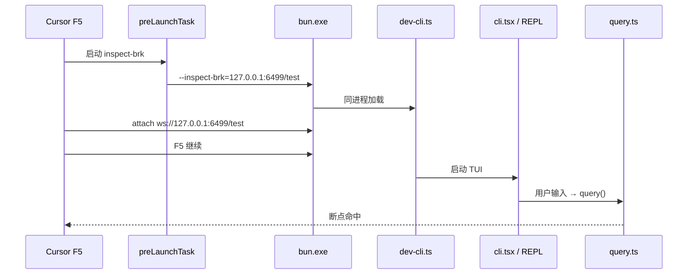

# VS Code / Cursor F5 断点调试说明书

在 **VS Code** 或 **Cursor** 中对本仓库打断点调试（含 `src/query.ts` 等核心模块）。适用于 **Windows / macOS / Linux**，下文以 Windows + Cursor 为例。

---

## 1. 前置条件

| 项目 | 要求 |
|------|------|
| 运行时 | [Bun](https://bun.sh) ≥ 1.3.0（默认路径 `%USERPROFILE%\.bun\bin\bun.exe`） |
| 扩展 | **[Bun for Visual Studio Code](https://marketplace.visualstudio.com/items?itemName=oven.bun-vscode)**（发布者 **Oven**，扩展 ID：`oven.bun-vscode`） |
| 工作区 | 打开仓库根目录（含 `package.json` 的目录） |

安装扩展后执行 **Developer: Reload Window** 重载窗口。

推荐扩展列表见 `.vscode/extensions.json`；工作区已配置 `bun.runtime` 指向本机 Bun 可执行文件。

---

## 2. 为什么需要专用调试入口？

日常开发命令：

```bash
bun run dev
```

实际链路为 `scripts/dev.ts` → **`Bun.spawnSync` 启动子进程** 运行 `src/entrypoints/cli.tsx`。调试器附在**父进程**上，**`src/query.ts` 等断点不会命中**。

F5 调试使用 **同进程** 入口：

```bash
bun --feature BUDDY --feature ... scripts/dev-cli.ts [参数]
```

| 入口 | 用途 | 进程模型 |
|------|------|----------|
| `bun run dev` | 终端日常开发 | 子进程 spawn |
| `scripts/dev-cli.ts` | F5 / attach 调试 | **同进程** |
| `bun run dev:inspect` | 终端手动 inspect + attach | **同进程** + `--inspect-wait` |

---

## 3. 配置文件

运行以下命令可重新生成调试配置（修改 feature 列表后需执行）：

```bash
bun run generate:launch
```

生成文件：

| 文件 | 作用 |
|------|------|
| `.vscode/launch.json` | F5 调试配置（`type: bun`） |
| `.vscode/tasks.json` | attach 模式的 `preLaunchTask`（`--inspect-brk`） |
| `.vscode/settings.json` | `bun.runtime` 等扩展设置 |

验证同进程路径是否正常（不启动调试器）：

```bash
bun run verify:f5
```

---

## 4. 调试配置一览

### 4.1 ★ Attach REPL → query.ts（**首选**）

适用于交互式 REPL，调试 `query.ts`、`QueryEngine.ts`、`REPL.tsx` 等。

1. **F5** → 选择 **「★ Attach REPL → query.ts (首选)」**
2. 专用 Terminal 输出 `Listening: ws://127.0.0.1:6499/test`
3. 调试器 attach 后在 `dev-cli.ts` 入口暂停 → **F5 继续**
4. 等待 REPL（Claude Code 界面）出现
5. 在 **同一 Terminal** 输入消息（如 `hello`）触发 API 调用
6. 断点命中（如 `src/query.ts`）

### 4.2 ★ Attach pipe (-p) → query.ts

单轮管道模式，更快打到 `query.ts`，适合验证 API 路径：

1. F5 → **「★ Attach pipe (-p) → query.ts」**
2. attach 并 **F5 继续** 后，在同一 Terminal 输入 `hello`

### 4.3 Attach: 手动（preLaunchTask 失败时）

**Terminal：**

```bash
bun run dev:inspect
```

看到 `ws://127.0.0.1:6499/test` 后，F5 → **「Attach: 手动 (先 bun run dev:inspect)」**。

### 4.4 Smoke: debugger 是否工作

最小验证：打开 `scripts/debug-smoke.ts`，F5 → **「Smoke: debugger 是否工作」**，应在第 4 行 `debugger` 停住。  
若 Smoke 失败，先排查扩展/attach，再调试业务代码。

### 4.5 Launch inspect-wait REPL

直接 launch + `--inspect-wait`（Windows 上断点绑定不如 attach 稳定，作备选）。

---

## 5. 推荐操作流程（首次）

```
1. 安装 oven.bun-vscode → Reload Window
2. bun install
3. F5 → Smoke 测试（确认调试器可用）
4. F5 → ★ Attach REPL → query.ts
5. F5 继续 → REPL 输入 hello → 断点命中 query.ts
```

在 `src/query.ts` 或任意 `.ts` / `.tsx` 源文件中单击行号设断点即可（无需改代码）。

---

## 6. 架构示意



---

## 7. 常见问题

### 7.1 `-Command` 无法识别（PowerShell）

**现象：** Terminal 报 `-Command : 无法将 "-Command" 项识别为 cmdlet...`

**原因：** Windows 上 `type: shell` 的 task 经 PowerShell 包装时路径解析错误。

**处理：** 已改用 `tasks.json` 中 `type: process` 直接启动 `bun.exe`。若仍报错，执行 `bun run generate:launch` 重新生成配置，或使用 **手动 attach**（§4.3）。

### 7.2 断点灰色 / 不命中（launch 模式）

**原因：** Windows 上 Bun 的 `request: launch` 断点绑定不稳定（[oven-sh/bun#12735](https://github.com/oven-sh/bun/issues/12735)）。

**处理：** 使用 **attach + `--inspect-brk`**（§4.1），不要用 `bun run dev` 配合 Node 调试器。

### 7.3 端口 6499 被占用

```powershell
Get-Process bun -ErrorAction SilentlyContinue | Stop-Process -Force
```

然后重新 F5。

### 7.4 REPL 不出现

attach 后必须 **F5 继续**（不要一直 Step Over 停在 `dev-cli.ts` 第 1 行）。REPL 输出在 **preLaunchTask 专用 Terminal**，不是 Debug Console。

### 7.5 `production is not defined`

F5 路径**禁止**在 launch 中使用 `-d process.env.NODE_ENV`。`NODE_ENV` 由 `dev-cli.ts` 与 launch `env` 注入。

### 7.6 与 `bun run dev` 的差异

| 命令 | 适合 |
|------|------|
| `bun run dev` | 日常终端开发、快速迭代 |
| F5 attach + `dev-cli.ts` | 断点调试 `query.ts` 等 |

---

## 8. 相关脚本

| 脚本 / 命令 | 说明 |
|-------------|------|
| `scripts/dev-cli.ts` | F5 同进程入口，注入 `MACRO` + `NODE_ENV` 后 `import` CLI |
| `scripts/dev-debug.ts` | `bun run dev:inspect`，终端 `--inspect-wait` 同进程启动 |
| `scripts/devArgs.ts` | 共享 `--feature` / F5 参数 |
| `scripts/debug-smoke.ts` | 最小 debugger 烟雾测试 |
| `scripts/generate-vscode-launch.ts` | 生成 `.vscode/launch.json` 等 |
| `scripts/verify-f5-path.ts` | CI/本地验证 F5 同进程管道 |

---

## 9. API 配置（调试 DeepSeek 等）

用户级配置：`~/.claude/settings.json`（Windows：`%USERPROFILE%\.claude\settings.json`）。

DeepSeek Anthropic 兼容示例：

```json
{
  "env": {
    "ANTHROPIC_BASE_URL": "https://api.deepseek.com/anthropic",
    "ANTHROPIC_DEFAULT_SONNET_MODEL": "deepseek-v4-flash",
    "ANTHROPIC_DEFAULT_OPUS_MODEL": "deepseek-v4-flash"
  }
}
```

管道快速验证：

```bash
echo "Reply with exactly: OK" | bun run dev -p --model deepseek-v4-flash
```

---

## 10. 维护说明

- 新增 build feature 后运行 `bun run generate:launch` 更新 launch/task 中的 `--feature` 列表。
- `.gitignore` 已跟踪 `.vscode/launch.json`、`.vscode/tasks.json`、`.vscode/settings.json`，克隆仓库即可使用。
- 调试完成后请勿在业务代码中保留临时 `debugger;` 语句。
